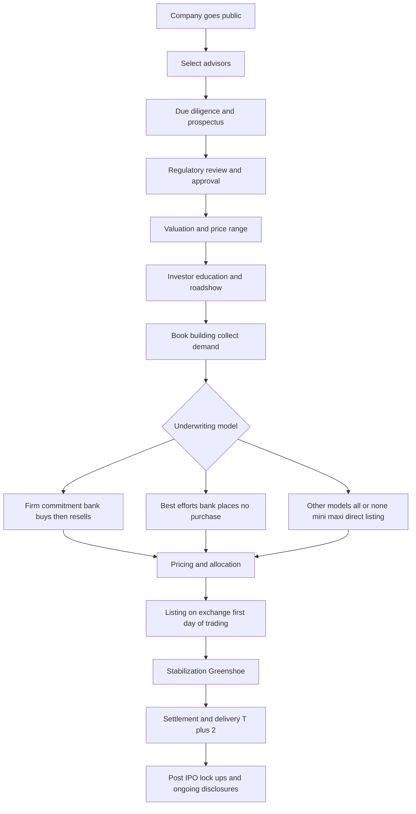

```mermaid
flowchart TD
  A[Company goes public] --> B[Select advisors]
  B --> C[Due diligence and prospectus]
  C --> D[Regulatory review and approval]
  D --> E[Valuation and price range]
  E --> F[Investor education and roadshow]
  F --> G[Book building collect demand]
  G --> H{Underwriting model}
  H --> H1[Firm commitment bank buys then resells]
  H --> H2[Best efforts bank places no purchase]
  H --> H3[Other models all or none mini maxi direct listing]
  H1 --> I[Pricing and allocation]
  H2 --> I
  H3 --> I
  I --> J[Listing on exchange first day of trading]
  J --> K[Stabilization Greenshoe]
  K --> L[Settlement and delivery T plus 2]
  L --> M[Post IPO lock ups and ongoing disclosures]
```
