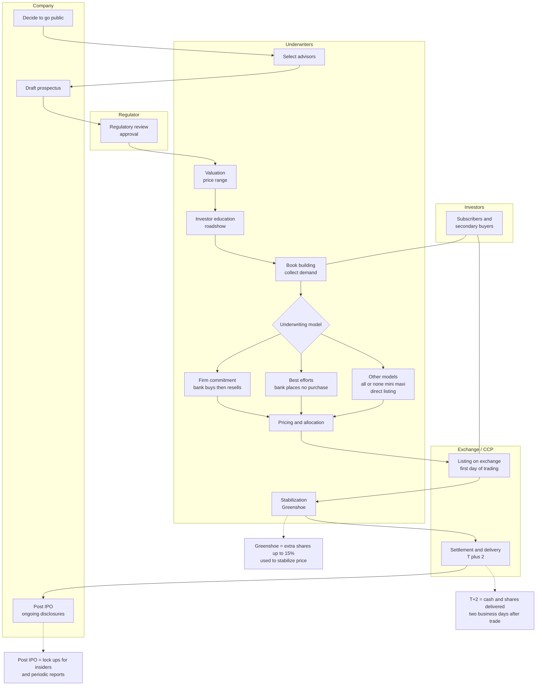

```mermaid
flowchart TD

%% --- Swimlanes / actors ---
subgraph A1[Company]
  A[Decide to go public]
  C[Draft prospectus]
  M[Post IPO<br/>ongoing disclosures]
end

subgraph A2[Underwriters]
  B[Select advisors]
  E[Valuation<br/>price range]
  F[Investor education<br/>roadshow]
  G[Book building<br/>collect demand]
  H{Underwriting model}
  H1[Firm commitment<br/>bank buys then resells]
  H2[Best efforts<br/>bank places no purchase]
  H3[Other models<br/>all or none mini maxi<br/>direct listing]
  I[Pricing and allocation]
  K[Stabilization<br/>Greenshoe]
end

subgraph A3[Regulator]
  D[Regulatory review<br/>approval]
end

subgraph A4[Exchange / CCP]
  J[Listing on exchange<br/>first day of trading]
  L[Settlement and delivery<br/>T plus 2]
end

subgraph A5[Investors]
  Z[Subscribers and<br/>secondary buyers]
end

%% --- Main flow ---
A --> B --> C --> D --> E --> F --> G --> H
H --> H1 --> I
H --> H2 --> I
H --> H3 --> I
I --> J --> K --> L --> M
Z --- G
Z --- J

%% --- Short callouts ---
Kx[Greenshoe = extra shares up to 15%<br/>used to stabilize price]
Lx[T+2 = cash and shares delivered<br/>two business days after trade]
Mx[Post IPO = lock ups for insiders<br/>and periodic reports]
K -.-> Kx
L -.-> Lx
M -.-> Mx

```
