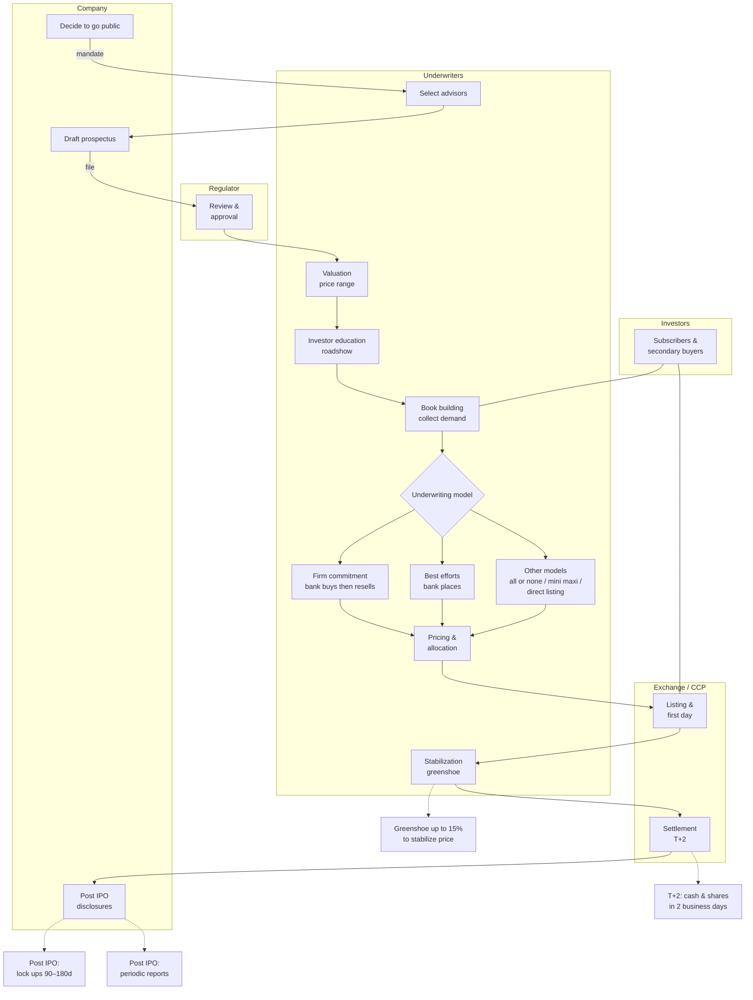

### IPO Process — Roles & Steps


### IPO Process — Message Flow (Sequence)
```mermaid
sequenceDiagram

  participant Co as Company
  participant UW as Underwriters
  participant Reg as Regulator
  participant Ex as Exchange CCP
  participant Inv as Investors

  Co->>UW: 1 Decide to go public
  Co->>UW: 2 Select advisors and mandate
  UW-->>Inv: 3 Map investors universe

  Co->>UW: 4 Draft prospectus start
  UW->>Reg: 5 File to regulator
  Reg-->>Co: 5 Review and approval cycle

  UW->>Co: 6 Valuation and price range
  UW->>Inv: 7 Roadshow and education
  UW->>Inv: 8 Book building collect orders

  UW->>Co: 9 Underwriting model
  alt 9a Firm commitment
    UW->>Co: Banks buy issue then resell
  else 9b Best efforts
    UW->>Co: Banks place issue no purchase
  else 9c Other models
    UW->>Co: All or none or mini maxi or direct listing
  end

  UW->>Inv: 10 Pricing and allocation
  Co->>Ex: 11 List shares first day trading
  UW->>Ex: 12 Stabilization Greenshoe if used
  Inv->>Ex: Secondary trading
  Ex->>Ex: 13 Settle and deliver T plus 2
  Co-->>Inv: 14 Post IPO lock ups and ongoing disclosures
Note over Co,Ex: Legend : Solid (->>) = action • Dashed (-->>) = info
  ```

### IPO Step Details (Reference Table)

| # | Step | Who | What happens | Key outputs/docs | Notes / Risks |
|---|---|---|---|---|---|
| 1 | Decide to go public | Company, board | Go/no-go decision, timeline, readiness check | Board approval | Market window, governance readiness |
| 2 | Select advisors | Company → Underwriters; legal; auditors | Mandate bookrunners, kick-off, open data room | Engagement letters, timetable, working group list | Pick banks with sector strength/distribution |
| 3 | Map investors universe | Underwriters | Identify and prioritize target investors | Targeting plan | Anchor/cornerstone investors identified |
| 4 | Draft prospectus | Company, legal, auditors | Due diligence (business/legal/financial) and drafting | Preliminary prospectus (red herring) | KPI consistency, auditor comfort letter |
| 5 | Regulatory review | Regulator, company, counsel | Comment letters ↔ responses until clearance | Approval / Effective | Review timelines, sensitive issues |
| 6 | Valuation & price range | Underwriters, company | Peers, DCF/comps, set indicative range | Valuation memo, price range | Track comps and market conditions |
| 7 | Roadshow | Management, underwriters | Teach-ins, 1:1s, group meetings | Investor feedback | Segment-specific messaging, tough Q&A |
| 8 | Book building | Underwriters | Collect orders (size/price); assess book quality | Order book | Mix of long-only vs. hot money |
| 9a | Firm commitment | Underwriters | Banks buy the issue then resell | Underwriting agreement | Market risk borne by syndicate |
| 9b | Best efforts | Underwriters | Placement without bank purchase | Placement agreement | Demand shortfall risk on issuer |
| 10 | Pricing & allocation | Underwriters, company | Set final price; allocate to investors | Pricing press release, final prospectus | Allocation discipline for post-IPO stability |
| 11 | Listing / first day | Exchange, market makers | First print; trading begins | Ticker live | Opening volatility |
| 12 | Stabilization / greenshoe | Underwriters | Over-allotment ~15% to smooth price | Stabilization report | Jurisdictional constraints |
| 13 | Settlement T+2 | CCP, custodians, brokers | Cash ↔ shares in two business days | Final settlement | Settlement fails, fail coverage |
| 14 | Post-IPO | Company, IR | Lock-ups 90–180 days; periodic reporting | 10-Q/10-K or local reports | IR calendar, guidance, blackout windows |

### IPO - role cards 

**Underwriters / Bookrunners**  
Design the deal, run education/roadshow, build the order book, set price/allocation, and may stabilize (greenshoe).  
Examples: Goldman Sachs, Morgan Stanley, J.P. Morgan, Bank of America, Citi, Barclays, UBS, Deutsche Bank, HSBC, Jefferies, RBC, BNP Paribas, Société Générale.

**Legal counsel (company & banks)**  
Prepare the prospectus/disclosures, manage due diligence, opinions, and regulatory filings.  
Examples (company counsel / banks’ counsel): Skadden, Latham & Watkins, Simpson Thacher, Cooley, Wilson Sonsini, Davis Polk, Sullivan & Cromwell, Cravath, Freshfields, Clifford Chance, Linklaters, Allen & Overy, White & Case.

**Auditors**  
Provide audited financials, reviews, and a comfort letter supporting selected figures.  
Examples: PwC, Deloitte, EY, KPMG.

**Regulators**  
Review filings, issue comment letters, and grant clearance/effectiveness.  
Examples: SEC (US), FCA/UKLA (UK), AMF (FR), BaFin (DE), CNMV (ES), CONSOB (IT), ESMA (EU coordination), SFC (HK), MAS (SG), SEBI (IN).

**Exchanges (listing venues)**  
Admit securities to trading and provide the marketplace.  
Examples: NYSE, Nasdaq (US); LSE (UK); Euronext (EU); Deutsche Börse (DE); SIX (CH); HKEX (HK); SGX (SG); BSE/NSE (IN); TSE (JP).

**CCP / Clearing houses**  
Novate trades (become the counterparty), collect margin, and manage default risk.  
Examples: NSCC (DTCC, US equities), LCH EquityClear, Eurex Clearing, SIX x-clear, HKEX Clearing.

**CSD / Depositories**  
Record ownership and handle final securities settlement/custody at the market infrastructure level.  
Examples: DTC (DTCC, US), Euroclear, Clearstream, CREST (UK), HKSCC (HK), NSDL/CDSL (IN).

**Market makers / Liquidity providers**  
Quote two-sided prices and provide liquidity, especially around the open/close and post-IPO.  
Examples: Citadel Securities, Virtu, Jane Street, Susquehanna (SIG), Optiver, IMC, Flow Traders, Hudson River Trading.

**Custodian banks**  
Safekeep assets, handle settlement, corporate actions, and reporting for institutions.  
Examples: BNY Mellon, State Street, J.P. Morgan, Northern Trust, HSBC.

**Transfer agents / Registrars**  
Maintain the shareholder register and process corporate actions (dividends, DRIPs, proxy).  
Examples: Computershare, Equiniti, American Stock Transfer (AST), Continental Stock Transfer.

**IR / PR advisors**  
Craft the equity story, prepare investor materials, coordinate media and investor communications.  
Examples: ICR, FTI Consulting, Brunswick, Edelman, Kekst CNC, Sard Verbinnen (SVC).

**Investors (buy-side segments)**  
Provide capital in the IPO book and form the aftermarket (each with different horizons/styles).  
Examples: Long-only funds and pensions (BlackRock, Vanguard, Capital Group), hedge funds (Millennium, Citadel, Point72), sovereign wealth (GIC, ADIA), family offices, ETF issuers.
