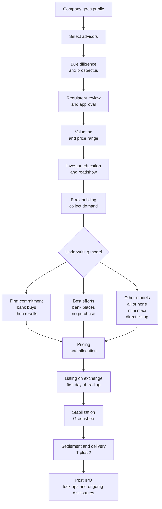

```mermaid
flowchart TD
  A[Company goes public] --> B[Select advisors]
  B --> C[Due diligence<br/>and prospectus]
  C --> D[Regulatory review<br/>and approval]
  D --> E[Valuation<br/>and price range]
  E --> F[Investor education<br/>and roadshow]
  F --> G[Book building<br/>collect demand]
  G --> H{Underwriting model}

  H --> H1["Firm commitment<br/>bank buys<br/>then resells"]
  H --> H2["Best efforts<br/>bank places<br/>no purchase"]
  H --> H3["Other models<br/>all or none<br/>mini maxi<br/>direct listing"]

  H1 --> I[Pricing<br/>and allocation]
  H2 --> I
  H3 --> I
  I --> J[Listing on exchange<br/>first day of trading]
  J --> K[Stabilization<br/>Greenshoe]
  K --> L[Settlement and delivery<br/>T plus 2]
  L --> M[Post IPO<br/>lock ups and ongoing disclosures]
```
