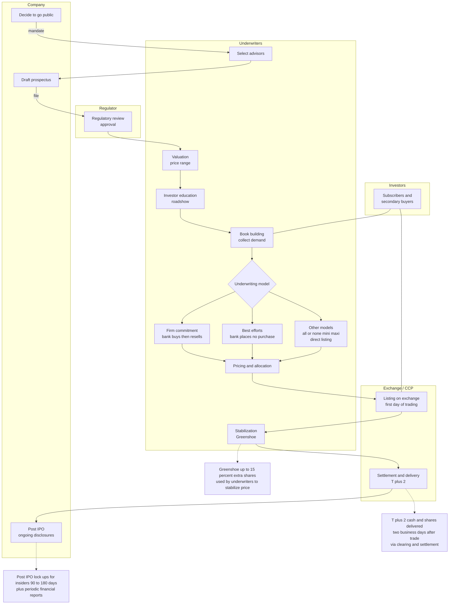

```mermaid
flowchart TD

%% --- Swimlanes / actors ---
subgraph C0[Company]
  C1[Decide to go public]
  C2[Draft prospectus]
  C3[Post IPO<br/>ongoing disclosures]
end

subgraph U0[Underwriters]
  U1[Select advisors]
  U2[Valuation<br/>price range]
  U3[Investor education<br/>roadshow]
  U4[Book building<br/>collect demand]
  U5{Underwriting model}
  U5a[Firm commitment<br/>bank buys then resells]
  U5b[Best efforts<br/>bank places no purchase]
  U5c[Other models<br/>all or none mini maxi<br/>direct listing]
  U6[Pricing and allocation]
  U7[Stabilization<br/>Greenshoe]
end

subgraph R0[Regulator]
  R1[Regulatory review<br/>approval]
end

subgraph X0[Exchange / CCP]
  X1[Listing on exchange<br/>first day of trading]
  X2[Settlement and delivery<br/>T plus 2]
end

subgraph I0[Investors]
  I1[Subscribers and<br/>secondary buyers]
end

%% --- Main flow with a few edge labels ---
C1 -->|mandate| U1
U1 --> C2
C2 -->|file| R1
R1 --> U2
U2 --> U3 --> U4 --> U5
U5 --> U5a --> U6
U5 --> U5b --> U6
U5 --> U5c --> U6
U6 --> X1 --> U7 --> X2 --> C3

%% investors connect at primary and secondary stages
I1 --- U4
I1 --- X1

%% --- Explanatory callouts (short and wrapped, no parentheses/dashes) ---
Kx[Greenshoe up to 15 percent extra shares<br/>used by underwriters to stabilize price]
Tx[T plus 2 cash and shares delivered<br/>two business days after trade<br/>via clearing and settlement]
Lx[Post IPO lock ups for insiders 90 to 180 days<br/>plus periodic financial reports]

U7 -.-> Kx
X2 -.-> Tx
C3 -.-> Lx
```
