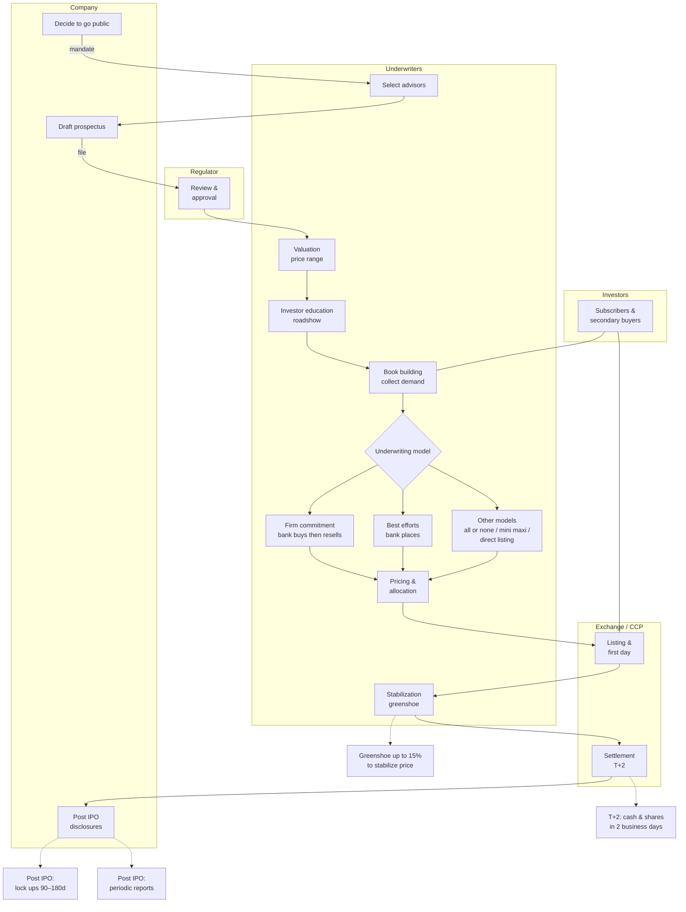

In this note sheet we will cover the followings topics : 

Instruments (equities, bonds, FX, derivatives), Primary vs. Secondary markets, Trading workflow (order → exchange → clearing → settlement), Intermediaries: brokers, CSDs, exchanges, clearinghouses, regulators, Participants: investors vs. traders (roles & behavior), Concepts: speculation, arbitrage, Market types & common jargon

---
# 1. Introduction to Financial Market

### Markets in General
In general markets are simply the places where stuff get traded in order to make profit. When it comes to financial market the actor gather together to transact on financial instrument. Like in our day to day life, we also have Online Financial Market place (similar to amazon in real world) or Physical premise.

### The Major Financial Markets
Financial markets can be split into **Stock markets**, **Commodity markets**, **Currency Markets**, **Derivative Markets** and so on.

**Stock markets** : It's the place where we trade the share or stock of a compagny also called Stock Exchange.

    The major Stock Exchange in the world are New york Stock Exchange (NYSE) and NASDAQ in USA, National Stock Exchange (NSE) in India,
    London Stock Exchange in UK, Japan Exchange Group (JPX) in Japan, Korea Exchange (KRX) in South Korea, Deutsche Börse in Germany,
    Hong Kong Stock Exchange (HKEX) in Hong Kong.

**Commodity markets** : Venues where raw materials and primary products are traded often via spot and futures contracts.

     Major commodity exchanges include the CME Group (NYMEX/COMEX) and Intercontinental Exchange (ICE) in the United States/UK,
     the London Metal Exchange (LME) in the United Kingdom, Shanghai Futures Exchange (SHFE) in China,Dalian Commodity Exchange (DCE) in China,
     and Zhengzhou Commodity Exchange (ZCE) in China, the Tokyo Commodity Exchange (TOCOM) in Japan, the Multi Commodity Exchange (MCX)
     and NCDEX in India

**Currency Markets** : Decentralized (no single central exchange or order book) and primarily OTC (over-the-counter: trades negotiated directly between participants rather than on an exchange) markets where currencies trade via spot, forwards, swaps, and options, a smaller share trades on exchanges (FX futures/options). In a decentralized Foreign Exchange (FX) market, prices and liquidity are dispersed across dealers and multiple platforms.

    Major FX platforms include EBS (Electronic Broking Services) / CME Group and Refinitiv Matching for **interbank trading**. 
    Cboe FX, LMAX Exchange, Currenex, FXall, and 360T are used primarily for **client-to-bank trading** (Electronic Communication Network /Request For Quotation workflows),
    while **exchange listed FX** (futures and options) trades on CME Group (US) and Eurex (EU) with Central CounterParty (CCP). 
      
      A central counterparty (CCP) steps in as buyer to every seller and seller to every buyer, novates the trades, and manages risk through margining. 
      Example: Bank A sells 10 EUR/USD contracts to Bank B on an exchange. After novation, A has a contract with the CCP (it sells to the CCP) and B has a contract with the CCP (it buys from the CCP). A and B no longer have any direct legal relationship.

**Derivative Markets** : Markets where contracts whose value comes from an underlying asset are traded. Main contract types: futures, options, forwards, swaps. There are two channels: 

    (1) **exchange-listed derivatives** (standardized) on CME Group, ICE, Eurex, and Cboe (options); 
    (2) **OTC derivatives**, trades negotiated directly between participants.
 
---

# 2. Need for Financial Markets

### 2.1 Why We Need Financial Markets
In every economy,financial markets connect investor (those who bring capital on the table) to business owner and governement ( the users of this capital). Thus, thanks to this main function, the financial markets become very critical for the good health of any country's economic because they fund public projet and private expansion.

### 2.2 What Financial Markets Enable

#### Capital raising (primary market)
The governments finance infrastructure buy selling debts (treasury bonds), The firms finance growth (more R&D, hiring, capacity) by selling share.

#### Investment access (for individual)
Instead of leaving money idle in a bank, individual can invest this money and plays a relevant role in the economy growth. Obviously, they will expect a return and reward for this investment.

#### Diversification
The thousands of listed securities across stock exchanges worldwide allow investors to diversify their portfolios and to manage their risk.

#### Indices as Economic health indicators
The stock indices aggregate company performance and often act as **leading indicators, a bellwether for broader ecomomy.

#### Risk management (derivatives)
Firms and producers can hedge price risks using forwards, futures, options.

example: a wheat farmer who fears fall of the prices can sells wheat forwards to lock today's price and stabilize revenues.

### Summary
**Connect capital**: savers → projects (public & private).
**Enable investing**: households can grow wealth with the economy.
**Inform the cycle**: indices help track macro conditions.
**Manage risk**: derivatives transfer/hedge exposures rather than eliminate them.

---

# 3. Introduction to Financial Instrument

### Definition - What Gets Traded
Financial instrument are legal agreements where one party pay cash (or value) in exchange for a claim. According to International Accounting Standards (IAS), a Financial Instrument is any contract that creates a financial asset for one entity and a financial liability or equity instrument for another

In practice, when it comes to **equity**, the investor pays cash and receives an **ownership claim (shares)** which may carry **voting right** and **dividend** depending of the share class and company policy.

When it comes to **debt or bond**, the investor pays cash and receives **a creditor claim (a loan to the issuer of the debt)**. Here there are no ownership and tipically no dividend. The investor generally receives a **coupon payments (based on the bond's term)** + a **repayment of principal at maturity**

### Purpose and Economic Role
Financial markets act as a channel to move money from the investors (providers) to the users( firms/government) at the lowest cost (fast, transparent, competitive).

Simple image: pipes carrying savings to useful projects.

### Classification by Asset Class
| Equity-based | Debt-based | Currency instruments |
|---|---|---|
| Represent ownership (common shares). | Represent a loan/obligation (bonds/notes). | Neither equity nor debt, X is usually treated as a separate category. |

Identification (Tickers & Listings): Each instrument has a symbol/ticker ( Microsoft = MSFT on NASDAQ). Some shares may be traded on multiple exchanges.

### Classification by Instrument Type
| Category | Description |
|---|---|
| Cash instruments | Value determined directly by the market; typically easily transferable (e.g., stocks, bonds, deposits). |
| Derivative instruments | Value derived from an underlying (equities, interest rates, FX, commodities), traded OTC or on an exchange (forwards, futures, options, swaps). |

### Trading Channels
| Channel | Description |
|---|---|
| OTC (over-the-counter) | Trades negotiated directly between participants. |
| Exchange-traded | Standardized contracts under exchange rules, often with central clearing via a CCP. |

---

# 4. Stocks

**What is a Stock** : A stock or a share or equity is a security that represents an ownership stake in a company. It carry rights and benefits

**Why We Buy Stocks** : Investors buy stocks to seek capital appreciation when the price rises over time, and also dividend according to the firm policy

**2 Types of Stocks** : (1) Common Stock, usually carries voting rights and gives shareholders a residual claim on dividends. (2) Preferred Stock, Typically has no voting rights but provides priority dividends and often a higher claim on assets in a liquidation


**Market Cap (Size Bucket)** : 
(1) Large-cap, multi billions companies with deep liquidity. They tend to have more stable earningsand lower volatility than smaller ones

(2) Mid-cap, sitting between Large cap and small cap they are medium sized companies with solid growth potential and generally good liquidity. 

(3) Small-cap, smaller companies with higher growth uncertainty, thinner liquidity and usually higher volatility

(4) Penny Stocks, in USA the SEC treats penny stock as shares that cost less than 5 USD. Typically outside major exchange (OTC) and they can involve low liquidity and elevated risk( wide spread, price manipulation). In other part of the world, they have their owns juriductions and features.

**Key Risks** : The main risk are firstly the price volatility. Indeed, the prices can swing in the short term and even healthy firms see fluctuation in prices. Secondly we have the bankruptcy hierarchy. In case of liquidation the common shareholders are last in line.

---

# 5. Primary and Secondary Market

Financial Markets have 2 main segments :  **Primary Market** and **Secondary Market**

The first one is where issuance happens and the second one where trading among investors happens.

**Primary Market (New Issue Market)** : The primary market is where a company sells its shares or bonds to the public for the first time to raise capital. Then, subscriptions are made at the issue price set by the company (and its advisors). Each offering happens once (per issuance). Typical events include the **Initial Public Offering (IPO)**, **Offer for Sale (OFS)** by existing promoters, **Rights Issues** to existing shareholders, and **Bonus Issues** of free additional shares.


**Secondary Market (Exchanges)** : The secondary market is where listed shares, bonds and others instruments are traded


**Lifecycle / Flow** : New securities are first Issue in primary → public subscribes → list on exchange → trade in secondary 


**Primary vs Secondary, Key Differences (with Actors)** :
| Dimension | Primary Market | Secondary Market |
|---|---|---|
| Purpose | Raise new capital for the issuer | Provide liquidity and price discovery |
| Counterparties | Company ↔ Investors | Investor ↔ Investor (via exchange/broker) |
| Cash flow | Money to the issuer | Money between investors |
| Pricing | Issue price (fixed or book-built) | Market price (supply/demand) |
| Frequency | One-time per offering | Continuous trading |
| Events | IPO, OFS, Rights, Bonus | Exchange trading, block trades, etc. |
| Key actors | Issuer (company/government); investment banks/underwriters; legal counsel and auditors; regulator/listing authority; registrar; institutional and retail subscribers | Retail and institutional investors; brokers/dealers; market makers, HFT and prop trading firms; exchanges/ATS and dark pools; clearinghouses (CCP); custodians; regulators |

---

# 6. Initial Public Offering (IPO) Process 

### IPO Process — Roles & Steps


### IPO Process — Message Flow (Sequence)
```mermaid
sequenceDiagram

  participant Co as Company
  participant UW as Underwriters
  participant Reg as Regulator
  participant Ex as Exchange CCP
  participant Inv as Investors

  Co->>UW: 1 Decide to go public
  Co->>UW: 2 Select advisors and mandate
  UW-->>Inv: 3 Map investors universe

  Co->>UW: 4 Draft prospectus start
  UW->>Reg: 5 File to regulator
  Reg-->>Co: 5 Review and approval cycle

  UW->>Co: 6 Valuation and price range
  UW->>Inv: 7 Roadshow and education
  UW->>Inv: 8 Book building collect orders

  UW->>Co: 9 Underwriting model
  alt 9a Firm commitment
    UW->>Co: Banks buy issue then resell
  else 9b Best efforts
    UW->>Co: Banks place issue no purchase
  else 9c Other models
    UW->>Co: All or none or mini maxi or direct listing
  end

  UW->>Inv: 10 Pricing and allocation
  Co->>Ex: 11 List shares first day trading
  UW->>Ex: 12 Stabilization Greenshoe if used
  Inv->>Ex: Secondary trading
  Ex->>Ex: 13 Settle and deliver T plus 2
  Co-->>Inv: 14 Post IPO lock ups and ongoing disclosures
Note over Co,Ex: Legend : Solid (->>) = action • Dashed (-->>) = info
  ```

### IPO Step Details (Reference Table)

| # | Step | Who | What happens | Key outputs/docs | Notes / Risks |
|---|---|---|---|---|---|
| 1 | Decide to go public | Company, board | Go/no-go decision, timeline, readiness check | Board approval | Market window, governance readiness |
| 2 | Select advisors | Company → Underwriters; legal; auditors | Mandate bookrunners, kick-off, open data room | Engagement letters, timetable, working group list | Pick banks with sector strength/distribution |
| 3 | Map investors universe | Underwriters | Identify and prioritize target investors | Targeting plan | Anchor/cornerstone investors identified |
| 4 | Draft prospectus | Company, legal, auditors | Due diligence (business/legal/financial) and drafting | Preliminary prospectus (red herring) | KPI consistency, auditor comfort letter |
| 5 | Regulatory review | Regulator, company, counsel | Comment letters ↔ responses until clearance | Approval / Effective | Review timelines, sensitive issues |
| 6 | Valuation & price range | Underwriters, company | Peers, DCF/comps, set indicative range | Valuation memo, price range | Track comps and market conditions |
| 7 | Roadshow | Management, underwriters | Teach-ins, 1:1s, group meetings | Investor feedback | Segment-specific messaging, tough Q&A |
| 8 | Book building | Underwriters | Collect orders (size/price); assess book quality | Order book | Mix of long-only vs. hot money |
| 9a | Firm commitment | Underwriters | Banks buy the issue then resell | Underwriting agreement | Market risk borne by syndicate |
| 9b | Best efforts | Underwriters | Placement without bank purchase | Placement agreement | Demand shortfall risk on issuer |
| 10 | Pricing & allocation | Underwriters, company | Set final price; allocate to investors | Pricing press release, final prospectus | Allocation discipline for post-IPO stability |
| 11 | Listing / first day | Exchange, market makers | First print; trading begins | Ticker live | Opening volatility |
| 12 | Stabilization / greenshoe | Underwriters | Over-allotment ~15% to smooth price | Stabilization report | Jurisdictional constraints |
| 13 | Settlement T+2 | CCP, custodians, brokers | Cash ↔ shares in two business days | Final settlement | Settlement fails, fail coverage |
| 14 | Post-IPO | Company, IR | Lock-ups 90–180 days; periodic reporting | 10-Q/10-K or local reports | IR calendar, guidance, blackout windows |

### IPO - role cards 

**Underwriters / Bookrunners**  
Design the deal, run education/roadshow, build the order book, set price/allocation, and may stabilize (greenshoe).  
Examples: Goldman Sachs, Morgan Stanley, J.P. Morgan, Bank of America, Citi, Barclays, UBS, Deutsche Bank, HSBC, Jefferies, RBC, BNP Paribas, Société Générale.

**Legal counsel (company & banks)**  
Prepare the prospectus/disclosures, manage due diligence, opinions, and regulatory filings.  
Examples (company counsel / banks’ counsel): Skadden, Latham & Watkins, Simpson Thacher, Cooley, Wilson Sonsini, Davis Polk, Sullivan & Cromwell, Cravath, Freshfields, Clifford Chance, Linklaters, Allen & Overy, White & Case.

**Auditors**  
Provide audited financials, reviews, and a comfort letter supporting selected figures.  
Examples: PwC, Deloitte, EY, KPMG.

**Regulators**  
Review filings, issue comment letters, and grant clearance/effectiveness.  
Examples: SEC (US), FCA/UKLA (UK), AMF (FR), BaFin (DE), CNMV (ES), CONSOB (IT), ESMA (EU coordination), SFC (HK), MAS (SG), SEBI (IN).

**Exchanges (listing venues)**  
Admit securities to trading and provide the marketplace.  
Examples: NYSE, Nasdaq (US); LSE (UK); Euronext (EU); Deutsche Börse (DE); SIX (CH); HKEX (HK); SGX (SG); BSE/NSE (IN); TSE (JP).

**CCP / Clearing houses**  
Novate trades (become the counterparty), collect margin, and manage default risk.  
Examples: NSCC (DTCC, US equities), LCH EquityClear, Eurex Clearing, SIX x-clear, HKEX Clearing.

**CSD / Depositories**  
Record ownership and handle final securities settlement/custody at the market infrastructure level.  
Examples: DTC (DTCC, US), Euroclear, Clearstream, CREST (UK), HKSCC (HK), NSDL/CDSL (IN).

**Market makers / Liquidity providers**  
Quote two-sided prices and provide liquidity, especially around the open/close and post-IPO.  
Examples: Citadel Securities, Virtu, Jane Street, Susquehanna (SIG), Optiver, IMC, Flow Traders, Hudson River Trading.

**Custodian banks**  
Safekeep assets, handle settlement, corporate actions, and reporting for institutions.  
Examples: BNY Mellon, State Street, J.P. Morgan, Northern Trust, HSBC.

**Transfer agents / Registrars**  
Maintain the shareholder register and process corporate actions (dividends, DRIPs, proxy).  
Examples: Computershare, Equiniti, American Stock Transfer (AST), Continental Stock Transfer.

**IR / PR advisors**  
Craft the equity story, prepare investor materials, coordinate media and investor communications.  
Examples: ICR, FTI Consulting, Brunswick, Edelman, Kekst CNC, Sard Verbinnen (SVC).

**Investors (buy-side segments)**  
Provide capital in the IPO book and form the aftermarket (each with different horizons/styles).  
Examples: Long-only funds and pensions (BlackRock, Vanguard, Capital Group), hedge funds (Millennium, Citadel, Point72), sovereign wealth (GIC, ADIA), family offices, ETF issuers.


---

# 7. Introduction to Various Intermediaries

# 8. Brokers

# 9. Central Securities Depository

# 10. Stock Exchange

# 11. Clearinghouse

# 12. Financial Regulator
