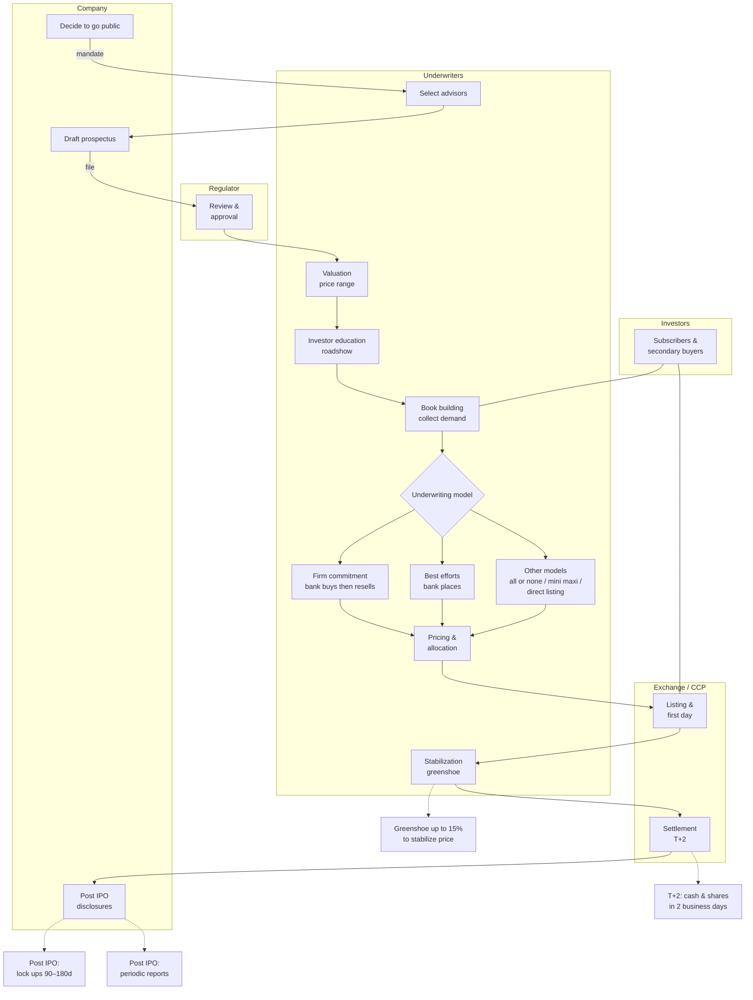
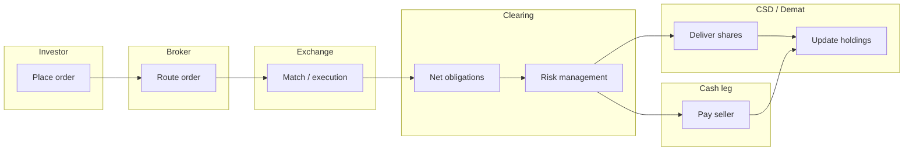
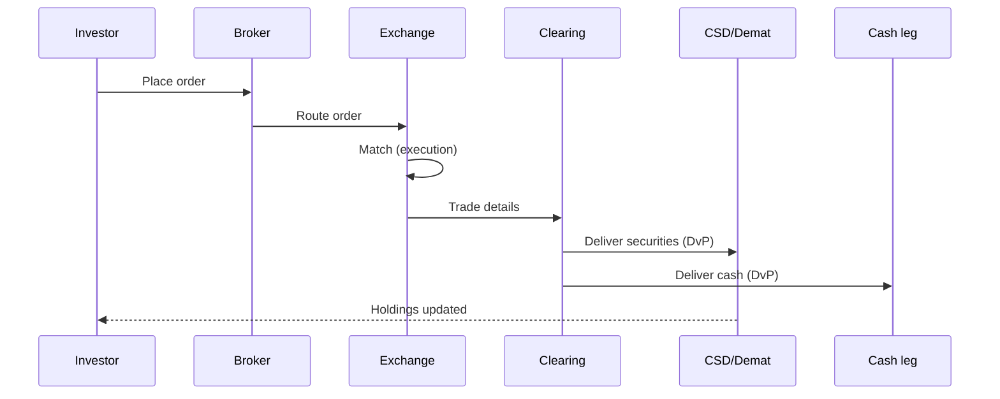
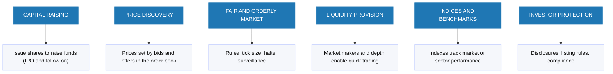
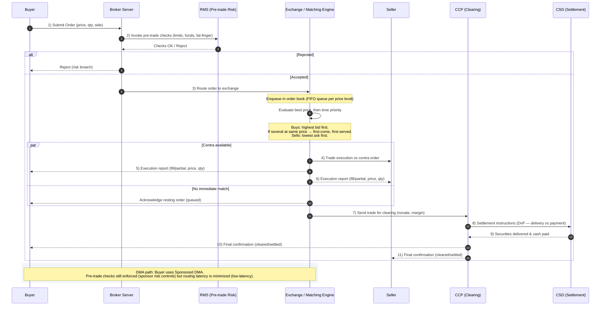
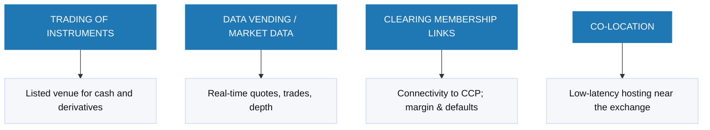

In this note sheet we will cover the followings topics : 

Instruments (equities, bonds, FX, derivatives), Primary vs. Secondary markets, Trading workflow (order → exchange → clearing → settlement), Intermediaries: brokers, CSDs, exchanges, clearinghouses, regulators, Participants: investors vs. traders (roles & behavior), Concepts: speculation, arbitrage, Market types & common jargon

---
# 1. Introduction to Financial Market

### Markets in General
In general markets are simply the places where stuff get traded in order to make profit. When it comes to financial market the actor gather together to transact on financial instrument. Like in our day to day life, we also have Online Financial Market place (similar to amazon in real world) or Physical premise.

### The Major Financial Markets
Financial markets can be split into **Stock markets**, **Commodity markets**, **Currency Markets**, **Derivative Markets** and so on.

**Stock markets** : It's the place where we trade the share or stock of a compagny also called Stock Exchange.

    The major Stock Exchange in the world are New york Stock Exchange (NYSE) and NASDAQ in USA, National Stock Exchange (NSE) in India,
    London Stock Exchange in UK, Japan Exchange Group (JPX) in Japan, Korea Exchange (KRX) in South Korea, Deutsche Börse in Germany,
    Hong Kong Stock Exchange (HKEX) in Hong Kong.

**Commodity markets** : Venues where raw materials and primary products are traded often via spot and futures contracts.

     Major commodity exchanges include the CME Group (NYMEX/COMEX) and Intercontinental Exchange (ICE) in the United States/UK,
     the London Metal Exchange (LME) in the United Kingdom, Shanghai Futures Exchange (SHFE) in China,Dalian Commodity Exchange (DCE) in China,
     and Zhengzhou Commodity Exchange (ZCE) in China, the Tokyo Commodity Exchange (TOCOM) in Japan, the Multi Commodity Exchange (MCX)
     and NCDEX in India

**Currency Markets** : Decentralized (no single central exchange or order book) and primarily OTC (over-the-counter: trades negotiated directly between participants rather than on an exchange) markets where currencies trade via spot, forwards, swaps, and options, a smaller share trades on exchanges (FX futures/options). In a decentralized Foreign Exchange (FX) market, prices and liquidity are dispersed across dealers and multiple platforms.

    Major FX platforms include EBS (Electronic Broking Services) / CME Group and Refinitiv Matching for **interbank trading**. 
    Cboe FX, LMAX Exchange, Currenex, FXall, and 360T are used primarily for **client-to-bank trading** (Electronic Communication Network /Request For Quotation workflows),
    while **exchange listed FX** (futures and options) trades on CME Group (US) and Eurex (EU) with Central CounterParty (CCP). 
      
      A central counterparty (CCP) steps in as buyer to every seller and seller to every buyer, novates the trades, and manages risk through margining. 
      Example: Bank A sells 10 EUR/USD contracts to Bank B on an exchange. After novation, A has a contract with the CCP (it sells to the CCP) and B has a contract with the CCP (it buys from the CCP). A and B no longer have any direct legal relationship.

**Derivative Markets** : Markets where contracts whose value comes from an underlying asset are traded. Main contract types: futures, options, forwards, swaps. There are two channels: 

    (1) **exchange-listed derivatives** (standardized) on CME Group, ICE, Eurex, and Cboe (options); 
    (2) **OTC derivatives**, trades negotiated directly between participants.
 
---

# 2. Need for Financial Markets

#### Why We Need Financial Markets
In every economy,financial markets connect investor (those who bring capital on the table) to business owner and governement ( the users of this capital). Thus, thanks to this main function, the financial markets become very critical for the good health of any country's economic because they fund public projet and private expansion.

####  What Financial Markets Enable

##### Capital raising (primary market)
The governments finance infrastructure buy selling debts (treasury bonds), The firms finance growth (more R&D, hiring, capacity) by selling share.

##### Investment access (for individual)
Instead of leaving money idle in a bank, individual can invest this money and plays a relevant role in the economy growth. Obviously, they will expect a return and reward for this investment.

##### Diversification
The thousands of listed securities across stock exchanges worldwide allow investors to diversify their portfolios and to manage their risk.

##### Indices as Economic health indicators
The stock indices aggregate company performance and often act as **leading indicators, a bellwether for broader ecomomy.

##### Risk management (derivatives)
Firms and producers can hedge price risks using forwards, futures, options.

example: a wheat farmer who fears fall of the prices can sells wheat forwards to lock today's price and stabilize revenues.

#### Summary
**Connect capital**: savers → projects (public & private).
**Enable investing**: households can grow wealth with the economy.
**Inform the cycle**: indices help track macro conditions.
**Manage risk**: derivatives transfer/hedge exposures rather than eliminate them.

---

# 3. Introduction to Financial Instrument

### Definition - What Gets Traded
Financial instrument are legal agreements where one party pay cash (or value) in exchange for a claim. According to International Accounting Standards (IAS), a Financial Instrument is any contract that creates a financial asset for one entity and a financial liability or equity instrument for another

In practice, when it comes to **equity**, the investor pays cash and receives an **ownership claim (shares)** which may carry **voting right** and **dividend** depending of the share class and company policy.

When it comes to **debt or bond**, the investor pays cash and receives **a creditor claim (a loan to the issuer of the debt)**. Here there are no ownership and tipically no dividend. The investor generally receives a **coupon payments (based on the bond's term)** + a **repayment of principal at maturity**

### Purpose and Economic Role
Financial markets act as a channel to move money from the investors (providers) to the users( firms/government) at the lowest cost (fast, transparent, competitive).

Simple image: pipes carrying savings to useful projects.

### Classification by Asset Class
| Equity-based | Debt-based | Currency instruments |
|---|---|---|
| Represent ownership (common shares). | Represent a loan/obligation (bonds/notes). | Neither equity nor debt, X is usually treated as a separate category. |

Identification (Tickers & Listings): Each instrument has a symbol/ticker ( Microsoft = MSFT on NASDAQ). Some shares may be traded on multiple exchanges.

### Classification by Instrument Type
| Category | Description |
|---|---|
| Cash instruments | Value determined directly by the market; typically easily transferable (e.g., stocks, bonds, deposits). |
| Derivative instruments | Value derived from an underlying (equities, interest rates, FX, commodities), traded OTC or on an exchange (forwards, futures, options, swaps). |

### Trading Channels
| Channel | Description |
|---|---|
| OTC (over-the-counter) | Trades negotiated directly between participants. |
| Exchange-traded | Standardized contracts under exchange rules, often with central clearing via a CCP. |

---

# 4. Stocks

**What is a Stock** : A stock or a share or equity is a security that represents an ownership stake in a company. It carry rights and benefits

**Why We Buy Stocks** : Investors buy stocks to seek capital appreciation when the price rises over time, and also dividend according to the firm policy

**2 Types of Stocks** : (1) Common Stock, usually carries voting rights and gives shareholders a residual claim on dividends. (2) Preferred Stock, Typically has no voting rights but provides priority dividends and often a higher claim on assets in a liquidation


**Market Cap (Size Bucket)** : 
(1) Large-cap, multi billions companies with deep liquidity. They tend to have more stable earningsand lower volatility than smaller ones

(2) Mid-cap, sitting between Large cap and small cap they are medium sized companies with solid growth potential and generally good liquidity. 

(3) Small-cap, smaller companies with higher growth uncertainty, thinner liquidity and usually higher volatility

(4) Penny Stocks, in USA the SEC treats penny stock as shares that cost less than 5 USD. Typically outside major exchange (OTC) and they can involve low liquidity and elevated risk( wide spread, price manipulation). In other part of the world, they have their owns juriductions and features.

**Key Risks** : The main risk are firstly the price volatility. Indeed, the prices can swing in the short term and even healthy firms see fluctuation in prices. Secondly we have the bankruptcy hierarchy. In case of liquidation the common shareholders are last in line.

---

# 5. Primary and Secondary Market

Financial Markets have 2 main segments :  **Primary Market** and **Secondary Market**

The first one is where issuance happens and the second one where trading among investors happens.

**Primary Market (New Issue Market)** : The primary market is where a company sells its shares or bonds to the public for the first time to raise capital. Then, subscriptions are made at the issue price set by the company (and its advisors). Each offering happens once (per issuance). Typical events include the **Initial Public Offering (IPO)**, **Offer for Sale (OFS)** by existing promoters, **Rights Issues** to existing shareholders, and **Bonus Issues** of free additional shares.


**Secondary Market (Exchanges)** : The secondary market is where listed shares, bonds and others instruments are traded


**Lifecycle / Flow** : New securities are first Issue in primary → public subscribes → list on exchange → trade in secondary 


**Primary vs Secondary, Key Differences (with Actors)** :
| Dimension | Primary Market | Secondary Market |
|---|---|---|
| Purpose | Raise new capital for the issuer | Provide liquidity and price discovery |
| Counterparties | Company ↔ Investors | Investor ↔ Investor (via exchange/broker) |
| Cash flow | Money to the issuer | Money between investors |
| Pricing | Issue price (fixed or book-built) | Market price (supply/demand) |
| Frequency | One-time per offering | Continuous trading |
| Events | IPO, OFS, Rights, Bonus | Exchange trading, block trades, etc. |
| Key actors | Issuer (company/government); investment banks/underwriters; legal counsel and auditors; regulator/listing authority; registrar; institutional and retail subscribers | Retail and institutional investors; brokers/dealers; market makers, HFT and prop trading firms; exchanges/ATS and dark pools; clearinghouses (CCP); custodians; regulators |

---

# 6. Initial Public Offering (IPO) Process 

### IPO Process — Roles & Steps


### IPO Process — Message Flow (Sequence)
```mermaid
sequenceDiagram

  participant Co as Company
  participant UW as Underwriters
  participant Reg as Regulator
  participant Ex as Exchange CCP
  participant Inv as Investors

  Co->>UW: 1 Decide to go public
  Co->>UW: 2 Select advisors and mandate
  UW-->>Inv: 3 Map investors universe

  Co->>UW: 4 Draft prospectus start
  UW->>Reg: 5 File to regulator
  Reg-->>Co: 5 Review and approval cycle

  UW->>Co: 6 Valuation and price range
  UW->>Inv: 7 Roadshow and education
  UW->>Inv: 8 Book building collect orders

  UW->>Co: 9 Underwriting model
  alt 9a Firm commitment
    UW->>Co: Banks buy issue then resell
  else 9b Best efforts
    UW->>Co: Banks place issue no purchase
  else 9c Other models
    UW->>Co: All or none or mini maxi or direct listing
  end

  UW->>Inv: 10 Pricing and allocation
  Co->>Ex: 11 List shares first day trading
  UW->>Ex: 12 Stabilization Greenshoe if used
  Inv->>Ex: Secondary trading
  Ex->>Ex: 13 Settle and deliver T plus 2
  Co-->>Inv: 14 Post IPO lock ups and ongoing disclosures
Note over Co,Ex: Legend : Solid (->>) = action • Dashed (-->>) = info
  ```

### IPO Step Details (Reference Table)

| # | Step | Who | What happens | Key outputs/docs | Notes / Risks |
|---|---|---|---|---|---|
| 1 | Decide to go public | Company, board | Go/no-go decision, timeline, readiness check | Board approval | Market window, governance readiness |
| 2 | Select advisors | Company → Underwriters; legal; auditors | Mandate bookrunners, kick-off, open data room | Engagement letters, timetable, working group list | Pick banks with sector strength/distribution |
| 3 | Map investors universe | Underwriters | Identify and prioritize target investors | Targeting plan | Anchor/cornerstone investors identified |
| 4 | Draft prospectus | Company, legal, auditors | Due diligence (business/legal/financial) and drafting | Preliminary prospectus (red herring) | KPI consistency, auditor comfort letter |
| 5 | Regulatory review | Regulator, company, counsel | Comment letters ↔ responses until clearance | Approval / Effective | Review timelines, sensitive issues |
| 6 | Valuation & price range | Underwriters, company | Peers, DCF/comps, set indicative range | Valuation memo, price range | Track comps and market conditions |
| 7 | Roadshow | Management, underwriters | Teach-ins, 1:1s, group meetings | Investor feedback | Segment-specific messaging, tough Q&A |
| 8 | Book building | Underwriters | Collect orders (size/price); assess book quality | Order book | Mix of long-only vs. hot money |
| 9a | Firm commitment | Underwriters | Banks buy the issue then resell | Underwriting agreement | Market risk borne by syndicate |
| 9b | Best efforts | Underwriters | Placement without bank purchase | Placement agreement | Demand shortfall risk on issuer |
| 10 | Pricing & allocation | Underwriters, company | Set final price; allocate to investors | Pricing press release, final prospectus | Allocation discipline for post-IPO stability |
| 11 | Listing / first day | Exchange, market makers | First print; trading begins | Ticker live | Opening volatility |
| 12 | Stabilization / greenshoe | Underwriters | Over-allotment ~15% to smooth price | Stabilization report | Jurisdictional constraints |
| 13 | Settlement T+2 | CCP, custodians, brokers | Cash ↔ shares in two business days | Final settlement | Settlement fails, fail coverage |
| 14 | Post-IPO | Company, IR | Lock-ups 90–180 days; periodic reporting | 10-Q/10-K or local reports | IR calendar, guidance, blackout windows |

### IPO - role cards 

**Underwriters / Bookrunners**  
Design the deal, run education/roadshow, build the order book, set price/allocation, and may stabilize (greenshoe).  
Examples: Goldman Sachs, Morgan Stanley, J.P. Morgan, Bank of America, Citi, Barclays, UBS, Deutsche Bank, HSBC, Jefferies, RBC, BNP Paribas, Société Générale.

**Legal counsel (company & banks)**  
Prepare the prospectus/disclosures, manage due diligence, opinions, and regulatory filings.  
Examples (company counsel / banks’ counsel): Skadden, Latham & Watkins, Simpson Thacher, Cooley, Wilson Sonsini, Davis Polk, Sullivan & Cromwell, Cravath, Freshfields, Clifford Chance, Linklaters, Allen & Overy, White & Case.

**Auditors**  
Provide audited financials, reviews, and a comfort letter supporting selected figures.  
Examples: PwC, Deloitte, EY, KPMG.

**Regulators**  
Review filings, issue comment letters, and grant clearance/effectiveness.  
Examples: SEC (US), FCA/UKLA (UK), AMF (FR), BaFin (DE), CNMV (ES), CONSOB (IT), ESMA (EU coordination), SFC (HK), MAS (SG), SEBI (IN).

**Exchanges (listing venues)**  
Admit securities to trading and provide the marketplace.  
Examples: NYSE, Nasdaq (US); LSE (UK); Euronext (EU); Deutsche Börse (DE); SIX (CH); HKEX (HK); SGX (SG); BSE/NSE (IN); TSE (JP).

**CCP / Clearing houses**  
Novate trades (become the counterparty), collect margin, and manage default risk.  
Examples: NSCC (DTCC, US equities), LCH EquityClear, Eurex Clearing, SIX x-clear, HKEX Clearing.

**CSD / Depositories**  
Record ownership and handle final securities settlement/custody at the market infrastructure level.  
Examples: DTC (DTCC, US), Euroclear, Clearstream, CREST (UK), HKSCC (HK), NSDL/CDSL (IN).

**Market makers / Liquidity providers**  
Quote two-sided prices and provide liquidity, especially around the open/close and post-IPO.  
Examples: Citadel Securities, Virtu, Jane Street, Susquehanna (SIG), Optiver, IMC, Flow Traders, Hudson River Trading.

**Custodian banks**  
Safekeep assets, handle settlement, corporate actions, and reporting for institutions.  
Examples: BNY Mellon, State Street, J.P. Morgan, Northern Trust, HSBC.

**Transfer agents / Registrars**  
Maintain the shareholder register and process corporate actions (dividends, DRIPs, proxy).  
Examples: Computershare, Equiniti, American Stock Transfer (AST), Continental Stock Transfer.

**IR / PR advisors**  
Craft the equity story, prepare investor materials, coordinate media and investor communications.  
Examples: ICR, FTI Consulting, Brunswick, Edelman, Kekst CNC, Sard Verbinnen (SVC).

**Investors (buy-side segments)**  
Provide capital in the IPO book and form the aftermarket (each with different horizons/styles).  
Examples: Long-only funds and pensions (BlackRock, Vanguard, Capital Group), hedge funds (Millennium, Citadel, Point72), sovereign wealth (GIC, ADIA), family offices, ETF issuers.


---

# 7. Introduction to Various Intermediaries(= They facilitate others' trading)

A single trade involves more entities and not only the stock exchange. Indeed, in order to execute one trade, multiple specialized entities coordinate so that orders can be placed, matched, cleared, and settled safely. 

<h4><ins>Key Intermediaries</ins></h4>

- **Exchange (matching engine) :** Their role is to host the order book and matches buy/sell orders using its matching rules.
  
- **Broker:** The role of broker is to provide client access to markets, routes orders to venues (exchange), and offers account services and reporting. They make money by adding comissions/fees to their transaction and/or by selling retail Order Flow to Market Makers or wholesalers.
  
- **Market Maker:** His goal is to provide liquidity to the market by posting continuous 2 sided quotes (bid/ask) and filling orders as principal on venues. Their earning comes from bid-ask spread and maker rebates. Its key risk is informed flow orders likely driven by new informations whose can move price against them. They mitigate this riks by widening the spreads, adjusting size and hedging quickly.
  
- **Clearing member / Clearing house:** They sit between buyers and sellers after a trade. It novates the trade (becomes buyer to every seller and seller to every buyer) and manage counterparty risk via marging (initial + daily variation) and a well structured **default waterfall:**

[ 1. Defaulter's Margin → 2. Defaulter’s default-fund contribution ( Default fund is a mutual safety pool prefunfunded mainly by all CCP members and partially by investor) → 3. CCP capital (" Skin in the game") → 4. Mutualized default fund (pool prefunded by all CCP's members used after the CCP's skin)→ 5. Assesment(additional calls on surviving members) → 6.Recovery / wind-down tools 


  *below the default waterfall process*,
  
  ```mermaid
flowchart LR
  A[Defaulter margin] --> B[DF slice] --> C[CCP skin] --> D[Mutual DF] --> E[Assessments] --> F[Recovery] --> G[Wind down]
```

- **CSD / Demat (Central Securities Depository)**: The market’s electronic vault and ledger for securities. It records ownership and moves securities at settlement via DvP( =simultaneous exchange, shares to buyer, cash to seller, in one linked settlement). Only participants (brokers, custodians, CCPs) have CSD accounts. Investors hold demat accounts(dematerialized securities account) through their broker/custodian(bank or specialist firm that safekeeps investor's securities that operates demat account). The CSD also routes corporate actions (dividends, splits, rights, proxies).
  
  
- **Regulator:** Sets the rules, licenses and supervises participants, and enforces fair, orderly, transparent markets with investor protection.
In IPOs: the regulator reviews and approves the offering document, declares a registration effective (US) or approves the prospectus (UK/EU) while the exchange separately decides on listing/admission.


*Key Intermediaries by Hub* (quick reference)

| Hub / Region | Exchanges / MTFs | Brokers / IB (regional standouts) | Market Makers / Wholesalers | CCPs (clearing) | CSDs (depositories) | Regulator |
|---|---|---|---|---|---|---|
| **London (UK)** | LSE, Cboe Europe, Turquoise, Aquis | Barclays, HSBC, NatWest Markets; Peel Hunt, Numis; (plus globals: GS, MS, JPM, BofA, Citi, UBS, DB) | Citadel Sec., Virtu, Jane Street, XTX, SIG, IMC | LCH, EuroCCP | CREST (Euroclear UK & Intl) | FCA/UKLA |
| **Amsterdam (NL)** | Euronext Amsterdam, Cboe NL | ABN AMRO Clearing, Van Lanschot Kempen; (plus globals) | Optiver, IMC, Flow Traders, Jane Street, Citadel Sec., Virtu | EuroCCP, Eurex Clearing | Euroclear NL | AFM / DNB |
| **Zurich / Geneva (CH)** | SIX Swiss Exchange, BX Swiss | UBS, Credit Suisse (UBS), Julius Baer, ZKB; (plus globals) | Flow Traders, Jane Street, IMC (EU ops) | SIX x-clear, Eurex Clearing | SIX SIS | FINMA |
| **Nordics (SE/DK/NO/FI/IS)** | Nasdaq Nordic (SE/DK/FI/IS), Euronext Oslo (Oslo Børs) | SEB, Nordea, Danske, DNB Markets, Carnegie, ABG Sundal Collier, Pareto, Handelsbanken, Swedbank | Optiver, IMC, Virtu, Jane Street, Flow Traders (EU ops) | Nasdaq Clearing AB, LCH, SIX x-clear, EuroCCP | Euroclear SE/FI, VP (DK), Euronext Securities Oslo (VPS), Nasdaq CSD (Baltics), Nasdaq CSD Iceland | Finansinspektionen (SE), Finanstilsynet (DK/NO), FIN-FSA (FI) |
| **Frankfurt (DE)** | Deutsche Börse (Xetra), Tradegate | Deutsche Bank, Commerzbank; Hauck Aufhäuser, Berenberg; (plus globals) | Optiver, IMC, Flow Traders, Jane Street, Virtu | Eurex Clearing | Clearstream | BaFin |
| **Paris / Brussels (FR/BE)** | Euronext Paris/Brussels | BNP Paribas, Société Générale, Natixis; Degroof Petercam | Citadel Sec., Virtu, Jane Street, IMC, Flow Traders | LCH (EquityClear), EuroCCP | Euroclear FR/BE | AMF (FR), FSMA (BE) |
| **Dublin (IE)** | Euronext Dublin | Davy, Goodbody; (plus globals) | SIG (Dublin), Jane Street, Citadel Sec., Virtu | EuroCCP, Eurex Clearing | Euroclear Ireland (via Euroclear Bank) | CBI (Central Bank of Ireland) |
| **Luxembourg (LU)** | LuxSE | (Focus on funds admin/custody; IB via globals) | (EU MMs via other hubs) | LCH / Eurex (access) | Clearstream Banking Luxembourg | CSSF |
|


<h4><ins>Market Access &amp; Account Setup</ins></h4>

- (1)DMA via broker (most common): You are not an exchange member; you use the broker’s membership/infrastructure with mandatory pre-trade risk checks (limits, controls).

- (2)DMA as a member: You become an exchange member yourself (costly; capital/technology/compliance requirements). Used by hedge funds, prop desks, and large institutions.

      Advantages : Lower latency, fine grained control (routing, order type) and execution transparency.
      Constraints : Technical requirements, pre-trade risk control(automatic checks applied before your order
      reaches the exchange, to stop bad or dangerous orders, these action add friction, cost and limits even though
      they are necessary), compliance and higher fixed cost. 
      
When an investor opens a brokerage account, the broker also sets up a demat/custody account for the investor with (or through) a CSD participant. The top-level CSD account is held by the CSD participant (e.g., the broker/custodian/bank), not by the retail investor or a typical small trading firm.

(Exception: only firms that become direct CSD participants hold their own CSD accounts.)

<h4><ins>Trading Workflow (End-to-End)</ins></h4>

1. **Order placement:** You place a buy/sell order with your broker (price, quantity, order type).
2. **Routing & execution:** The broker forwards the order to the exchange, where it is matched against opposing orders—this is the **execution**.
3. **Clearing:** A clearing member reports the trade to the clearing house, which **nets** obligations and manages risk between counterparties.
4. **Settlement:** On settlement date, **cash** moves to the seller and **securities** move to the buyer’s **Demat/CSD** account; books and records are updated.

*trading Workflow (end-to-end) - Roles & Steps*



*trading Workflow (end-to-end) - Message Flow (Sequence)*



<h4><ins>Investor Touchpoints</ins></h4>

As an investor, you typically **interact only with your broker** for onboarding, funding, order entry, confirmations, and statements. The exchange, clearing house, and CSD work **behind the scenes**, so the end to end process often appears like a black box.

<h4><ins>Regulator’s Role</ins></h4>

The regulator defines market rules, licensing and conduct standards, disclosure requirements, and surveillance mechanisms. It aims to ensure **fair, orderly, and efficient markets** and **protect investors** through oversight and enforcement.

<h4><ins>Takeaways</ins></h4>

- A completed trade relies on **multiple intermediaries**, not just the exchange.  
- **Access paths:** Direct Market Acces (DMA) for members vs. DMA via **broker** for most investors.  
- **Finality:** Clearing and CSD/Demat custody are essential to move cash and update ownership safely.

---

# 8. Market Microstructure & Execution (Advanced)
DRAFT :

Understand queue mechanics, priority rules, and liquidity metrics.

Master venue/order-type differences and routing choices.

Outline

Priority & Queues

Price–Time vs Pro-Rata vs Size priority

Queue position, queue-jumping (pegs, midpoint, hidden/iceberg)

Liquidity & Costs

Spread, depth, impact, slippage; maker–taker fees/rebates

Fill probability, toxicity (short-term alpha), volatility

Order Types (by family)

Limit, Market, IOC/FOK, Pegged (primary/mid/market), Iceberg, Hidden

Post-Only, Reduce-Only, MinQty/Discretion, Stop/Trail (risk use)

Routing & Venue Mix

Lit vs Dark (midpoint), MTFs/ATS, SOR logic (price/size/latency/fees)

Timing

Auctions (Open/Close/IO), continuous trading, halts/volatility auctions

Microstructure Metrics (quick kit)

Effective/realized spread, markout, venue hit-rate, reversion

(Add a Mermaid sequence for “Order → SOR → Venues (lit/dark) → Fills → TCA”.)

---

# 9.Client Assets, Clearing Accounts & Settlement (Advanced)

Know how client assets are protected and how accounts are structured across clearing/custody.

Understand EU/UK settlement rules and penalties.

Outline

Account Models

Omnibus vs Segregated (at CCP/CSD/custodian)

ISA/OSA (individual vs omnibus segregated at CCPs)

Porting mechanics in member default

Client Asset Protection

Custody chains, rehypothecation limits, bankruptcy remoteness

Statements, reconciliations, record-keeping

Clearing Account Flows

House vs Client accounts; give-ups; client margin collection

Collateral types, haircuts, concentration limits

Settlement & Penalties

EU CSDR: T+2, fail penalties, buy-ins (framework)

Partial settlement, Hold/Release, shaping

Corporate Actions Ops

Mandatory vs voluntary events; elections; deadlines; entitlement calc

Cross-Border & ICSDs

Euroclear/Clearstream bridges; FX/cash accounts; local sub-custody

(Add a Mermaid flow: Trade → CCP house/client → CSD DvP → Custodian/Demat → Corporate actions.)

---

# 10. Inside the Broker: Types, Services & Best Execution

Brokers are separate from exchanges. They connect you to the market, handle your account, and route your orders. Most traders (retail and many small institutions) use brokers because it is simpler and cheaper than being an exchange member.
The broker is the first link in the chain between investor's order and the market. It **connects the investor to trading venues,handles account, routes orders to venues (fills) and returns execution report(confirmation)** 

Choosing the right broker is critical as it can have a substantial impact on the trading journey.

<h4><ins> Broker Types</ins></h4>


- **Retail / Discount broker :** A retail(discount) broker focuses on execution and self directed trading (web,mobile,desktop,API) rather than advice. Their price offer tend to be low (zero comission) however, they charge the spread, data access, and the margin interest.
  
  The order type are basics, market/limit/stop ; they offer cash or margin account ; Orders are routed to venues or Market Maker (wholesalers) with pre trade risk check(cash/margin avaibility, size, fat finger, compliance) 
  
  *Who uses it:* retail traders, small LLCs.  
  *Pros:* cheaper, fast onboarding.
  *Cons:* little or no advice.

- **Full-service broker :**  this type of broker provides advices and recommendations, access to research, trading on behalf of a trader, and portfolio/wealth management (asset allocation, tax/estate/retirement planning). It offers more hands-on support (human advisor, discretionary mandates, goal-based plans). Their prices are higher than retail/discount. They apply single trade commissions, advisory fee and charge for the platform.
  
Execution & routing: can route to exchanges/venues or MM ; pre-trade risk checks still apply.

*Who uses it:* investors who want guidance or delegation (busy professionals, families, small institutions).
*Pros:* tailored advice, behavioral coaching, curated access, admin handled.
*Cons:* costly, potential conflicts (product shelves/revenue sharing), less DIY focus.
    

- **Broker-dealer (can internalize) :** This broker is also a dealer. It can internalizes meaning execute your order against its own book (fill from its own inventory/quote; called principal trade) and become the counterparty or route it to venues (Agency trade). When it internalizes, it may give price improvement (better than the quoted price) and very fast fills. Revenues come from spread capture, maker–taker fees/rebates, and Pay For Order Flow (PFOF); agency commissions may also apply. Conflicts must be managed (best-execution duty, disclosures, routing reports). Indeed, if the broker-dealer decide to internalize, it must give a result at least as good as routing externally. 

Hedging : Even if it fills you internally, the broker-dealer will often hedge its position on an exchange/ MTF/ATS or with another market maker after your trade. Furthermore, if the broker-dealer doesn't want the risk, lacks inventory or quotes, or internalizations wouldn't meet its best expectation

  *Who uses it:* both retail (via wholesaler models) and institutions (high-touch or algo/SOR flow).    
  *Pros:* potential price improvement, fast fills. *Cons:* conflicts to manage; disclosures.

- **Prime broker (institutional) :** A prime broker (PB) is an institutional broker that provides the infrastructure and balance sheet a fund needs to trade at scale. The PB finances positions & margin (credit line; cross-margin across cash/futures/swaps; haircuts on position)
  
Execution : Fund trades via multiple executing brokers/algos/venues. The fills are then give up to the PB for clear(novate trade)/custody(holding and safeguarding customer's securities to prevent damage,loss or theft)/financing

  *Who uses it:* hedge funds, prop firms, active family offices needing leverage, shorting, custody, and operational scale.    
  *Pros:* end to end service + balance-sheet. *Cons:* high minimums, complex agreements.

- **Introducing broker (IB) :**  An IB brings clients and provides the front-end service (onboarding, platform/help). It does not hold client assets or clear trades. Instead, orders are routed to the clearing broker(also called carrying broker). This carrying broker also handles execution, clearing, custody. IB earns introducing commission, clearing earns by charging for execution, clearing and custody then pays back the introducing broker depending of their agreement.

*Who uses it:* Client who want local services, small brokers or fintech who want to launch quickly.
 *Pros:* local service, lower setup. *Cons:* relies on another firm for execution/custody.

- **White-label broker :**  A white label broker operates under its own brand but on another broker’s technology, license, and infrastructure. The underlying provider handles all the technical services. The white label broker is in charge of branding, client acquisition and front-end (often with limited customization).
  
  *Who uses it:* fintechs, startups that want to launch fast without building full brokerage infrastructure.
  *Pros:* quick to launch.
  *Cons:* dependency on the underlying provider.

- **Execution-only / Agency broker :**  Acts strictly as an agent, focuses on best execution and smart order routing (SOR) across exchanges, Multilateral Trading Facilities (MTFs), dark pools (venue where pre trade quote are hidden to reduce market impact). No involvent in research or investment advice. Does not trade against customer (no principal/internalization).

  *Who uses it:* institutions and sophisticated clients who want low conflicts, advanced routing/algos, and price/venue expertise.
  *Pros:* low conflicts, price/venue expertise. *Cons:* limited extras.

- **Custody-only (custodian bank):** It holds your securities at the CSD/ICSD through the bank’s participant accounts.
It sends DvP settlement instructions, manages fails, and moves cash.
It processes corporate actions (dividends, splits, rights issues, proxy voting) and handles tax reclaims/withholding.

*Who uses it:* Funds, asset managers, family offices that want strong asset protection and industrial-grade ops, while using a separate executing broker for trades.

  *Pros:* Robust asset protection. *Cons:* need a separate executing broker


<h4><ins>Broker Types by Hub — Quick Reference</ins></h4>

| Hub / Region | Retail / Discount | Full-service / Wealth | Broker-dealer (can internalize) | Execution-only / Agency | Prime Broker (institutional) | Introducing / White-label | Custody-only (custodian bank) |
|---|---|---|---|---|---|---|---|
| **London (UK)** | IG, Hargreaves Lansdown, Freetrade, Saxo | Barclays Wealth, HSBC GPB, UBS WM, Morgan Stanley WM | Citi, Barclays, JPM, BofA, Goldman Sachs, Morgan Stanley | Instinet, Virtu (ex-ITG), Liquidnet (TP ICAP), Redburn Atlantic | GS PB, MS PB, JPM PB, UBS PB, Citi PB | IBKR Introducing, Apex partners, DriveWealth WL | State Street, BNY Mellon, Northern Trust, HSBC Securities Services |
| **Amsterdam (NL)** | DEGIRO, BUX, Saxo NL | ABN AMRO MeesPierson, Van Lanschot | ABN AMRO, ING, Citi EU desks | IMC (agency), Kempen Execution | GS/MS/JPM/UBS PB (EU hubs) | IBKR Introducing NL, local fintech WL | BNP Paribas Securities Services NL |
| **Zurich / Geneva (CH)** | Swissquote, Saxo CH | UBS WM, Julius Baer, Credit Suisse (UBS) | UBS, ZKB, Vontobel | Kepler Cheuvreux CH, Bernstein (EU) (access) | UBS PB, GS/MS/JPM PB (CH coverage) | White-label via Swiss core-banking providers | SIX SIS custody; HSBC, BNPSS, Northern Trust (CH branches) |
| **Nordics (SE/DK/NO/FI/IS)** | Nordnet, Avanza, Saxo Nordics | SEB Private, Nordea Private, Danske, DNB PB | SEB, Nordea, Danske, DNB Markets, Handelsbanken | Carnegie (agency), ABG, Pareto (agency), Kepler Cheuvreux Nordics | GS/MS/JPM/UBS PB (regional coverage) | IBKR Introducing Nordics, local WLs | SEB/Handelsbanken custody; VP (DK), VPS (NO), Euroclear SE/FI (via banks) |
| **Frankfurt (DE)** | Trade Republic, Scalable Capital, flatexDEGIRO | Deutsche Bank Wealth, Commerzbank PB, Berenberg | Deutsche Bank, Commerzbank, Citi DE | XTX/agency access via brokers, Bernstein/Kepler | GS/MS/JPM/UBS PB (DE desks) | IBKR Introducing DE, WL via Bank-as-a-Service | Clearstream (via banks), HSBC Germany, BNPSS DE |
| **Paris / Brussels (FR/BE)** | Boursorama, Bourse Direct, DEGIRO BE | BNP Paribas WM, Société Générale PB, Natixis WM, Degroof Petercam | BNP Paribas, Société Générale, Natixis, Citi FR | Exane BNP Paribas (agency), Kepler Cheuvreux, Redburn Atlantic | GS/MS/JPM/UBS PB (FR/BE coverage) | IBKR Introducing FR/BE; DriveWealth/Alpaca WL via fintechs | BNP Paribas Securities Services, CACEIS, SGSS, Euroclear FR/BE (via participants) |
| **Dublin (IE)** | Davy Select, Goodbody Online, DEGIRO IE | Davy PB, Goodbody WM | Citi/Barclays/UBS (IE desks), SIG Dublin (market making; BD arms) | Instinet/agency access via UK, Goodbody DMA | GS/MS/JPM/UBS PB (IE coverage) | IBKR Introducing IE; WL via fintech vendors | BNY Mellon Ireland, Northern Trust Ireland, HSBC Ireland; Euroclear Ireland (via EB) |
| **Luxembourg (LU)** | (Retail via EU platforms: DEGIRO, Saxo) | UBS WM LU, Julius Baer LU, local private banks | Citi/UBS/BNP (LU desks) | Agency via EU brokers (Paris/Frankfurt) | GS/MS/JPM/UBS PB (fund hub support) | White-label via bank/fund platforms | Clearstream Banking Luxembourg; State Street, J.P. Morgan Bank Luxembourg |
| **North America (US/Canada)** | Robinhood, Charles Schwab, Interactive Brokers, Fidelity; Questrade, Wealthsimple Trade | Merrill Lynch (BofA), Morgan Stanley WM, UBS US WM, Raymond James; RBC Wealth, TD Wealth, BMO Nesbitt Burns, CIBC Wood Gundy, Scotia Wealth | Citadel Securities, Virtu, Two Sigma Securities, Jane Street (US ops) | Instinet, Liquidnet (TP ICAP), TD Cowen, BTIG; Virtu ITG Canada, Canaccord Genuity Exec. Svcs | Goldman Sachs PB, Morgan Stanley PB, J.P. Morgan PB, UBS PB, BofA Securities PB, Citi PB; RBC Prime Services, BMO Prime Brokerage, Scotiabank Prime Services | IBKR Introducing, Apex Clearing, DriveWealth, Alpaca; Fidelity Clearing Canada, NBCN (National Bank), CI Investment Services | BNY Mellon, State Street, Northern Trust, J.P. Morgan Custody; CIBC Mellon, RBC Investor & Treasury Services |

*Note : Many names in this table ( JPM, Morgan Stanley, HSBC,Barclays, and so on ) are multi-line financial group and not just Investment bank. This conglomerate model means a single group can appear in multiple entities category (Broker, Investment bank, sales/trading, Securities services/custody).*

<h4><ins> Market Access</ins></h4>

**- DMA via broker (most common):**  With Direct Market Acess (DMA) via broker , the customer are not an exchange member; it use the broker’s membership/infrastructure with mandatory pre-trade risk checks (limits, controls).
  
**- Venue connectivity (exchanges, MTFs, dark/ATS) :** Brokers connect to multiple lit venue (exchange and MTFs) or dark pools and in EU/EK sometimes SIs (dealer quote streams).
More venues = more liquidity sources and better routing choices but also more complexity, more fees.
  
**- Smart Order Router (SOR) basics :** A Smart Oder Router (SOR) is and algorithmic system that decide where/when to send order accros lit venue, MTF or darkpool to get the best route with the overall outcome. In other word, it seeks the best route by balancing price, fees/rebates, speed/ latency and likelihood of fill 

<h4><ins> Fees & Revenue</ins></h4>

**- Commissions/fees; maker–taker rebates/fees :** Per-order or per-share **commissions**, plus venue **fees/rebates** (maker–taker, taker–maker, auction fees). Many brokers **pass through** exchange/clearing costs; some add small **markups**.


**- Payment for Order Flow (where allowed) ** : Order flow sold to wholesaler, Market Maker. Broker may also receives a rebate for routing retail order.
  
**- Interest on cash/margin; FX/ops fees :** Net interest on **idle cash** and **margin loans**; **FX conversion spreads**; operational fees (wire/withdrawal, custody/settlement pass-throughs, marketdata plans).


**- Securities lending revenue share :** Revenue from lending out fully-paid or margin securities to short sellers. Some brokers share a portion with clients.


<h4><ins> Best Execution & Routing</ins></h4>

**- Price, likelihood of fill, speed, costs (holistic best-ex) :** “Best execution” means the broker seeks the **best overall outcome** (generally through SOR). The strategy depends on customer **instructions** (urgent vs patient, lit-only vs allow dark).


**- High-level routing disclosures/policies :** Brokers publish how they route orders (venues used, use of dark/SIs/wholesalers, internalization) and provide post-trade reports (where your order filled, timestamps). Policies explain when they post vs take, try midpoint/dark, or split across venues, and how fees/rebates and conflicts are handled all within their best execution framework.


<h4><ins> Key Takeaways</ins></h4>
- Broker = access + routing + safekeeping (directly or via custodian)  
- Your cost = spread + fees + slippage; know routing and risk controls

<h4><ins>Process: Order via Broker</ins></h4>

```mermaid
flowchart LR
  A[Investor<br/>order entry] --> B[Broker<br/>pre-trade checks]
  B --> C[SOR routing]
  C --> D[Venue(s)<br/>execution]
  D --> E[Clearing]
  E --> F[CSD / Custody<br/>settlement]
  F --> G[Confirmations<br/>statements]
```

---

# 11. Inside the Market Maker (MM) :  

*underway*

---

# 12. Inside the Customer Securities Depository (CSD): Safekeeping, DvP Settlement & Asset Servicing

CSDs are the core posttrade infrastructure: they safekeep dematerialized securities; ensure Delivery-versus-Payment (DvP) settlement so that cash and securities move simultaneously; and perform asset servicing such as dividends, coupons, rights and proxy voting   

<ins> **CSD**: </ins>

CSD is a market infrastructure that maintains and keeps safe the securities accounts, settles transfers in **DvP**, and provides **asset servicing** (coupons, dividends, rights, voting, splits).
Many countries have one domestic CSD traditionally associated with the National Stock Exchange
  
<ins> **ICSD :** </ins>  

International CSD focused on international instruments (notably **Eurobonds**) ( **Euroclear Bank** and **Clearstream Banking S.A.**). ICSDs are based in Europe but operates worldwide. Although headquartered in Europe, the two ICSDs Euroclear Bank and Clearstream Banking S.A. grew out of the Eurobond market. Today they provide global settlement, custody, and collateral services for a broad set of international instruments, not just Eurobonds.
  
***ICSDs matter for Eurobonds because they provide a single international hub to issue, safekeep, and settle cross border bonds, offering multi-currency DvP, links to domestic CSDs so issuers reach global investors and investors move collateral efficiently.***

*"Eurobond A bond issued outside the home jurisdiction of its currency and offered to investors across multiple international markets (the “euro” refers to the offshore euromarket, not Europe or the euro). Eurobonds are typically  and settled/cleared via ICSDs such as Euroclear and Clearstream"

  
<ins> **Dematerialization / Rematerialization :** </ins> 

Converting paper certificates into electronic records; today, most major markets operate in demat form.

  *Why dematerialization ?* : Dematerialization accelerates settlement, reduces handling and transport risks, and lowers operational errors tied to lost or forged certificates.


  
<ins>**DvP (Delivery-versus-Payment) :** </ins> 

Securities delivered iff cash is paid.

***Simply put, DvP is a settlement mechanism that links the cash and securities legs so neither becomes final unless the other does. This eliminates principal risk.***
   
   -> All the DvP models apply the simple rules of No Cash,No Shares / No Shares,No Cash.

*Below the 3 BIS(Bank for International Settlements) model and their consequences.*
   
  - **Model 1**, **gross** securities + **gross** cash (trade by trade) : Each matched instruction settled individually. The engine checks you have the securities and the cash right now. If yes → settle; if not → park & recycle. With this model we need highest intraday liquidity on both side, the risk profile is considered minimal.

    *Who loves it : Risk controllers and central bank*


    *Who complains : Treasury and desk with thin intraday lines(because cash is required instantally)*
    
     
  - **Model 2**: **gross** securities + **net** cash : The securities are received/delivered instruction by instruction while cash is settled on a net basis at defined intervals (eg, at the end of the day). In this model, we need lower cash liquidity compared to model 1 but the same securities liquidity is needed (we must have the line by line inventory to deliver). Here the risk profil is considered also minimal with nuance. Indeed we must have the net cash at cutoff and operational issues can still cause fails or penalties.

  *Who loves it : Treasury and cash management teams because of lower intraday cash usage ; Desk with high volume in equities and fixed income that do both buy and sell intraday.* 

  
  *Who complains : Risk compliance teams remain cautious because cash settles on a net basis at defined windows, creating a funding pressure at cut-off, potential settlement-discipline penalties if funding fails ; traders relying on just-in-time inventory ; Participants with irregular one side flows (mostly buys or mostly sells) who see little cash netting relief.*

    
  - **Model 3**: **net** securities + **net** cash (batch) : During the day, trades are captured but not individually settled. At the batch window, the system multilaterally nets all participants's trade. We have here lowest liquidity need because we fund at only the nets. Regarding the risk, if one payer can't fund at the batch window, the batch can jam (systemic settlement risk) unless supported by guarantees (prefunding, CCP)
    
 *Who loves it : Treasury and cash teams (minimal cash usage) ; Market operators handling massive ticket volumes; Back-office teams (fewer payments to process)*

 
 *Who complains it : Risk/Compliance on batch dependency (failure of a big payer can jam the cycle); Participants with directional one-sided flows (limited netting benefit), and counterparties facing tight cut ouioffs without robust prefunding lines.*

*Below worked examples of model 1 / 2 / 3*

| Case | Timeline | What happens | Cash movement | Liquidity impact | Risk/notes |
|---|---|---|---|---|---|
| A) Model 1  | 10:15 buy €200m; 11:00 sell €200m | Each trade settles immediately (gross/gross) | Cash leaves at 10:15 for the buy; sale cash arrives at 11:00 (no offset) | High intraday funding (no netting) | Needs pre-funding or intraday credit; potential gridlock if funding tight |
| B) Model 2  | Same trades | Securities settle gross; cash nets at 17:00 | One net cash at window (buys offset sells) | Medium (cash compressed; securities still line-by-line) | Funding pressure at cut-off; settlement-discipline penalties if funding fails |
| C) Model 3 — batch efficiency | 100 small two-way equity tickets | Multilateral netting; batch DvP on nets | One net cash + net per ISIN (International Securities Identification Number) | Low (max netting) | Batch can stall if a big net payer can’t fund; mitigants: CCP guarantees, prefunding, loss-allocation |


 <ins>**Asset servicing :** <ins> 
 
 CSD covers the full corporate action lifecycle, capturing event terms, allocating entitlements, handling elections for rights issues, and supporting proxy voting. Many CSDs also support pledging/collateral management, blocking securities against credit lines or CCP margin calls.

 

<ins>**Omnibus vs Segregated :** <ins> **CSD**: 

</ins> Pooled nominee account vs named/fully segregated client account structures at the CSD or custodian layer.
  
  
- <ins>**T+X** :<ins>


Contractual settlement cycle (e.g., **T+2** for many cash equity markets).
  
- <ins>**Corporate actions**: <ins> 

</ins>Cash (coupons/dividends) and non-cash (bonus, rights, splits, mergers), plus **proxy voting**.


<ins>4) Actor & flow map (diagram)</ins>

```mermaid
flowchart LR
  Investor[Investor] --> Broker[Broker]
  Broker -->|Order| Exchange[Exchange/Venue]
  Broker --> Custodian[Custodian Bank]
  Custodian --> CSD[CSD (domestic)]
  CSD <--> ICSD[ICSD (Euroclear/Clearstream)]
  CSD --> RTGS[Central Bank RTGS (cash leg)]
  CSD --> Issuer[Issuer/Agent]
  CSD --> CCP[CCP (if cleared upstream)]
```

---

# 13. Stock Exchange

#### <ins>what are they?</ins>

Stock Exchange is a regulated marketplace where buyers and sellers trade listed instruments (equities, ETFs, listed derivatives). It provides the infrastructure, rulebook, and surveillance for price discovery and liquidity.

#### <ins>Functions of Stock Exchanges</ins>




#### <ins>Trade Execution Message flow (sequence)</ins>





#### <ins>Facilities of Stock Exchanges</ins>



---

# 14. Inside the Clearinghouse (CCP): Novation, Netting & Risk Management

#### <ins>CCPs and their Core Roles</ins>

CCPs are another core post-trade Finantial Market Infrastructures (FMIs) : **they novate trades** (become buyer to every seller and seller to every buyer), **execute multilateral netting** (compress obligations), **call margins to cover market risk,** **manage collateral & liquidity (eligibility, haircuts, liquidity lines)** and **operate a default waterfall** if a member defaults. Then they **coordinate with CSDs and ICSDs for DvP settlement**.


#### <ins>Clearing vs Settlement:</ins>

Clearing = confirmation, novation, netting, risk calculation & margining.
Settlement = final DvP exchange of cash and securities (at a CSD/ICSD).


#### <ins>Margining (IM/VM)</ins>

- **Initial Margin(IM) :** Money put upfront to cover a possible future loss (PFE).
  
- **Variation Money (VM) :** It's a daily to-up or pay-out that brings your balance in line with current prices.
  

**Mini-table (fill in your specifics)**

| Item         | Method                    | Frequency      | Notes                                |
|--------------|---------------------------|----------------|--------------------------------------|
| **IM**       | VaR/ES + add-ons          | Daily/Intraday | Concentration, liquidity add-ons     |
| **VM**       | Mark-to-market            | Daily/Intraday | Cut-offs, thresholds                 |


#### <ins>Default Management & Waterfall</ins>

1. **Defaulter’s IM/VM :** First, the CCP uses the defaulting member's own margin
   
2. **Defaulter’s default fund contribution :** If the margin wasn't enough, the CCP takes the defaulter's slice of the default fund ( prepaid mutual buffer).
   
3. **Skin-in-the-game (CCP capital) :** Next, the CCP puts its own capital ( small tranche) to absorb a part of the loss.
   
4. **Mutualized Default Fund (other members) :** Then, losses hit the mutual pool funded by all surviving members (mutualization of residual risk)
   
5. **Assessments (additional calls) :** If needed, the CCP calls extra contributions from surviving members.
    
6. **Recovery tools :** Before shutting anything down, the CCP can use recovery tools to stabilize
    
7. **Resolution :**  If recovery cannot restore safety, resolution authorities step in under law to restructure.


   
#### <ins>Membership:</ins>

- **General Clearing Member (GCM) **: A bank/prime broker that clears its own trandes and those of other firms
  
*simple picture : the GCM is a clearing hub for multiple participants*


- **Principal Clearing Member (PCM)**: A clearing member that primarily clears for itself (and possibly a limited client set).

  *Key idea: Less of a hub than a GCM*

  
- **House Account**:  The member has its ownn proprietary account (prop/treasury desks).

  
  *Consequence : The member is in charge of its netting itself but doesn't benefit for any client protection

  
- **Client Omnibus (OCA)**: An aggregated account where client's positions and assets are pooled at the member.

  
*Pros: operationally simple and cheaper, good netting (collateral efficiency).*


*Cons: protection and portability (transfer to another CM upon default) are medium because everything is pooled.pooled client positions/assets under the member (operationally simple; cheaper).*


- **Individual Segregated Account (ISA)**: A client by client segregated account, legally segregated (kept separate by law and contract).

  
*Pros: high protection and high portability (easy to move the client book if the CM defaults).*


*Cons: higher cost and complexity; less pooling → slightly lower collateral efficiency.*


***Decision shortcut:***

***Need collateral efficiency and simplicity → choose Omnibus.***

***Need strong legal protection and portability → choose ISA.***

***Acting as a client hub → GCM; mostly own-account activity → PCM***


*Operational flow*: portfolio hedging → default management auction → residual loss allocation per the cascade.

  
---

# 15. Financial Regulator

DRAFT

# 15. Inside the Financial Regulator: Mandates, Toolset & Market Oversight

#### <ins>Regulators and their Core Roles</ins>

Financial regulators are **public authorities** (sometimes with **SROs**) that **set rules** (rulemaking), **supervise firms/markets** (ongoing monitoring), **enforce** (investigations, sanctions), and **protect investors & market integrity** (fair, orderly, efficient markets). They also **oversee FMIs** (CCPs/CSDs) and **coordinate** with central banks and resolution authorities.


#### <ins>Prudential vs Conduct (Twin Mandates)</ins>

- **Prudential :** Keep firms **safe & sound** (capital, liquidity, risk governance, recovery/resolution).
- **Conduct/Markets :** Ensure **clean behavior & transparency** (market abuse control, disclosure, best execution).

**Mini-table (fill in your jurisdiction specifics)**

| Pillar         | Focus                            | Typical Tools/Tests                         | Notes                                  |
|----------------|----------------------------------|---------------------------------------------|----------------------------------------|
| **Prudential** | Solvency, liquidity, resilience  | Capital ratios, LCR/NSFR, stress tests      | Recovery & Resolution playbooks        |
| **Conduct**    | Fair treatment, market integrity | Surveillance, disclosures, best-ex policies | Suitability/appropriateness, conflicts |


#### <ins>Perimeter & Who They Oversee</ins>

- **Banks** (often w/ central bank & prudential authority).
- **Securities markets**: issuers, **brokers/dealers**, **exchanges/MTFs/OTFs**, asset managers.

  ---

  # 16. Market Indices

DRAFT

#### <ins>What is an Index?</ins>
A **market index** is a **basket** of selected securities whose **level** summarizes market moves (a barometer). It’s a **statistical indicator** built from constituent **prices/returns** via a formula (divisor).


#### <ins>Construction: Universe → Method → Maintenance</ins>
- **Universe & Selection**: listing venue, size/liquidity screens, free float (tradable shares).
- **Weighting method** (how much each stock counts):
  - **Market-cap weighted** (often **free-float** adjusted) — largest firms drive returns.
  - **Price-weighted** — higher price = higher weight (e.g., Dow).
  - **Equal-weighted** — each stock same weight (tilts to smaller caps).
  - (Others: **fundamental/factor** weighting.)
- **Corporate actions handling**: dividends, splits, spin-offs → **divisor** adjustment.
- **Maintenance**: **rebalancing** (weights back to target) & **reconstitution** (adds/removes).

**Mini-table (quick view)**

| Method            | Intuition (gloss)                    | Pros                                 | Cons                                  |
|-------------------|--------------------------------------|--------------------------------------|---------------------------------------|
| Cap-weighted      | Weight ∝ size (market value)         | Low turnover; investable             | Concentration risk (mega-caps)        |
| Price-weighted    | Weight ∝ share price                 | Simple history                       | Price ≠ size; arbitrary tilts         |
| Equal-weighted    | Same weight each stock               | Diversifies leaders/laggards         | Higher turnover; capacity limits      |


#### <ins>Types of Indices</ins>
- **Global / Regional** (multi-country): e.g., MSCI World (broad “beta” to developed markets).
- **National (broad-based)**: e.g., **S&P 500**, **Nikkei 225**, **FTSE 100**, **DAX**, **CAC 40**, **Nifty 50**.
- **Sector / Industry**: e.g., **S&P 500 Energy (SPN)**, **Bank Nifty**.
- **By asset class**: **Equity**, **Commodity**, **Rates**, **Credit**.
- **Return variant**: **Price return** (ex-dividends) vs **Total return** (dividends reinvested).


#### <ins>What Indices Are Used For</ins>
- **Benchmarking**: compare portfolio/strategy to market **beta** (tracking error = active drift).
- **Trading (via derivatives/ETPs)**: raw indices aren’t securities, but **futures & options** (and ETFs) make index exposure tradable.
- **Hedging**: offset portfolio **systematic risk** (index futures/puts).
- **Asset allocation**: core building blocks (country/sector tilts, factor sleeves).


#### <ins>Reading Moves (Interpretation)</ins>
Index up → aggregated expectations improving; down → worsening.  
Note **composition effects** (few mega-caps can drive cap-weighted indices).


#### <ins>Key Examples</ins>
US: **S&P 500**, **Dow Jones Industrial Average**  
UK: **FTSE 100** · Germany: **DAX** · France: **CAC 40**  
India: **Nifty 50** · Hong Kong: **Hang Seng**  
(Plus global families: **MSCI**, **S&P Global 100**.)


#### <ins>Quick Q&A (exam-style)</ins>
- **Are indices directly tradable?** No → use **ETFs, futures, options** (derivatives/wrappers).  
- **Price vs Total Return?** Total includes **dividends** (reinvested); price does not.  
- **Cap-weighted drawback?** **Concentration risk** (top names dominate).  
- **Rebalance vs Reconstitute?** Weights reset vs members change.


#### <ins>Mini-Gloss</ins>
- **Free float**: shares actually tradable (excludes locked/insider).  
- **Divisor**: scaling term keeping index level consistent after actions.  
- **Tracking error**: std. dev. of active return vs benchmark.  
- **Beta**: sensitivity to market index moves (systematic risk).


---
MARKET PARTICIPANT
---

# 17. INTRODUCTION TO MARKET PARTICIPANT 

DRAFT

#### <ins>Participants & Big Split</ins>
Entities who operate in markets = **market participants**. Broad split:
- **Investors** — long-horizon capital deployment (wealth accumulation).
- **Traders** — higher frequency **positioning** for **short-term P&L** (profit & loss).


#### <ins>Investors</ins>
- **Institutional investors**: professional money (OPM = other people’s money): mutual/pension funds, insurers, investment banks, hedge funds.  
  *Edge*: ticket size, fee tiers, research access.
- **Retail investors**: individuals via brokers; goals-driven (retirement, education, etc.).


#### <ins>Traders — Main Taxonomies</ins>

**By analysis approach**
- **Technical**: price/volume patterns, indicators (trend, momentum).
- **Fundamental**: macro, earnings, valuation.
- **Quantitative**: statistical/mathematical models (signals, factor models).


**By execution style**
- **Manual / Discretionary**: human-triggered orders (judgment).
- **Algorithmic / Systematic**: rules code trades (automation).

**By asset class**
- **Equity**, **Commodity** (energy/metals), **FX** (currencies), **Rates/Credit**, **Derivatives** (futures & options).

**By capital & seat**
- **Proprietary (Prop)**: trades firm’s capital, profit split.
- **Retail**: own capital from home/office via broker.

**By horizon**
- **Scalper / Day / Swing / Position** (minutes → months).


#### <ins>Roles (preview)</ins>
- **Speculator** — takes risk for return (views).  
- **Hedger** — reduces existing risk (protection).  
- **Arbitrageur** — exploits mispricing (low-risk spreads).

*(Details in next unit.)*


#### <ins>Mini-table (fill for your examples)</ins>

| Dimension        | Buckets (examples)                         | Notes (gloss)                     |
|------------------|--------------------------------------------|-----------------------------------|
| Analysis         | Technical / Fundamental / Quant            | Signal source                     |
| Execution        | Discretionary / Algorithmic                | Who clicks vs who codes           |
| Asset            | Equity / FX / Commodity / Rates / Derivs   | Trading venue & microstructure    |
| Capital & Seat   | Prop / Retail                              | Whose money, where                |
| Horizon          | Scalper / Day / Swing / Position           | Holding period                    |
| Role             | Speculator / Hedger / Arbitrageur          | Economic function                 |


---

# 18. Inside Speculators: Role, Playbooks & Market Impact

DRAFT

#### <ins>What is Speculation?</ins>
Buying/selling an asset to **profit from near-term price moves** (short-term P&L), based on an **educated view** (not pure chance).


#### <ins>Who are Speculators?</ins>
Profit-motivated **traders** who take **directional risk** (long/short) when they believe expected return > risk.  
*(Directional = betting on up or down; P&L = profit & loss).*


#### <ins>Speculators vs Investors vs Gamblers</ins>
- **Investor** — long horizon, fundamentals, wealth compounding (risk-adjusted).  
- **Speculator** — short/medium horizon, catalysts/signals, disciplined **risk management**.  
- **Gambler** — outcome-driven with weak thesis/edge (little analysis).  


#### <ins>Typical Playbooks (signal source)</ins>
- **Event-driven**: earnings, policy decisions, M&A, macro prints.  
- **Momentum / Breakout**: ride trends (follow price strength).  
- **Mean-reversion**: fade over-extensions to revert to average.  
- **Relative-value**: long/short within sector, pairs.  
- **Macro/Carry** (FX/rates/commodities): rate differentials, term structure.  
- **Quant/Systematic**: statistical edges (factors, ML signals).


#### <ins>Instruments & Implementation</ins>
- **Cash equities**, **ETFs**, **futures & options** (leverage, shorting, convexity).  
- **CFDs/Swaps** (OTC exposure; counterparty risk).  
- **Order types**: limit/market/stop; **time-in-force** (DAY, IOC).  
*(Convexity = options’ non-linear P&L; leverage = amplified exposure).*


#### <ins>Risk Management (non-negotiable)</ins>
- **Sizing** (risk per trade; % of equity).  
- **Stops/Targets** (pre-defined exit rules).  
- **Diversification** (avoid single-name concentration).  
- **Volatility & Liquidity filters** (avoid slippage/gaps).  
- **Review** (post-trade analytics; hit rate vs payoff ratio).  

**Mini-table**

| Metric            | What it means (gloss)                        | Typical target                  |
|-------------------|----------------------------------------------|----------------------------------|
| Hit rate          | % winning trades                             | < 50% ok if payoff > 1          |
| Payoff ratio      | Avg win / Avg loss                           | > 1.5 desirable                 |
| Max drawdown      | Peak-to-trough loss                          | Keep contained

---

# 19. Inside Hedgers: Purpose, Instruments & Hedge Design

DRAFT 

#### <ins>What is Hedging?</ins>
Hedging = taking an **offsetting position** to reduce **price risk** on an existing exposure (insurance-like; reduces loss, doesn’t prevent the event).


#### <ins>Who are Hedgers?</ins>
Investors or firms that **neutralize unwanted risk** (market, FX, rates, commodity) by going **opposite** the current exposure (becoming “covered” vs “naked”).


#### <ins>Why Hedge? (vs. do nothing / sell)</ins>
- **Stabilize P&L** (limit drawdowns without exiting the core position).  
- **Avoid exit/re-entry costs** (taxes, slippage, missed upside).  
- **Meet mandates** (risk limits, covenants, accounting smoothness).


#### <ins>Key Instruments</ins>
- **Futures/Forwards** (linear, low cost, margin-based).  
- **Options** (non-linear “convexity”; defined downside).  
- **Swaps** (rates/FX/commodity; tailor term & notional).  
- **ETF/Index overlays** (fast, liquid proxies).  

*(Convexity = non-linear P&L response; linear = 1:1 with price.)*


#### <ins>Hedge Design: Core Ideas</ins>
- **Hedge ratio** (how much to hedge):  
  - **Equity beta hedge**: `Contracts ≈ (β_port * V_port) / (β_fut*_


---

# 20. Inside Arbitrageurs: Spread Capture & Market Efficiency

DRAFT

#### <ins>What is Arbitrage?</ins>
**Simultaneous** buy of the **cheaper** instrument and sell of the **richer** one to **lock in the spread** (price gap).  
*(Spread = price difference; goal is near risk-free profit after costs.)*


#### <ins>Who are Arbitrageurs?</ins>
Traders who systematically **capture mispricings** across venues/instruments. They **buy low / sell high** at the same time and then **flatten** when prices converge.


#### <ins>Core Archetypes</ins>
- **Pure (cross-market) arbitrage**: same stock quoted 16.40 on Venue A and 18.00 on Venue B → buy A / sell B.  
- **Cash–futures (basis) arbitrage**: stock vs its futures when **F ≠ fair value**.  
  - Equity fair value (simplified): `F ≈ S * (1 + r - q)^{T}` *(r = financing; q = dividends/yield)*  
- **Calendar (futures–futures)**: near-month vs next-month futures mispriced.  
- **Correlated instruments**: de-anchored spread between two highly related securities.  
- **FX triangular**: currency A/B, B/C, A/C loop not consistent.


#### <ins>How It Works (mechanics)</ins>
Signal (mispricing) → **Simultaneous** long/short → Hold until **convergence** → Close both legs → Book **spread net of costs**.  
*(Convergence = spread back to normal/fair.)*


#### <ins>Why It Matters (market function)</ins>
- **Law of One Price** enforcement → **price alignment** across venues.  
- **Liquidity & discovery** → tighter **bid–ask**, faster correction of anomalies.


#### <ins>Key Risks & Frictions</ins>
- **Transaction costs & fees** (can erase small spreads).  
- **Latency/slippage** (fills not perfectly simultaneous).  
- **Inventory/borrow** (short locate, recall risk).  
- **Basis risk** (proxy not a perfect match).  
- **Funding/margin** (capital usage; haircuts).  
- **Operational** (routing, outages).  
> *Result: “Risk-less” in theory, but **execution risk** in practice.*


#### <ins>Typical Tooling</ins>
- **Smart order routing**, **co-location**, **low-latency** infra.  
- **Inventory/borrow management** for shorts.  
- **Risk engine** (limits on legging risk, exposure caps).


#### <ins>Mini-Examples</ins>
- **Cash–carry**: F too high vs S → **buy S / sell F**; earn carry to expiry.  
- **Reverse cash–carry**: F too low → **sell S (borrow) / buy F**.  
- **Calendar**: long cheaper spread leg, short richer leg; exit on mean reversion.  
- **FX triangle**: exploit inconsistent cross rates until parity restored.


#### <ins>Quick Q&A (exam-style)</ins>
- **Is arbitrage always risk-free?** No — **frictions & timing** risks remain.  
- **What collapses the spread?** Arbitrage **flows** themselves (competition).  
- **Why liquidity matters?** To enter/exit **both legs** cheaply and fast.  
- **Cash vs futures link?** **Carry model** ties F to S via rates/dividends.


#### <ins>Mini-Gloss</ins>
- **Spread**: price gap to capture.  
- **Convergence**: spread moves back to fair value.  
- **Legging risk**: one leg fills, the other doesn’t (price moves).  
- **Carry**: financing minus income (cost of holding).


#### <ins>Checklist (fill for your case)</ins>
- [ ] Define target spread & **all-in costs** (fees, borrow, funding).  
- [ ] Pre-trade checks: borrow available? margin OK?  
- [ ] Execution: simultaneous routing, fail-safes for partial fills.  
- [ ] Monitoring: spread bands, kill-switch; exit rules.  
- [ ] Post-trade: P&L attribution (edge vs slippage/costs).


---

Types of Market

---

# 21. Various Financial Markets


#### <ins>Top-Level Classification</ins>
- **By asset**: **Equity**, **Debt (Bonds)**, **FX (Currencies)**, **Commodities**.
- **By product**: **Cash** (spot) vs **Derivatives** (forwards, futures, options, swaps).
- **By venue**: **Exchange-Traded (ET)** vs **Over-the-Counter (OTC)**.
- **By lifecycle**: **Primary** (issuance) vs **Secondary** (trading after issuance).


#### <ins>Exchange-Traded vs OTC</ins>
- **Exchange-Traded**: central order book; rules, **listing/clearing** via exchange/CCP; fixed hours.  
- **OTC**: bilateral (dealer–client/interdealer), flexible terms; decentralized network; 24h for some assets (e.g., FX).


#### <ins>Capital Markets</ins>
- **Equity markets**: stocks/shares; raise equity capital; trade on **stock exchanges** (secondary).  
- **Debt (bond) markets**: govies, corporates, munis; coupons/maturity; typically **OTC** (with some ET platforms).

**Who funds whom?** Savers (retail/institutional) → firms/governments (capital users).


#### <ins>Commodity Markets</ins>
- **Underlying**: energy (oil/gas), metals (gold/copper), agri (corn/wheat).  
- **Venues**: **OTC** and **commodity exchanges** (futures options).  
- **Use-cases**: producers/consumers hedge; traders speculate/arbitrage.


#### <ins>FX (Foreign Exchange) Markets</ins>
- **Pairs** (EUR/USD, USD/JPY…); decentralized, dealer-driven; banks, central banks, funds, retail brokers.  
- **Products**: spot, **forwards**, swaps, options (mostly **OTC**; some listed futures).


#### <ins>Derivatives Markets</ins>
- **Forwards**: bespoke, **OTC**.  
- **Futures**: standardized, **exchange-traded**, cleared at **CCP**.  
- **Options**: both **listed** (ET) and **OTC**.  
- **Swaps**: rates/credit/FX/commodity — mainly **OTC** (often cleared for rates/credit).

*(Derivative = contract whose value depends on an underlying; used for **hedging**, **speculating**, **arbitraging**.)*


#### <ins>How They Link Together</ins>
- **Cash ↔ Derivatives**: futures/options reference spot/index; arbitrage ties prices.  
- **Exchange ↔ OTC**: same underlying can trade on both (different microstructure).  
- **Primary ↔ Secondary**: issuance sets supply; secondary markets set ongoing **price discovery**.


#### <ins>Mini-Table (quick map)</ins>

| Market      | Typical Venue      | Instruments (examples)                | Main Users                        |
|-------------|--------------------|---------------------------------------|-----------------------------------|
| Equity      | Exchange (ET)      | Stocks, ETFs, equity options/futures  | Issuers, funds, retail, HFT       |
| Bonds       | OTC (+ venues)     | Govies, IG/HY corps, munis            | Treasuries, AMs, dealers          |
| Commodities | ET + OTC           | Futures/options, physical contracts   | Producers, consumers, traders     |
| FX          | OTC (dealer)       | Spot, forwards, swaps, options        | Banks, CBs, funds, brokers        |
| Derivatives | ET + OTC           | Futures, options, swaps, forwards     | Hedgers, specs, arbs              |


#### <ins>Quick Q&A (exam-style)</ins>
- **Exchange vs OTC?** Centralized & standardized vs bilateral & customizable.  
- **Primary vs Secondary?** Issuance vs post-issuance trading.  
- **Futures venue?** Exchange-traded & CCP-cleared.  
- **Forwards venue?** OTC (custom terms).  
- **Are stocks “debt-based”?** No — **equity-based**.


#### <ins>Mini-Gloss</ins>
- **Clearing/CCP**: central counterparty that novates & nets trades, calls **margin**.  
- **Liquidity**: ease of trading size at low cost (tight **bid–ask**).  
- **Basis**: futures vs spot difference (carry, convenience yield).  
- **Credit risk**: counterparty default risk (higher in OTC, mitigated by collateral/clearing).


#### <ins>Checklist (fill for your notes)</ins>
- [ ] List your local main **equity** & **bond** venues.  
- [ ] Identify **FX pairs** and **commodity** contracts you’d follow.  
- [ ] Note 1 derivative you’d use for **hedging** vs **speculating**.

---


# 22. Glossary — Core Trading Jargon (Ultra-Short)
DRAFT

#### <ins>Positions & Direction</ins>
- **Long**: you **buy** the asset (you’re “long” it).
- **Short / Short-selling**: you **sell first** what you don’t own, plan to buy back later (borrowed shares).

#### <ins>Open/Close</ins>
- **Open position**: active long or short.
- **Square off / Close**: trade that **neutralizes** the position (sell your long; buy back your short).

#### <ins>Activity & Data</ins>
- **Volume**: total **shares/contracts traded** over a period (buy + sell prints).
- **OHLC**: **Open, High, Low, Close** prices per bar (e.g., daily).  
- **OHLCV**: OHLC **plus Volume**.

#### <ins>Trends & Market States</ins>
- **Trend**: dominant **direction** of price (up/down/sideways).
- **Bullish**: expectation **up**; **Bull market**: broad market rising.
- **Bearish**: expectation **down**; **Bear market**: broad market falling.

#### <ins>Extras you’ll meet often</ins>
- **Bid–Ask**: best **buy (bid)** and **sell (ask)** quotes; **spread** = ask − bid (transaction cost proxy).
- **Liquidity**: ease of trading **size** with low impact (tight spreads, deep book).
- **Slippage**: worse fill than expected (execution gap).
- **Leverage**: control larger exposure with less capital (amplifies P&L).
- **Margin**: collateral posted to a broker/CCP (risk buffer).
- **Stop-loss**: pre-set exit to cap downside.
- **Take-profit**: pre-set exit to lock gains.
- **Volatility (vol)**: magnitude of price swings (risk proxy).


### Mini-table (quick recall)

| Term        | One-liner (gloss)                           | Tiny example                         |
|-------------|---------------------------------------------|--------------------------------------|
| Long        | Buy to gain if price rises                  | Buy 100 AAPL                         |
| Short       | Sell borrowed to gain if price falls        | Short 100 AAPL, cover lower          |
| Square off  | Close/open → flat                           | Sell long / Buy back short           |
| Volume      | Total traded qty                            | 1.5m shares today                    |
| OHLC(V)     | Price bar (+ volume)                        | Daily OHLCV 2013–2018                |
| Bull/Bear   | Uptrend vs downtrend                        | S&P up months = bull                 |
| Spread      | Ask − Bid                                   | 100.02 − 100.00 = 0.02               |
| Slippage    | Fill worse than quote                       | Expected 100.00, got 100.03          |


### Quick Q&A (exam-style)
- **Going long means?** Buying; profit if price rises.  
- **Square off a short?** **Buy** to cover.  
- **OHLCV stands for?** Open, High, Low, Close, **Volume**.  
- **Bull vs Bear market?** Broad uptrend vs downtrend.


### Checklist (fill for your notes)
- [ ] Add 2 real tickers; write one long & one short example.  
- [ ] Capture one week of **OHLCV** for a stock you follow.  
- [ ] Define your default **stop-loss** & **take-profit** rules.


  


