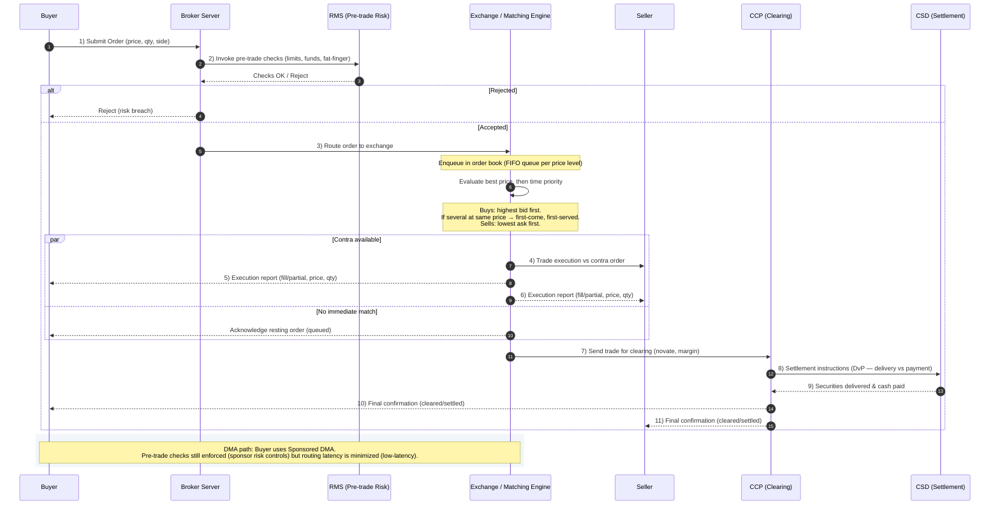

```mermaid
sequenceDiagram
    autonumber
    participant B as Buyer
    participant BRK as Broker Server
    participant RMS as RMS (Pre-trade Risk)
    participant EX as Exchange / Matching Engine
    participant SEL as Seller
    participant CCP as CCP (Clearing)
    participant CSD as CSD (Settlement)

    %% Order entry
    B->>BRK: 1) Submit Order (price, qty, side)
    BRK->>RMS: 2) Invoke pre-trade checks (limits, funds, fat-finger)
    RMS-->>BRK: Checks OK / Reject
    alt Rejected
        BRK-->>B: Reject (risk breach)
    else Accepted
        BRK->>EX: 3) Route order to exchange
        note over EX: Enqueue in order book (FIFO queue per price level)

        %% Matching logic (Price–Time Priority)
        EX->>EX: Evaluate best price, then time priority
        Note over EX: Buys: highest bid first.<br/>If several at same price → first-come, first-served.<br/>Sells: lowest ask first.

        %% Execution
        par Contra available
            EX->>SEL: 4) Trade execution vs contra order
            EX-->>B: 5) Execution report (fill/partial, price, qty)
            EX-->>SEL: 6) Execution report (fill/partial, price, qty)
        and No immediate match
            EX-->>B: Acknowledge resting order (queued)
        end

        %% Post-trade
        EX->>CCP: 7) Send trade for clearing (novate, margin)
        CCP->>CSD: 8) Settlement instructions (DvP — delivery vs payment)
        CSD-->>CCP: 9) Securities delivered & cash paid
        CCP-->>B: 10) Final confirmation (cleared/settled)
        CCP-->>SEL: 11) Final confirmation (cleared/settled)
    end

    %% DMA variant (sponsored access)
    rect rgba(230,238,247,0.5)
    Note over B,EX: DMA path: Buyer uses Sponsored DMA.<br/>Pre-trade checks still enforced (sponsor risk controls) but routing latency is minimized (low-latency).
    end
```
