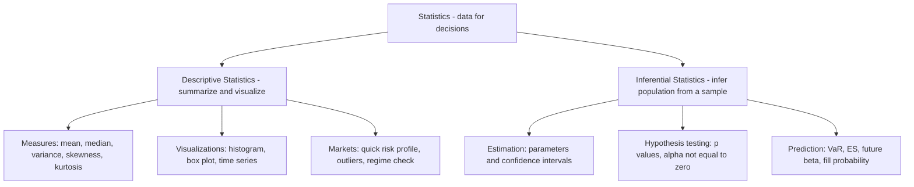
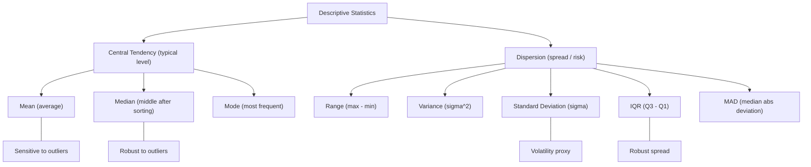

TABLE OF CONTENTS

1 An Introduction to Probability & Statistics
2 Descriptive Statistics I: Visualizing the Data
3 Descriptive Statistics II: Summarizing the Data
4 Basics of Probability Theory
5 Probability Distributions of Random Variables
6 Standard Statistical Distributions
7 Basics of Inferential Statistics
8 Hypothesis Testing
9 Covariance & Correlation
10 Linear Regression
11 Other Resources & Reference Material
Appendix 1
Appendix 2

---

# CHAP I :  An Introduction to Probability & Statistics

we encounter data everywhere in our society. Org takes decision based on data. (better judgment under uncertainty)

#### 1. <ins>What is Statistics?</ins>

Science which deals with collection, organisation, analysing, interpretion and presentation of data to support decision making. It helps decision makers in making informed decision 

could be split in 2 main field **Descriptif stat (summarizing and visualisation of data)** and **Inferential statistics (draw conclusion about a population from a sample)**

#### 2. <ins>Probability vs. Statistics (clear contrast)</ins>

Also study together it remains a difference between both of them.

***Probability*** :Start with a model → ask “**what is the chance this event happens?**” 
Concerned with calculating the likelihood of an event to occuring ang it. "
Ex: “What is the probability daily return < −2% if returns are normal?”
Generally calculated before the even takes place.

***Statistic*** : start with data → ask “**what does the data say about the model/parameters?”**
Comes into play once the event has taken place.
Ex: “Using 3 years of returns, what is the volatility (σ) and its confidence interval?”

| **Topic**     | **Before/After**         | **Typical Question**                     | **Example (markets)**                         |
|---------------|---------------------------|-------------------------------------------|-----------------------------------------------|
| Probability   | Before seeing outcome     | How likely is event **E**?                | Chance of **stop-loss** being hit tomorrow    |
| Statistics    | After observing data      | What are the parameters? Is **alpha** real? | Estimated **Sharpe**, test if **alpha ≠ 0** |

#### 3. <ins>practical application of statistic</ins>

we see stat accross many field such as medicine( predict the presence of a disease in a patient) ; **economy ( analyze relationship between economic measures such as GDP and unemployement rate)** ; business (to study past trends of customer behaviour; A/B test) ; insurance ( to calculate the risk presented by the insured client or property- insurance premium is directly proportional to the risk posed by the insured) ; 

**Finance (sell-side & buy-side)** : to evaluate risks and returns for stocks ; portfolio optimisation, risk management, credit modeling, trading strategy formulation.

- **Risk management:** estimate VaR (Value at Risk) and ES (Expected Shortfall).

- **Portfolio:** optimize mean–variance; estimate beta (market sensitivity).

- **Credit:** model PD/LGD/EAD (probability of default, loss given default, exposure).

- **Trading:** build & test signals; measure alpha (excess return) vs noise.

#### 4. <ins>Statistics in Quant Finance & Algorithmic Trading (desk-friendly)</ins>

- **Signal discovery:** is a pattern real or just **noise**? (use p-values, out-of-sample tests).

- **Parameter estimation:** mean return, **volatility, autocorrelation, cross-correlation** (lead/lag).

- **Backtesting:** **in-sample** fit vs **out-of-sample** performance; avoid **overfitting**.

- **Execution:** estimate **slippage** (execution shortfall), **market impact, fill probability.**

- **Risk:** scenario & **stress tests** (2008, 2020), regime shifts.

- **Monitoring:** production **drift** (live stats ≠ backtest stats), breaks in correlation.

**<ins>Trader vocab (with short hints)</ins>**

**Alpha** (excess return), **beta** (market sensitivity), **vol** (volatility), **drawdown** (peak-to-trough loss), **Sharpe** (return per unit risk), **VaR/ES** (tail risk), **slippage** (execution shortfall), **fill rate** (execution probability).

#### 5. <ins>Common Pitfalls (to avoid early)</ins>

Look-ahead bias (using future info), survivorship bias (dropping failed firms), data-snooping/p-hacking (testing too many ideas), non-stationarity (market regimes change), overfitting (model glued to past).

#### 6. <ins>Mini Example (simple & concrete)</ins>

You have 1,000 daily returns for Stock X.

Descriptive: plot histogram; compute mean, vol, skew, kurtosis.

Inferential: 95% CI for mean return; test H₀: mean = 0 (is there alpha?).

Decision: if alpha is statistically significant and economically meaningful (after costs/slippage), proceed to paper-trade.

#### 7. <ins>Tiny Glossary (one-liners)</ins>

Population: the full set you care about (all possible returns).

Sample: the data you actually have (historical window).

Estimator: formula to estimate a parameter (e.g., sample mean).

Bias/Variance: accuracy vs stability of an estimator.

Confidence Interval (CI): plausible range for a parameter.

p-value: probability of seeing your result (or more extreme) if the null hypothesis were true.

---

# CHAP II:  Descriptive Statistics I: Visualizing the Data

is about describing the caracteristque of a data set, we doing by organising, presenting and summarizing the data effectively

#### 1. <ins>Time Series: tabular data</ins>
Use a simple table (date-indexed) to store Open/High/Low/Close, Volume, and any labels (e.g., Buy/Sell/Hold).

What it shows (markets): evolution of closing price (trend), range (intraday volatility), volume (participation/liquidity), and position signals.

How to read it: scan rows by date to see sequences (streaks), sudden jumps, gaps, or regime changes.

#### 2. <ins>Data Types</ins>**
Collected data can be qualitative or quantitative (important for choosing the right chart / summary).

##### 2.1 Qualitative data :
usually consist of **non-numeric values**, also referred to as "Categorical variables"

Non-numeric labels or categories (e.g., Buy / Sell / Hold, sector, rating).

##### 2.2 Quantitative data:
consist of **numerical values** and can be further divided into discrete and continuous data

###### 2.2.1 Discrete data :
Usually takes up integer values and is often used to represent **countable items**
for example the number of tails when we flip a coin 50 times, the number of children in a family. the variables "shares owned " in the tab is a discrete data as the number of share is never fractional

###### 2.2.2 Continuous data :
data that **can not be counted but measured**. variable of continuous data are within a range but it can take any numerical value. 
Examples: Closing Price; time; returns; spread.

#### 3. <ins>Frequency Distribution of Data</ins>

Frequency distribution of data : show all the possible values(or ranges/bins) that the data can take along the frequency of occurence of these value.

##### 3.1 Categorical example :*

Buy: frequency = 4 → percentage = 4/6 ≈ 66.7%

Sell: frequency = 1 → percentage = 1/6 ≈ 16.7%

Hold: frequency = 1 → percentage = 1/6 ≈ 16.7%

| Category | Frequency | Percentage |
|---|---:|---:|
| Buy | 4 | 66.7% |
| Sell | 1 | 16.7% |
| Hold | 1 | 16.7% |
| **Total** | **6** | **100%** |

##### 3.2 Continuous example (Closing Price):
Values (illustrative): 173.00, 173.44, 171.10, …
Define bins (equal ranges): 165–167, 167–169, 169–171, 171–173, 173–175.
Count each closing price into its bin → build a histogram (shape, center, spread, tails).

Trader vocab: distribution (shape of outcomes), bin (range bucket), mode (peak), fat tails (extreme-risk).

#### 4. <ins> Visualizing the Data</ins>*

**Line chart** : show trend over time (simple way to feel underlying fluctuations).
Markets: momentum, trend breaks, gaps, regime shifts.

**Bar chart** : bars with different heights (vertical or horizontal).
Use for: counts (categorical frequencies), volume by day, returns by month.

**Pie chart** : show proportions of categories (percentage split).
Use for: Buy/Sell/Hold mix, sector allocation. (Best with few categories; otherwise use bar chart.)

#### Rules of thumb (desk):

- **Time evolution → line.**

- **Category comparison → bar.**

- **Share of whole (few slices) → pie.**

- **Distribution shape → histogram (continuous), bar (categorical)**

---

# CHAP III:  Descriptive Statistics II: Summarizing the Data

Here we have 2 mains branches. **The central tendency** which means the **typical level of data** (where values cluster) and the **Dispersion** which means the **spread of the data** ( how scattered values are around the central level.

#### 1. <ins>Measures of Central Tendency (location) </ins>

##### 1.1 <ins>Mean</ins> : 
**(1)Average** that is the sum of all observation divided by the number of observation.
  
$$
\bar{x}=\frac{1}{n}\sum_{i=1}^{n} x_i
$$

Example (Shares Owned) :6 investors with Shares Owned = [0,10,10,5,20,15]
Sum = 60 ; n= 6 ; mean = 10 shares 

If some values repeat, we use a **(2)weighted average (using frequencies)** where **weights = frequencies (how many times a value appears)** 

$$
\bar{x}_{w}=\frac{0\cdot1+5\cdot1+10\cdot2+15\cdot1+20\cdot1}{1+1+2+1+1}
=\frac{60}{6}=10\ \text{shares}
$$

| Shares Owned (x_i) | Frequency (w_i) | Contribution w_i * x_i |
|--------------------|-----------------:|-----------------------:|
| 0                  |                1 |                      0 |
| 5                  |                1 |                      5 |
| 10                 |                2 |                     20 |
| 15                 |                1 |                     15 |
| 20                 |                1 |                     20 |
| **Totals**         |            **6** |                **60** |

Weighted average = 60/6 = 10

Trader vocab : weights (importance/occurrence), **weighted average with volume weights → VWAP (volume-weighted average price) for execution quality.**

example : let have **Discrete trades (k=1...N)** ; **P = trade price**, **Q = trade size**

Continuous form (intergrals over time [t0,t1] )

$$
\mathrm{VWAP}=\frac{\int_{t_0}^{t_1} P_t \, dV_t}{\int_{t_0}^{t_1} dV_t}
$$

$$
P_t = price   process ;
V_t = cumulative  volume 
$$

$$
\int P_t\, dV_t \;\approx\; \sum_{k} P_{t_k}\,\Delta V_{t_k} \;=\; \sum_{k} P_k\, Q_k
$$

 **Mini-example (tick by tick)**

Successive trades:

$$
(P_1,Q_1)=(100,200),\quad (P_2,Q_2)=(101,100),\quad (P_3,Q_3)=(99,700)
$$

- **Cumulative volume after each trade:**
  
$$
V_{t_1}=200,\quad V_{t_2}=300,\quad V_{t_3}=1000.
$$

- **Jumps (equal to trade sizes):**

$$
\Delta V_{t_1}=200,\quad \Delta V_{t_2}=100,\quad \Delta V_{t_3}=700 \;=\; \text{trade sizes}.
$$

- **Bar volume** (if the 3 trades fall in the same 1-minute bar):
  
$$
\mathrm{Volume(1\text{-}min)}=200+100+700=1000.
$$

- **Bar VWAP** (volume-weighted)
  
$$
\mathrm{VWAP}=\frac{100\cdot200+101\cdot100+99\cdot700}{200+100+700}
=\frac{99400}{1000}=99.4.
$$

##### 1.2 <ins>Median</ins>  

The **median** is the **middle value** of a dataset **after sorting in ascending order**.

- **Odd number of observations:** the median is the **single middle value**.  
- **Even number of observations:** the median is the **average of the two middle values**.

**Mini examples**
- Odd: data = 2, 5, 7 → **median = 5**  
- Even: data = 2, 5, 7, 100 → **median = (5 + 7)/2 = 6**

*Trader note:* median is **robust to outliers** (extreme prints), giving a stable “central level” when the distribution has **fat tails**.

--> In fat-tail markets (more extreme moves than normal), prefer median (robust center) for a quick “level,” and use mean with care (sensitive to spikes).

##### 1.3 <ins>Mode</ins> :

The **mode** is the value that occurs **most often** in a dataset (highest frequency).

We can use the frequency distribution of **Shares Owned** to spot the mode:

| Shares Owned | Frequency |
|--------------|----------:|
| 1            |         4 |
| 2            |         1 |
| 3            |         1 |
| 4            |         1 |
| 5            |         3 |

Here, **1** has the **highest frequency (4)**. Hence, the **mode = 1**.

*Notes (market sense):*  
- If two values tie for highest frequency → **bimodal**.  
- If all frequencies are equal → **no clear mode**.  
- Mode is useful for **categorical** or **discrete** variables (e.g., “most common share count”), less informative for continuous prices unless **binned**.

#### 2. <ins>Measures of dispersion (spread/risk) </ins>

##### 2.1 <ins>Range, (max - min)</ins>

 Range is the simplest measure of calculating **variability** : the difference between the largest and the smallest value of a dataset.

 One limitation of using range is that it only reflecs the extremes and says nothing about how values are distributed in between.

**Dataset range (UB30 closing prices)**
| Date       | Close |
|------------|------:|
| 2025-10-13 | 171.10 |
| 2025-10-14 | 172.80 |
| 2025-10-15 | 169.95 |
| 2025-10-16 | 173.44 |
| 2025-10-17 | 174.20 |

- **Max close** = 174.20  
- **Min close** = 169.95  
- **Range** = 174.20 − 169.95 = **4.25**

  *Market sense:* how wide prices (or any metric) spread over a period.

##### 2.2 <ins>Standard Deviation</ins>

Standard deviation is the measure of spread of data relative to its mean.

- High deviation indicates that data are quite far away from the mean.
  
- Less deviation indicates that data points are very close to the mean

**Standard deviation is widely use as a proxy for volatility in the field of quantitative finance**

| | |
|---|---|
|  |  |

$$
\sigma \=\ \sqrt{\;\frac{1}{\,n-1\,}\;\sum_{i=1}^{n}\left(x_i - \bar{x}\right)^2}\,
\qquad
\mu \=\ \frac{1}{n}\sum_{i=1}^{n} x_i
$$

**Where:**

- \(sigma \) = sample standard deviation (proxy for **volatility** in markets)
- \(x_i\) = value of observation \(i\)
- \(n\) = number of observations in the sample
- \(\mu \) = sample mean

###### <ins>Empirical Rule (68–95–99.7)</ins>

If a dataset is <ins>**approximately normal**</ins> (bell-shaped, normal distribution), then most observations fall near the mean **μ** in bands of **σ** (standard deviation):

- **[ μ − 1σ , μ + 1σ ] ≈ 68%** of observations  
- **[ μ − 2σ , μ + 2σ ] ≈ 95%**  
- **[ μ − 3σ , μ + 3σ ] ≈ 99.7%**

###### How to read it (market sense):
- **σ** is a proxy for **volatility** (dispersion).  
- a daily return within **±1σ** is “common”; beyond **±2σ** is “unusual”; beyond **±3σ** is “rare”.

###### Z-score link:

The **z-score** tells how many **standard deviations (σ)** a value **x** is from the mean **μ**.

$z=\frac{x-\mu}{\sigma}$

- $|z|\le 1$ $\Rightarrow$ inside $\pm 1\sigma$ (~68%)
- $|z|\le 2$ $\Rightarrow$ inside $\pm 2\sigma$ (~95%)
- $|z|\le 3$ $\Rightarrow$ inside $\pm 3\sigma$ (~99.7%)
-  **In short:** “$|z| > 3$” x is an outlier but only if we are in the normality. Outside normality consider IQR/MAD tools. 

###### Usage (desk):

- Build **risk bands** around μ (e.g., μ ± kσ) to gauge moves.  
- Compare assets/days using **z-scores** (standardized returns).  
- Convert **daily σ** to annual: \( \sigma_{\text{ann}} \approx \sigma_{\text{daily}}\sqrt{252} \).

###### Caveats:
- Works **only** if the distribution is close to **normal**.  
- Markets often have **fat tails** (more extremes) and **skew** (asymmetry).  
  → The rule can **underestimate** extreme-move probabilities; always backtest/validate.

##### 2.3 <ins>Variance</ins>

This variable is closely linked to the standard deviation. Mathematically, variance is just the square of the standard deviation. both essentially convey the same information

$$
\sigma^{2} \=\ \frac{1}{\,n-1\,}\sum_{i=1}^{n}\bigl(x_i-\mu\bigr)^2
\qquad
\mu \=\ \frac{1}{n}\sum_{i=1}^{n} x_i
$$

**Where:**

- \(\sigma^{2}\) = **sample variance** (square of the standard deviation; proxy for volatility\(^2\))  
- \(x_i\) = value of observation \(i\)  
- \(n\) = number of observations in the sample  
- \(\mu\) = sample mean

*Note:* variance is in **squared units** (e.g., \(%^2\) for returns). Standard deviation is \(\sigma=\sqrt{\sigma^2}\) (same units as the data).

> **why square?**  
> - Prevents +/− deviations from canceling out (captures spread around the mean).  
> - Gives extra weight to large deviations ( 10 counts more than 5 because 100 > 25).  
> - Has convenient math properties (least squares, var–cov models, derivatives).  
> - We often report **standard deviation = √variance** for interpretability (same units as data).  
> - Alternative: use **MAD / IQR** when you want robustness to outliers.

#### <ins>Trader vocab (quick)</ins>

Level = central tendency (typical price/return).

Vol/variance = dispersion (risk/spread).

Median = robust center (resists outliers/spikes).

IQR/MAD = robust spread (less sensitive to extremes)

---

 # CHAP IV : Basics of Probability Theory

#### 1. <ins>Definitions and Terminology</ins>

 let suppose we are playing a game of dice. The die has 6 sided and is fair. Every side or face has an equal chance of turning up on rolling. Before rolling the die, the results are unknown. This is term as a <ins>**Random experiment**</ins>. Once the experiment is over, that is once we roll the die, we get to know the result. These result are termed as <ins>**Outcomes**</ins>.

Then, when we roll this die we have 6 possibles outcomes. The set of all possibles outcomes is termed as the **Sample Space**. It is denoted by the <ins>**Greek alphabet omega = {Sample Space}**</ins>

- Rolling a 6-sided die : Omega = {1,2,3,4,5,6}
  
- Flipping a Coin  : Omega ={Heads,Tails}

When a random experience is repeated several times, we term each of these repetitions as a **Trial**. 

- When we roll a six-faced fair die repeatedly, each trial would have an outcome from 1 to 6

- In our trial of flipping a fair coin once, each trial will result in either heads or tails for each trial.

  Suppose we consider a subset of the rolling die sample space : {2,3,5} ; {1,3,5} ; {3,6}.

   Any subset is termed as an <ins>**Event**</ins>.

  Still for this game, an Event can be to get a an odd number; to roll a multiple of three or to land a prime number : 

  - **E(odd) = {1,3,5}** 
 
  - **E(3x) = {3,6}**
 
  - **E(prime) = {2,3,5}** 

<ins>**The probability**</ins> now is termed as the <ins>**chance of an event taking place**</ins>.

an Event that is certain to happen has a probability of 1, ***P(E) = 1*** / NO CHANCE to happen has a probability of 0, ***P(E) = 0*** / IF there is any chance to the probability to happen then probability lies between 0 and 1 ***0<P(E)<1***

<table>
  <tr>
    <td style="border:1px solid #bbb; padding:10px; text-align:center;">
      $\mathbb{P}(\text{Event})=\dfrac{\text{Number of Favourable Outcomes}}{\text{Total Number of Possible Outcomes}}$
    </td>
  </tr>
</table>

#### 2. Exemple Coin Flip — 3 Tosses (Sample Space)

**Setup** : 
- Outcomes per toss: **H** (Heads), **T** (Tails)  
- Tosses: **3**, independent, fair coin

<ins>**Rule of Product**</ins>  
- \(2 \times 2 \times 2 = 2^3 = 8\) possible sequences.

<ins>**Sample Space \(\Omega\)**</ins>  
\[
\Omega = \{ \text{HHH}, \text{HHT}, \text{HTH}, \text{HTT}, \text{THH}, \text{THT}, \text{TTH}, \text{TTT} \}
\]

<ins>**Uniform probabilities**</ins>  
- For a fair coin: \(P(\text{each sequence}) = 1/8\).

---

### Counting Heads with a Binomial Model
Let \(X =\) number of Heads in 3 tosses. Then \(X \sim \text{Binomial}(n=3, p=1/2)\).

\[
P(X=k) = \binom{3}{k}\left(\tfrac{1}{2}\right)^3, \quad k=0,1,2,3.
\]

| k (Heads) | Sequences                          | \(P(X=k)\) |
|:---------:|------------------------------------|:----------:|
| 0         | TTT                                | 1/8        |
| 1         | HTT, THT, TTH                      | 3/8        |
| 2         | HHT, HTH, THH                      | 3/8        |
| 3         | HHH                                | 1/8        |

---

### Example Events
- **Exactly 2 Heads**: \(\{\text{HHT}, \text{HTH}, \text{THH}\}\) — \(P=3/8\)  
- **At least 1 Head**: \(\Omega \setminus \{\text{TTT}\}\) — \(P=7/8\)  
- **First toss is Head**: \(\{\text{HHH}, \text{HHT}, \text{HTH}, \text{HTT}\}\) — \(P=4/8=1/2\)

#### 2. <ins>Union and Intersection</ins> 

"02:53" 

#### 3. <ins>Inclusion-Exclusion Principle</ins> 

#### 4. <ins>Mutually Exclusice/ Disjoint Events</ins> 

---

# CHAP V : Probability Distributions of Random Variables

---

# CHAP VI :Standard Statistical Distributions

---

# CHAP VII :  Basics of Inferential Statistics

---

# CHAP VIII : Hypothesis Testing

---

# CHAP IX :  Covariance & Correlation

---

# CHAP X : Linear Regression

---

# CHAP XI :Other Resources & Reference Material

