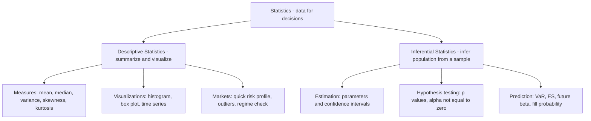

TABLE OF CONTENTS

1 An Introduction to Probability & Statistics
2 Descriptive Statistics I: Visualizing the Data
3 Descriptive Statistics II: Summarizing the Data
4 Basics of Probability Theory
5 Probability Distributions of Random Variables
6 Standard Statistical Distributions
7 Basics of Inferential Statistics
8 Hypothesis Testing
9 Covariance & Correlation
10 Linear Regression
11 Other Resources & Reference Material
Appendix 1
Appendix 2

---

#### CHAP I :  An Introduction to Probability & Statistics

we encounter data everywhere in our society. Org takes decision based on data. (better judgment under uncertainty)

**<ins>What is Statistics?</ins>**

Science which deals with collection, organisation, analysing, interpretion and presentation of data to support decision making. It helps decision makers in making informed decision 

could be split in 2 main field **Descriptif stat (summarizing and visualisation of data)** and **Inferential statistics (draw conclusion about a population from a sample)**

**<ins>Probability vs. Statistics (clear contrast)</ins>**

Also study together it remains a difference between both of them.

***Probability*** :Start with a model → ask “**what is the chance this event happens?**” 
Concerned with calculating the likelihood of an event to occuring ang it. "
Ex: “What is the probability daily return < −2% if returns are normal?”
Generally calculated before the even takes place.

***Statistic*** : start with data → ask “**what does the data say about the model/parameters?”**
Comes into play once the event has taken place.
Ex: “Using 3 years of returns, what is the volatility (σ) and its confidence interval?”

| **Topic**     | **Before/After**         | **Typical Question**                     | **Example (markets)**                         |
|---------------|---------------------------|-------------------------------------------|-----------------------------------------------|
| Probability   | Before seeing outcome     | How likely is event **E**?                | Chance of **stop-loss** being hit tomorrow    |
| Statistics    | After observing data      | What are the parameters? Is **alpha** real? | Estimated **Sharpe**, test if **alpha ≠ 0** |

**<ins>4.practical application of statistic</ins>**

we see stat accross many field such as medicine( predict the presence of a disease in a patient) ; **economy ( analyze relationship between economic measures such as GDP and unemployement rate)** ; business (to study past trends of customer behaviour; A/B test) ; insurance ( to calculate the risk presented by the insured client or property- insurance premium is directly proportional to the risk posed by the insured) ; 

**Finance (sell-side & buy-side)** : to evaluate risks and returns for stocks ; portfolio optimisation, risk management, credit modeling, trading strategy formulation.

- **Risk management:** estimate VaR (Value at Risk) and ES (Expected Shortfall).

- **Portfolio:** optimize mean–variance; estimate beta (market sensitivity).

- **Credit:** model PD/LGD/EAD (probability of default, loss given default, exposure).

- **Trading:** build & test signals; measure alpha (excess return) vs noise.

**<ins>Statistics in Quant Finance & Algorithmic Trading (desk-friendly)</ins>**

- **Signal discovery:** is a pattern real or just **noise**? (use p-values, out-of-sample tests).

- **Parameter estimation:** mean return, **volatility, autocorrelation, cross-correlation** (lead/lag).

- **Backtesting:** **in-sample** fit vs **out-of-sample** performance; avoid **overfitting**.

- **Execution:** estimate **slippage** (execution shortfall), **market impact, fill probability.**

- **Risk:** scenario & **stress tests** (2008, 2020), regime shifts.

- **Monitoring:** production **drift** (live stats ≠ backtest stats), breaks in correlation.

**<ins>Trader vocab (with short hints)</ins>**

**Alpha** (excess return), **beta** (market sensitivity), **vol** (volatility), **drawdown** (peak-to-trough loss), **Sharpe** (return per unit risk), **VaR/ES** (tail risk), **slippage** (execution shortfall), **fill rate** (execution probability).

**<ins>Common Pitfalls (to avoid early)</ins>**

Look-ahead bias (using future info), survivorship bias (dropping failed firms), data-snooping/p-hacking (testing too many ideas), non-stationarity (market regimes change), overfitting (model glued to past).

**<ins>Mini Example (simple & concrete)</ins>**

You have 1,000 daily returns for Stock X.

Descriptive: plot histogram; compute mean, vol, skew, kurtosis.

Inferential: 95% CI for mean return; test H₀: mean = 0 (is there alpha?).

Decision: if alpha is statistically significant and economically meaningful (after costs/slippage), proceed to paper-trade.

**<ins>Tiny Glossary (one-liners)</ins>**

Population: the full set you care about (all possible returns).

Sample: the data you actually have (historical window).

Estimator: formula to estimate a parameter (e.g., sample mean).

Bias/Variance: accuracy vs stability of an estimator.

Confidence Interval (CI): plausible range for a parameter.

p-value: probability of seeing your result (or more extreme) if the null hypothesis were true.

---

#### CHAP II : Descriptive Statistics I: Visualizing the Data

is about describing the caracteristque of a data set, we doing by organising, presenting and summarizing the data effectively

exemple : ....

**<ins>1) Time Series: tabular data</ins>
Use a simple table (date-indexed) to store Open/High/Low/Close, Volume, and any labels (e.g., Buy/Sell/Hold).

What it shows (markets): evolution of closing price (trend), range (intraday volatility), volume (participation/liquidity), and position signals.

How to read it: scan rows by date to see sequences (streaks), sudden jumps, gaps, or regime changes.

**<ins>2) Data Types</ins>**
Collected data can be qualitative or quantitative (important for choosing the right chart / summary).

**2.1 Qualitative data :** usually consist of non-numeric values, also referred to as "Categorical variables"

Non-numeric labels or categories (e.g., Buy / Sell / Hold, sector, rating).

**2.2 Quantitative data:** consist of numerical values and can be further divided into discrete and continuous data

*2.2.1 Discrete data :* Usually takes up integer values and is often used to represent countable item
for example the number of tails when we flip a coin 50 times, the number of children in a family. the variables "shares owned " in the tab is a discrete data as the number of share is never fractional

*2.2.2 Continuous data :* data that can not be counted but measured. variable of continuous data are within a range but it can take any numerical value. 
Examples: Closing Price; time; returns; spread.

**<ins>3) Frequency Distribution of Data</ins>**

Frequency distribution of data : SHOW all the possible values(or ranges/bins) that the data can take along the frequency of occurence of these value.

*3.1 Categorical example :*

Buy: frequency = 4 → percentage = 4/6 ≈ 66.7%

Sell: frequency = 1 → percentage = 1/6 ≈ 16.7%

Hold: frequency = 1 → percentage = 1/6 ≈ 16.7%

| Category | Frequency | Percentage |
|---|---:|---:|
| Buy | 4 | 66.7% |
| Sell | 1 | 16.7% |
| Hold | 1 | 16.7% |
| **Total** | **6** | **100%** |

*3.2 Continuous example (Closing Price):*
Values (illustrative): 173.00, 173.44, 171.10, …
Define bins (equal ranges): 165–167, 167–169, 169–171, 171–173, 173–175.
Count each closing price into its bin → build a histogram (shape, center, spread, tails).

Trader vocab: distribution (shape of outcomes), bin (range bucket), mode (peak), fat tails (extreme-risk).

**<ins>4) Visualizing the Data</ins>**

**Line chart** : show trend over time (simple way to feel underlying fluctuations).
Markets: momentum, trend breaks, gaps, regime shifts.

**Bar chart** : bars with different heights (vertical or horizontal).
Use for: counts (categorical frequencies), volume by day, returns by month.

**Pie chart** : show proportions of categories (percentage split).
Use for: Buy/Sell/Hold mix, sector allocation. (Best with few categories; otherwise use bar chart.)

**Rules of thumb (desk):**

- **Time evolution → line.**

- **Category comparison → bar.**

- **Share of whole (few slices) → pie.**

- **Distribution shape → histogram (continuous), bar (categorical)**

---

#### CHAP III :  Descriptive Statistics II: Summarizing the Data

---

#### Basics of Probability Theory

---

#### Probability Distributions of Random Variables

---

#### 6 Standard Statistical Distributions

---

#### 7 Basics of Inferential Statistics
---
#### 8 Hypothesis Testing
---
#### 9 Covariance & Correlation

#### 10 Linear Regression
---
#### 11 Other Resources & Reference Material

