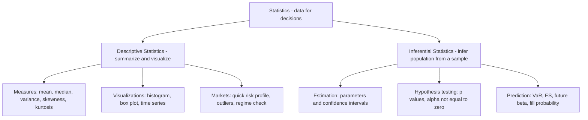
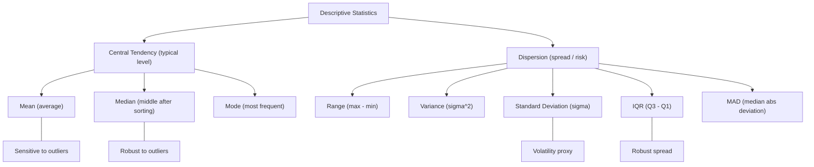

TABLE OF CONTENTS

1 An Introduction to Probability & Statistics
2 Descriptive Statistics I: Visualizing the Data
3 Descriptive Statistics II: Summarizing the Data
4 Basics of Probability Theory
5 Probability Distributions of Random Variables
6 Standard Statistical Distributions
7 Basics of Inferential Statistics
8 Hypothesis Testing
9 Covariance & Correlation
10 Linear Regression
11 Other Resources & Reference Material
Appendix 1
Appendix 2

---

# CHAP I :  An Introduction to Probability & Statistics

we encounter data everywhere in our society. Org takes decision based on data. (better judgment under uncertainty)

#### 1. <ins>What is Statistics?</ins>

Science which deals with collection, organisation, analysing, interpretion and presentation of data to support decision making. It helps decision makers in making informed decision 

could be split in 2 main field **Descriptif stat (summarizing and visualisation of data)** and **Inferential statistics (draw conclusion about a population from a sample)**

#### 2. <ins>Probability vs. Statistics (clear contrast)</ins>

Also study together it remains a difference between both of them.

***Probability*** :Start with a model → ask “**what is the chance this event happens?**” 
Concerned with calculating the likelihood of an event to occuring ang it. "
Ex: “What is the probability daily return < −2% if returns are normal?”
Generally calculated before the even takes place.

***Statistic*** : start with data → ask “**what does the data say about the model/parameters?”**
Comes into play once the event has taken place.
Ex: “Using 3 years of returns, what is the volatility (σ) and its confidence interval?”

| **Topic**     | **Before/After**         | **Typical Question**                     | **Example (markets)**                         |
|---------------|---------------------------|-------------------------------------------|-----------------------------------------------|
| Probability   | Before seeing outcome     | How likely is event **E**?                | Chance of **stop-loss** being hit tomorrow    |
| Statistics    | After observing data      | What are the parameters? Is **alpha** real? | Estimated **Sharpe**, test if **alpha ≠ 0** |

#### 3. <ins>practical application of statistic</ins>

we see stat accross many field such as medicine( predict the presence of a disease in a patient) ; **economy ( analyze relationship between economic measures such as GDP and unemployement rate)** ; business (to study past trends of customer behaviour; A/B test) ; insurance ( to calculate the risk presented by the insured client or property- insurance premium is directly proportional to the risk posed by the insured) ; 

**Finance (sell-side & buy-side)** : to evaluate risks and returns for stocks ; portfolio optimisation, risk management, credit modeling, trading strategy formulation.

- **Risk management:** estimate VaR (Value at Risk) and ES (Expected Shortfall).

- **Portfolio:** optimize mean–variance; estimate beta (market sensitivity).

- **Credit:** model PD/LGD/EAD (probability of default, loss given default, exposure).

- **Trading:** build & test signals; measure alpha (excess return) vs noise.

#### 4. <ins>Statistics in Quant Finance & Algorithmic Trading (desk-friendly)</ins>

- **Signal discovery:** is a pattern real or just **noise**? (use p-values, out-of-sample tests).

- **Parameter estimation:** mean return, **volatility, autocorrelation, cross-correlation** (lead/lag).

- **Backtesting:** **in-sample** fit vs **out-of-sample** performance; avoid **overfitting**.

- **Execution:** estimate **slippage** (execution shortfall), **market impact, fill probability.**

- **Risk:** scenario & **stress tests** (2008, 2020), regime shifts.

- **Monitoring:** production **drift** (live stats ≠ backtest stats), breaks in correlation.

**<ins>Trader vocab (with short hints)</ins>**

**Alpha** (excess return), **beta** (market sensitivity), **vol** (volatility), **drawdown** (peak-to-trough loss), **Sharpe** (return per unit risk), **VaR/ES** (tail risk), **slippage** (execution shortfall), **fill rate** (execution probability).

#### 5. <ins>Common Pitfalls (to avoid early)</ins>

Look-ahead bias (using future info), survivorship bias (dropping failed firms), data-snooping/p-hacking (testing too many ideas), non-stationarity (market regimes change), overfitting (model glued to past).

#### 6. <ins>Mini Example (simple & concrete)</ins>

You have 1,000 daily returns for Stock X.

Descriptive: plot histogram; compute mean, vol, skew, kurtosis.

Inferential: 95% CI for mean return; test H₀: mean = 0 (is there alpha?).

Decision: if alpha is statistically significant and economically meaningful (after costs/slippage), proceed to paper-trade.

#### 7. <ins>Tiny Glossary (one-liners)</ins>

Population: the full set you care about (all possible returns).

Sample: the data you actually have (historical window).

Estimator: formula to estimate a parameter (e.g., sample mean).

Bias/Variance: accuracy vs stability of an estimator.

Confidence Interval (CI): plausible range for a parameter.

p-value: probability of seeing your result (or more extreme) if the null hypothesis were true.

---

# CHAP II:  Descriptive Statistics I: Visualizing the Data

is about describing the caracteristque of a data set, we doing by organising, presenting and summarizing the data effectively

#### 1. <ins>Time Series: tabular data</ins>
Use a simple table (date-indexed) to store Open/High/Low/Close, Volume, and any labels (e.g., Buy/Sell/Hold).

What it shows (markets): evolution of closing price (trend), range (intraday volatility), volume (participation/liquidity), and position signals.

How to read it: scan rows by date to see sequences (streaks), sudden jumps, gaps, or regime changes.

#### 2. <ins>Data Types</ins>**
Collected data can be qualitative or quantitative (important for choosing the right chart / summary).

##### 2.1 Qualitative data :
usually consist of **non-numeric values**, also referred to as "Categorical variables"

Non-numeric labels or categories (e.g., Buy / Sell / Hold, sector, rating).

##### 2.2 Quantitative data:
consist of **numerical values** and can be further divided into discrete and continuous data

###### 2.2.1 Discrete data :
Usually takes up integer values and is often used to represent **countable items**
for example the number of tails when we flip a coin 50 times, the number of children in a family. the variables "shares owned " in the tab is a discrete data as the number of share is never fractional

###### 2.2.2 Continuous data :
data that **can not be counted but measured**. variable of continuous data are within a range but it can take any numerical value. 
Examples: Closing Price; time; returns; spread.

#### 3. <ins>Frequency Distribution of Data</ins>

Frequency distribution of data : show all the possible values(or ranges/bins) that the data can take along the frequency of occurence of these value.

##### 3.1 Categorical example :*

Buy: frequency = 4 → percentage = 4/6 ≈ 66.7%

Sell: frequency = 1 → percentage = 1/6 ≈ 16.7%

Hold: frequency = 1 → percentage = 1/6 ≈ 16.7%

| Category | Frequency | Percentage |
|---|---:|---:|
| Buy | 4 | 66.7% |
| Sell | 1 | 16.7% |
| Hold | 1 | 16.7% |
| **Total** | **6** | **100%** |

##### 3.2 Continuous example (Closing Price):
Values (illustrative): 173.00, 173.44, 171.10, …
Define bins (equal ranges): 165–167, 167–169, 169–171, 171–173, 173–175.
Count each closing price into its bin → build a histogram (shape, center, spread, tails).

Trader vocab: distribution (shape of outcomes), bin (range bucket), mode (peak), fat tails (extreme-risk).

#### 4. <ins> Visualizing the Data</ins>*

**Line chart** : show trend over time (simple way to feel underlying fluctuations).
Markets: momentum, trend breaks, gaps, regime shifts.

**Bar chart** : bars with different heights (vertical or horizontal).
Use for: counts (categorical frequencies), volume by day, returns by month.

**Pie chart** : show proportions of categories (percentage split).
Use for: Buy/Sell/Hold mix, sector allocation. (Best with few categories; otherwise use bar chart.)

#### Rules of thumb (desk):

- **Time evolution → line.**

- **Category comparison → bar.**

- **Share of whole (few slices) → pie.**

- **Distribution shape → histogram (continuous), bar (categorical)**

---

# CHAP III:  Descriptive Statistics II: Summarizing the Data

Here we have 2 mains branches. **The central tendency** which means the **typical level of data** (where values cluster) and the **Dispersion** which means the **spread of the data** ( how scattered values are around the central level.

#### 1. <ins>Measures of Central Tendency (location) </ins>

##### 1.1 <ins>Mean</ins> : 
**(1)Average** that is the sum of all observation divided by the number of observation.
  
$$
\bar{x}=\frac{1}{n}\sum_{i=1}^{n} x_i
$$

Example (Shares Owned) :6 investors with Shares Owned = [0,10,10,5,20,15]
Sum = 60 ; n= 6 ; mean = 10 shares 

If some values repeat, we use a **(2)weighted average (using frequencies)** where **weights = frequencies (how many times a value appears)** 

$$
\bar{x}_{w}=\frac{0\cdot1+5\cdot1+10\cdot2+15\cdot1+20\cdot1}{1+1+2+1+1}
=\frac{60}{6}=10\ \text{shares}
$$

| Shares Owned (x_i) | Frequency (w_i) | Contribution w_i * x_i |
|--------------------|-----------------:|-----------------------:|
| 0                  |                1 |                      0 |
| 5                  |                1 |                      5 |
| 10                 |                2 |                     20 |
| 15                 |                1 |                     15 |
| 20                 |                1 |                     20 |
| **Totals**         |            **6** |                **60** |

Weighted average = 60/6 = 10

Trader vocab : weights (importance/occurrence), **weighted average with volume weights → VWAP (volume-weighted average price) for execution quality.**

example : let have **Discrete trades (k=1...N)** ; **P = trade price**, **Q = trade size**

Continuous form (intergrals over time [t0,t1] )

$$
\mathrm{VWAP}=\frac{\int_{t_0}^{t_1} P_t \, dV_t}{\int_{t_0}^{t_1} dV_t}
$$

$$
P_t = price   process ;
V_t = cumulative  volume 
$$

$$
\int P_t\, dV_t \;\approx\; \sum_{k} P_{t_k}\,\Delta V_{t_k} \;=\; \sum_{k} P_k\, Q_k
$$

 **Mini-example (tick by tick)**

Successive trades:

$$
(P_1,Q_1)=(100,200),\quad (P_2,Q_2)=(101,100),\quad (P_3,Q_3)=(99,700)
$$

- **Cumulative volume after each trade:**
  
$$
V_{t_1}=200,\quad V_{t_2}=300,\quad V_{t_3}=1000.
$$

- **Jumps (equal to trade sizes):**

$$
\Delta V_{t_1}=200,\quad \Delta V_{t_2}=100,\quad \Delta V_{t_3}=700 \;=\; \text{trade sizes}.
$$

- **Bar volume** (if the 3 trades fall in the same 1-minute bar):
  
$$
\mathrm{Volume(1\text{-}min)}=200+100+700=1000.
$$

- **Bar VWAP** (volume-weighted)
  
$$
\mathrm{VWAP}=\frac{100\cdot200+101\cdot100+99\cdot700}{200+100+700}
=\frac{99400}{1000}=99.4.
$$

##### 1.2 <ins>Median</ins>  

The **median** is the **middle value** of a dataset **after sorting in ascending order**.

- **Odd number of observations:** the median is the **single middle value**.  
- **Even number of observations:** the median is the **average of the two middle values**.

**Mini examples**
- Odd: data = 2, 5, 7 → **median = 5**  
- Even: data = 2, 5, 7, 100 → **median = (5 + 7)/2 = 6**

*Trader note:* median is **robust to outliers** (extreme prints), giving a stable “central level” when the distribution has **fat tails**.

--> In fat-tail markets (more extreme moves than normal), prefer median (robust center) for a quick “level,” and use mean with care (sensitive to spikes).

##### 1.3 <ins>Mode</ins> :

The **mode** is the value that occurs **most often** in a dataset (highest frequency).

We can use the frequency distribution of **Shares Owned** to spot the mode:

| Shares Owned | Frequency |
|--------------|----------:|
| 1            |         4 |
| 2            |         1 |
| 3            |         1 |
| 4            |         1 |
| 5            |         3 |

Here, **1** has the **highest frequency (4)**. Hence, the **mode = 1**.

*Notes (market sense):*  
- If two values tie for highest frequency → **bimodal**.  
- If all frequencies are equal → **no clear mode**.  
- Mode is useful for **categorical** or **discrete** variables (e.g., “most common share count”), less informative for continuous prices unless **binned**.

#### 2. <ins>Measures of dispersion (spread/risk) </ins>

##### 2.1 <ins>Range, (max - min)</ins>

 Range is the simplest measure of calculating **variability** : the difference between the largest and the smallest value of a dataset.

 One limitation of using range is that it only reflecs the extremes and says nothing about how values are distributed in between.

**Dataset range (UB30 closing prices)**
| Date       | Close |
|------------|------:|
| 2025-10-13 | 171.10 |
| 2025-10-14 | 172.80 |
| 2025-10-15 | 169.95 |
| 2025-10-16 | 173.44 |
| 2025-10-17 | 174.20 |

- **Max close** = 174.20  
- **Min close** = 169.95  
- **Range** = 174.20 − 169.95 = **4.25**

  *Market sense:* how wide prices (or any metric) spread over a period.

##### 2.2 <ins>Standard Deviation</ins>

Standard deviation is the measure of spread of data relative to its mean.

- High deviation indicates that data are quite far away from the mean.
  
- Less deviation indicates that data points are very close to the mean

**Standard deviation is widely use as a proxy for volatility in the field of quantitative finance**

| | |
|---|---|
|  |  |

$$
\sigma \=\ \sqrt{\;\frac{1}{\,n-1\,}\;\sum_{i=1}^{n}\left(x_i - \bar{x}\right)^2}\,
\qquad
\mu \=\ \frac{1}{n}\sum_{i=1}^{n} x_i
$$

**Where:**

- \(sigma \) = sample standard deviation (proxy for **volatility** in markets)
- \(x_i\) = value of observation \(i\)
- \(n\) = number of observations in the sample
- \(\mu \) = sample mean

###### <ins>Empirical Rule (68–95–99.7)</ins>

If a dataset is <ins>**approximately normal**</ins> (bell-shaped, normal distribution), then most observations fall near the mean **μ** in bands of **σ** (standard deviation):

- **[ μ − 1σ , μ + 1σ ] ≈ 68%** of observations  
- **[ μ − 2σ , μ + 2σ ] ≈ 95%**  
- **[ μ − 3σ , μ + 3σ ] ≈ 99.7%**

###### How to read it (market sense):
- **σ** is a proxy for **volatility** (dispersion).  
- a daily return within **±1σ** is “common”; beyond **±2σ** is “unusual”; beyond **±3σ** is “rare”.

###### Z-score link:

The **z-score** tells how many **standard deviations (σ)** a value **x** is from the mean **μ**.

$z=\frac{x-\mu}{\sigma}$

- $|z|\le 1$ $\Rightarrow$ inside $\pm 1\sigma$ (~68%)
- $|z|\le 2$ $\Rightarrow$ inside $\pm 2\sigma$ (~95%)
- $|z|\le 3$ $\Rightarrow$ inside $\pm 3\sigma$ (~99.7%)
-  **In short:** “$|z| > 3$” x is an outlier but only if we are in the normality. Outside normality consider IQR/MAD tools. 

###### Usage (desk):

- Build **risk bands** around μ (e.g., μ ± kσ) to gauge moves.  
- Compare assets/days using **z-scores** (standardized returns).  
- Convert **daily σ** to annual: \( \sigma_{\text{ann}} \approx \sigma_{\text{daily}}\sqrt{252} \).

###### Caveats:
- Works **only** if the distribution is close to **normal**.  
- Markets often have **fat tails** (more extremes) and **skew** (asymmetry).  
  → The rule can **underestimate** extreme-move probabilities; always backtest/validate.

##### 2.3 <ins>Variance</ins>

This variable is closely linked to the standard deviation. Mathematically, variance is just the square of the standard deviation. both essentially convey the same information

$$
\sigma^{2} \=\ \frac{1}{\,n-1\,}\sum_{i=1}^{n}\bigl(x_i-\mu\bigr)^2
\qquad
\mu \=\ \frac{1}{n}\sum_{i=1}^{n} x_i
$$

**Where:**

- \(\sigma^{2}\) = **sample variance** (square of the standard deviation; proxy for volatility\(^2\))  
- \(x_i\) = value of observation \(i\)  
- \(n\) = number of observations in the sample  
- \(\mu\) = sample mean

*Note:* variance is in **squared units** (e.g., \(%^2\) for returns). Standard deviation is \(\sigma=\sqrt{\sigma^2}\) (same units as the data).

> **why square?**  
> - Prevents +/− deviations from canceling out (captures spread around the mean).  
> - Gives extra weight to large deviations ( 10 counts more than 5 because 100 > 25).  
> - Has convenient math properties (least squares, var–cov models, derivatives).  
> - We often report **standard deviation = √variance** for interpretability (same units as data).  
> - Alternative: use **MAD / IQR** when you want robustness to outliers.

#### <ins>Trader vocab (quick)</ins>

Level = central tendency (typical price/return).

Vol/variance = dispersion (risk/spread).

Median = robust center (resists outliers/spikes).

IQR/MAD = robust spread (less sensitive to extremes)

---

 # CHAP IV : Basics of Probability Theory

#### 1. <ins>Definitions and Terminology</ins>

 let suppose we are playing a game of dice. The die has 6 sided and is fair. Every side or face has an equal chance of turning up on rolling. Before rolling the die, the results are unknown. This is term as a <ins>**Random experiment**</ins>. Once the experiment is over, that is once we roll the die, we get to know the result. These result are termed as <ins>**Outcomes**</ins>.

Then, when we roll this die we have 6 possibles outcomes. The set of all possibles outcomes is termed as the **Sample Space**. It is denoted by the <ins>**Greek alphabet omega = {Sample Space}**</ins>

- Rolling a 6-sided die : Omega = {1,2,3,4,5,6}
  
- Flipping a Coin  : Omega ={Heads,Tails}

When a random experience is repeated several times, we term each of these repetitions as a **Trial**. 

- When we roll a six-faced fair die repeatedly, each trial would have an outcome from 1 to 6

- In our trial of flipping a fair coin once, each trial will result in either heads or tails for each trial.

  Suppose we consider a subset of the rolling die sample space : {2,3,5} ; {1,3,5} ; {3,6}.

   Any subset is termed as an <ins>**Event**</ins>.

  Still for this game, an Event can be to get a an odd number; to roll a multiple of three or to land a prime number : 

  - **E(odd) = {1,3,5}** 
 
  - **E(3x) = {3,6}**
 
  - **E(prime) = {2,3,5}** 

<ins>**The probability**</ins> now is termed as the <ins>**chance of an event taking place**</ins>.

an Event that is certain to happen has a probability of 1, ***P(E) = 1*** / NO CHANCE to happen has a probability of 0, ***P(E) = 0*** / IF there is any chance to the probability to happen then probability lies between 0 and 1 ***0<P(E)<1***

<table>
  <tr>
    <td style="border:1px solid #bbb; padding:10px; text-align:center;">
      $\mathbb{P}(\text{Event})=\dfrac{\text{Number of Favourable Outcomes}}{\text{Total Number of Possible Outcomes}}$
    </td>
  </tr>
</table>

#### 2. <ins>Exemple Coin Flip — 3 Tosses (Sample Space)</ins>

**Setup** : 
- Outcomes per toss: **H** (Heads), **T** (Tails)  
- Tosses: **3**, independent, fair coin

<ins>**Rule of Product**</ins> :
$2 \times 2 \times 2 = 2^3 = 8$ possible sequences.

<ins>**Sample Space ($\Omega$)**<ins> :

$$
\Omega=\{\mathrm{HHH},\ \mathrm{HHT},\ \mathrm{HTH},\ \mathrm{HTT},\ \mathrm{THH},\ \mathrm{THT},\ \mathrm{TTH},\ \mathrm{TTT}\}
$$

<ins>**Uniform probabilities**</ins> :
For a fair coin: $P(\text{each sequence}) = \tfrac{1}{8}$.

<ins>**Counting Heads with a Binomial Model**</ins>
Let $X$ = number of Heads in 3 tosses. Then $X \sim \mathrm{Binomial}(n=3,\ p=\tfrac12)$.

$$
P(X=k)=\binom{3}{k}\left(\tfrac12\right)^3,\quad k=0,1,2,3.
$$

| k (Heads) | Sequences                          | \(P(X=k)\) |
|:---------:|------------------------------------|:----------:|
| 0         | TTT                                | 1/8        |
| 1         | HTT, THT, TTH                      | 3/8        |
| 2         | HHT, HTH, THH                      | 3/8        |
| 3         | HHH                                | 1/8        |

**Example Events**
- **Exactly 2 Heads**: $\{\mathrm{HHT},\,\mathrm{HTH},\,\mathrm{THH}\}$  $P=3/8$
- **At least 1 Head**: $\Omega \setminus \{\mathrm{TTT}\}$ $P=7/8$
- **First toss is Head**: $\{\mathrm{HHH},\,\mathrm{HHT},\,\mathrm{HTH},\,\mathrm{HTT}\}$ — $P=4/8=1/2$

#### 2. <ins>Union and Intersection</ins> 

- Consider A, the event of rolling an odd number in rolling die game.
  
A= E(odd) = {1,3,5}, then P(E_odd) =3/6 = 1/2

- B, the event of rolling a multiple of 3
  
  B= E(3x)={3,6}, then P(E_3x)=2/6=1/3

##### 2.1 <ins> Intersection</ins>  

We term the outcomes of the both event, the **intersection**

The intersection would comprise all the values that are shared by both even A and B.

$$
E(A \cup B) = {3}.
$$

$$
P\big(E(\text{odd}) \cap E(3x)\big) = \tfrac{1}{6}.
$$

Intersection of 2 or multiple event is also an event. 

##### 2.2 <ins> Union</ins>  

If we want at least one outcome of both events to occur, we have to seek for the union.

The union would comprise all the values that are contained in all the events but without any repetition.

$$
E(A \cap B) = {1,3,5,6}.
$$

Union of 2 or multiple events is also an event. 

#### 3. <ins>Inclusion-Exclusion Principle</ins> 

***Event Notation & Rules*** 

| # | Rule (notation) | Quick reading | Example (fair 6-sided die) |
|---|---|---|---|
| 1 | $A\cap B$ | Intersection = “A and B” | $E(\mathrm{odd})\cap E(3x)=\{3\}$ |
| 2 | $A\cup B$ | Union = “A or B$^\*$” | $E(\mathrm{odd})\cup E(3x)=\{1,3,5,6\}$ |
| 3 | $A\cap B\cap C\cap D\ldots$ | n-ary intersection | $\{3\}\cap\{3,6\}\cap\{2,3,5\}=\{3\}$ |
| 4 | $A\cup B\cup C\cup D\ldots$ | n-ary union | $\{1,3,5\}\cup\{2,4\}\cup\{6\}=\{1,2,3,4,5,6\}$ |
| 5 | $P(A\cup B)=P(A)+P(B)-P(A\cap B)$ | Inclusion–Exclusion | $\tfrac12+\tfrac13-\tfrac16=\tfrac23$ |

$\;^\*$“or” is **inclusive**. If $A,B$ independent: $P(A\cap B)=P(A)P(B)$.

> Notes:  
> • In probability, “or” is **inclusive** (A, B, or both).  
> • If A and B are independent: P(A ∩ B) = P(A) · P(B).

#### 4. <ins>Mutually Exclusive (Disjoint Events)</ins> 

Let have A, event of rolling an odd number, A= E(odd) 

and B, the event of rolling an even number, B =E(even)

Then :

- (1) $A\cap B = ∅$, <ins> **empty set**</ins> 

- (2) P($A\cap B $) = 0

We know that $P(A\cup B)=P(A)+P(B)-P(A\cap B)$. Because of (2) :

- (3) <ins> **$P(A\cup B)=P(A)+P(B)$**</ins> 

suppose this case : we still rolling our die but after rolling the die, we are not supposed to see the outcome directly but we are informed that we have rolled an odd number. With this information known, what is the probability of having rolled the number 3 ? 

#### 5. <ins>Conditional Probability</ins> 

##### 5.1 <ins> Conditioning on a Specific Event (Given Event)</ins> 

###### 5.1.1 -<ins> Exemple (a):In-Set Hit Probability  :</ins>  

Suppose this case : we still rolling our die but after rolling the die, we are not supposed to see the outcome directly but we are informed that we have rolled an odd number. With this information known, what is the probability of having rolled the number 3 ? 

- <ins>Given</ins> odd: {1,3,5}

→ only “3” is multiple of 3

=> P(E3 | Eodd) = (1/6) / (3/6) = 1/3

The probability of the rolled number being 3 given that the rolled number is odd is 1/3. 

**Intuition (one-liner)**:
Once you know the outcome is odd {1,3,5}, 1 out of 3 outcomes is a multiple of 3 (the number 3), so the probability is 1/3.

###### 5.1.2 -<ins> Exemple (b): Next-Roll Probability  :</ins>  

- <ins> Given</ins>  : No 6 in first 30 rolls

We rolled a fair die **30** times and **no 6** appeared. What is the probability that the **31st** roll is a 6?

<ins>Question:</ins>  P(next roll = 6 | no 6 in first 30)

<ins> Answer under IID</ins>  (fair die)**
- The process is Independent an Identically Distributed(i.i.d). → no memory/ Independence from history, (<ins>Independant and Identically distributed</ins>).
- P(next = 6 | history) = 1/6, because P(A | history up to t) = P(A) when the process is iid
 
- <ins>**Trader vocab (one-liner): IID ⇒ no information edge from history.**</ins>
  *Past prints don’t create edge (avantage) → ***avoid gambler’s fallacy***.*

-  Under IID, past data provides no predictive edge for the next tick; if dependence or non-stationarity is present (autocorrelation, regime shifts), use conditional models—e.g., ARMA/GARCH (time-series), factor models (beta exposures), or HAC/Newey–West (robust SE).

        
<ins> How rare was the history?</ins> 
- P(no 6 in 30) = (5/6)^30 ≈ 0.0042 (0.42%)

<ins> Data-only estimates</ins>  (if you infer p6 from the sample)
- MLE: p6_hat = 0/30 = 0  (overfits; not recommended)
- Laplace/Bayes (6 vs not-6): (0+1)/(30+2) = 1/32 ≈ 3.1%
- Dirichlet-6 mean: (0+1)/(30+6) = 1/36 ≈ 2.78%

**Intuition **:
Even after 30 rolls with no 6, an **IID fair** die keeps the next-roll probability at **1/6**. The past frequency is not the future probability (no *edge*).

**Mini glossary (market-friendly)**:
- **IID**: independent & identically distributed (no memory,same law, independance from memory).
- **Ex-ante** (model-based) vs **ex-post** (data-based) probability.
- **Edge**: exploitable advantage; none here under IID.

##### 5.2 <ins> General Identities — Conditional, Product & Bayes</ins> 

-**Conditional** :  P(A | B) = P(A ∩ B) / P(B),  with P(B) > 0

-**Product** :      P(A ∩ B) = P(A | B) · P(B) = P(B | A) · P(A)

-**Bayes** :        P(A | B) = P(B | A) · P(A) / P(B)

#### 6. <ins>Bayes's Theorem</ins> 

 Bayes is simple a mechanism to update the odds when new info arrives. Like a trader updating a view after a fresh data print.

##### 6.1  <ins> What it actually means</ins> 

- **Odds** = chance ratio. `odds = p/(1-p)` Is ratio of probability of win divided probability of loss. (Pwin/Ploss)
  
-**Prior odds** = your baseline belief **before** seeing the data.

-**Likelihood** = how compatible the observed data is with each hypothesis/ data fit.

-**Posterior odds** = your updated belief after combining prior × likelihood (and normalizing).

**Posterior ∝ Likelihood × Prior** (posterior = belief after data; likelihood = data fit; prior = belief before data).

$$
P(A \mid B)=\frac{P(B \mid A)\,P(A)}{P(B)} \qquad\text{and}\qquad
\text{Posterior}(\theta\mid \text{data}) \propto \text{Likelihood}(\text{data}\mid\theta)\times \text{Prior}(\theta).
$$

In our game of rolling die, we suppose we have to play a number greater than 3 to win.
P(win) = 3/6 = 0.5

##### 6.2 <ins> Prior</ins>  

The belief **before** seeing the data (ex-ante view).  
> “**starting point**” update after the data (like a base case in trading).

**Terminology (very important).** The prior is **about the hypothesis/parameter itself** (your initial belief),  
not the data fit. Bayes then combines **Prior × Likelihood → Posterior**.

##### 6.3 <ins>likelihood</ins> 

**Key idea.** *Likelihood* measures **how well** a model/hypothesis makes the **observed data unsurprising** (*data fit*).  
>  As“a **score** for each hypothesis given the data.” Higher likelihood ⇒ **better fit**.

**Terminology (very important).** Likelihood is **not** “the probability of the hypothesis.”  
It is the **probability of the data, conditional on the hypothesis**: `L(H) = P(Data | H)`.

***One-liner*** (memo):
Likelihood = how unsurprising the data would be if the hypothesis were true (fit score).

##### 6.3 post 
Updated belief after seeing the data. We use the **posterior (or posterior predictive)** to make decisions after a data print.

##### 6.4 <ins>Exemple : **Bayes (odds form) — Fed example**</ins>

**<ins>Scenarios</ins>** : H1 = hawkish, H0 = dovish  
- Prior odds = 1:1 (50/50) → odds = 1  
**Surprise** = Actual − Consensus (vs what the market expected).

**Market read**
- **Positive surprise** (inflation > expected) → **hawkish tilt** (rates higher/longer), yields ↑, USD ↑.  
- **Negative surprise** (inflation < expected) → **dovish tilt** (rate-cut odds up), yields ↓, USD ↓.
  
- Evidence: CPI surprise is 3× more likely under H1 than under H0 → LR = 3.

*Note:* A surprise shifts **expectations** (pricing) — it doesn’t mean the central bank changed rates yet.
Posterior odds = Prior odds × LR = 1 × 3 = 3  
Posterior probability = odds / (1 + odds) = 3 / (1 + 3) = **75%**

<ins>**Sensitivity**</ins>
- Prior 40/60 → prior_odds = 0.4/0.6 = 0.667 → posterior_odds = 0.667 × 3 = 2  
  ⇒ P = 2 / (1 + 2) = **66.7%**
- If LR = 2 with 50/50 prior → posterior_odds = 2  
  ⇒ P = **66.7%**

<ins>**Rule of thumb**</ins>
Posterior odds = Prior odds × Likelihood ratio (LR)  
- If **LR > 1** ⇒ posterior > prior (evidence **favors** H1).
  
- If **LR = 1** ⇒ no change.
  
- If **LR < 1** ⇒ posterior < prior (evidence **disfavors** H1).

<ins>**Quick refs**</ins>
- **Odds** = p / (1 − p)  
   
- **LR (likelihood ratio)** = P(Data | H1) / P(Data | H0)  *(Bayes factor, “signal” upgrade/downgrade)*

##### Cheat-sheet
 Odds & Bayes
odds = p / (1 - p)
p = odds / (1 + odds)

Posterior_odds = Prior_odds × LR
LR = P(Data | H1) / P(Data | H0)

Log version (plus stable)
LLR = log P(Data | H1) − log P(Data | H0)
Posterior_logodds = Prior_logodds + LLR
p = exp(logodds) / (1 + exp(logodds))

---

# CHAP V : Probability Distributions of Random Variables

#### 1. <ins>Random Variable</ins>

Often represented as x is a variable whose its value it's an outcome of random experiment.
exemple : the number of head obtained after 30 coins flips, the amount of time we have to wait in a restaurant before getting the food. We sort random values in 2 categories : **discrete** and **continuous  

#### 2. <ins>Discrete Random Variable</ins>

random variable whose value is countable. Exemple : number of student in a class, number of red coins in a wallet and so on. the distribution of discrete random variables is compactly expressed as a <ins>**Probability Mass Function PMF**</ins>.

- **<ins>Binomial PMF (N=10, P=0.3)</ins>**
  

    
Models the **number of successes** in *n* independent trials with success probability *p* (e.g., trades that end green).

**Formula**  

$$
\mathbb{P}(X=k)=\binom{n}{k}p^k(1-p)^{n-k}.
$$

- **<ins>Poisson PMF (N=10, P=0.3)</ins>**

 Models a **count of events** per interval (discrete: $k=0,1,2,\dots$) 

with **intensity** $\lambda$ (average arrival rate).  

Formula: $\mathbb{P}(X=k)=e^{-\lambda}\frac{\lambda^k}{k!}$.  

#### 3. <ins>Continuous Random Variable</ins>

The PMF gives the probability **at a point**: $\(p(x) = \mathbb{P}(X = x)\)$. 

It applies to discrete variables (isolated values) such as **event counts** per minute (order flow).

**<ins>PDF (Probability Density Function)</ins>**

For a **continuous** variable there are **infinitely many** possible values.  
The probability of landing **exactly** on one point is therefore **0**: $\(\mathbb{P}(X = x) = 0\)$.  

We instead use a **PDF (density)** $\(f(x)\)$ and compute probability **over an interval**:  
$\(\mathbb{P}(a \le X \le b)$ = $\int_a^b f(x)\,dx\)$.

*<ins>Trader angle:</ins>*  
- **Discrete → PMF** (e.g., **order arrivals** = flow counts).  
- **Continuous → PDF** (e.g., **returns**; probability is the **area** under the curve).

#### 4. <ins>Probability Density Function of uniform continuous variable</ins>

-Density can be defined as probability per unit of lenght  

-Density = Probability/Lenght

#### 5. <ins>Discret vs continuous</ins>

| Type        | Objet          | Probability at a point       | Probability in an interval   |
| ----------- | -------------- | ---------------------- | ----------------------- |
| **Discret** | **PMF** (p(x)) | $(\mathbb{P}(X=x)=p(x))$ | $(\sum_{x\in[a,b]} p(x))$ |
| **Continuous** | **PDF** (f(x)) | $(\mathbb{P}(X=x)=0)$    | $(\int_a^b f(x),dx)$      |

---

# CHAP VI :Standard Statistical Distributions

#### 1. <ins>Exponential distribution</ins>

**Exponential distribution is a continuous distribution that is often used to model the expected time one needs to wait before the occurence of an event**. in other words, it determines the probability distribution of time between random occurrences.

For example, it can be used to model how long it would take a trade to get a fill, How long a shopkeeper needs to wait until a customer enters the shop and how much time to wait before the occurence of the next flood. In these events, waiting time is unknown and it can be thought of as a random variable following an exponential distribution.

##### 1.1 <ins>Exponential PDF chart - Probability as Area</ins>

##### 1.2 <ins>λ rate parameter - Exponential function</ins>

**λ (lambda) = rate / intensity (flow)**. It's an average arrival rate of events (e.g., orders per second).
Units: “events per time”. Example: λ = 12/min → on average 12 arrivals per minute.

- Bigger λ ⇒ steeper decay near 0.

More mass near 0 → shorter waits are more likely.

Mean and volatility both decrease: E[X] = 1/λ, SD[X] = 1/λ.

- Smaller λ ⇒ flatter decay.

More mass in the tail → longer waits are more likely.

Mean and volatility increase.

- Mental image: λ is a “speed knob.” Turn it up → the curve drops faster, more area near 0 (fast fills). Turn it down → curve drops slower, more area in the tail (slow fills).

PDF:   f(x) = λ * e^(−λ x),  x ≥ 0   ;   f(x) = 0,  x < 0
CDF:   F(x) = 1 − e^(−λ x)
Area:  P(a ≤ X ≤ b) = e^(−λ a) − e^(−λ b)
Note:  λ = rate/flow  ; mean = 1/λ ;Volatility σ=1/λ ; var = 1/λ^2

#### 2. <ins>Probability Density Function of Normal Distribution</ins>

if : 
- X follows a normal distribution

- (\mu) mean

- (\sigma) = Standard deviation

  ##### 2.1 Z-score

  ##### 2.2 Application normal distribution in trading
  
Assuming **normal returns** (R \sim \mathcal N(\mu,\sigma^2)) with
**mean** (\mu=8%) and **SD (vol)** (\sigma=5%):

- **Z-score** for 10%:** $(z=\dfrac{0.10-0.08}{0.05}=0.40)$.

  Z-score table
* **P(R ≥ 10%)** (= 1-\Phi(0.40) \approx 1-0.6554 = \mathbf{34.5%})
  *(“chance of beating 10%” — upside tail)*.

 (values are Φ(z) = P(Z ≤ z))

| z \ c | **.00** | **.01** | **.02** | **.03** | **.04** | **.05** | **.06** | **.07** | **.08** | **.09** |
|:----:|:------:|:------:|:------:|:------:|:------:|:------:|:------:|:------:|:------:|:------:|
| **0.30** | 0.6179 | 0.6217 | 0.6255 | 0.6293 | 0.6331 | 0.6368 | 0.6406 | 0.6443 | 0.6480 | 0.6517 |
| **0.40** | **0.6554** | 0.6591 | 0.6628 | 0.6664 | 0.6700 | 0.6736 | 0.6772 | 0.6808 | 0.6844 | 0.6879 |

row **0.4**, col **.00** → Φ(0.40) = **0.6554**

**P(Z>04) = 1-0.6554 =0.3446 --> P(R ≥ 10%) =34-35%
* **P(R ≤ 10%)** (=\Phi(0.40)\approx \mathbf{65.5%})
  *(“at or below 10%” — cumulative)*.
* **P(R = 10%)** (= 0) for a continuous distribution (probability at a single point is zero).

> Trader read: with **drift 8%** and **vol 5%**, there’s about a **34–35%** chance the return **exceeds 10%** over the period.

  ##### 2.3 Normal vs Exponential distribution Application normal distribution in trading

| Distribution                   | Parameters            | Mean (drift) | Volatility (vol) | Relationship              |
|--------------------------------|-----------------------|--------------:|------------------:|---------------------------|
| Normal N(mu, sigma^2)          | mu, sigma             | mu            | sigma             | Independent               |
| Exponential Exp(lambda)        | lambda (rate/flow)    | 1/lambda      | 1/lambda          | Equal                     |
| Poisson Pois(lambda) (discrete)| lambda                | lambda        | sqrt(lambda)      | Related but not equal     |
| Binomial Bin(n, p) (discrete)  | n, p                  | n*p           | sqrt(n*p*(1-p))   | Related but not equal     |

#### 3. <ins>Skewness</ins>

A normal distribution is perfectly symmetrical with no skew if mean median and mode are equal

- A LEFT SKEW (NEGATIVELY skewed distribution, with a long left tail:
  Daily stock, Exam grades
  

- A RIGHT SKEW DISTRIBITION (POSITIVELY SKEWED DISTRIBUTION, with a long right tail) :
  Distribution of Income, Movie ticket sales
  

#### 4. <ins>Kurtosis</ins>

##### 4.1 <ins>Quick indicator of tail risk (should not be  take alone, need other measure tools</ins>

Kurtosis is a measure that defines how heavy the tails of a distribution are
Higher kurtosis implies fatter tails that is more probability density for extreme values

##### 4.2 <ins>Mesokurtic, Leptokurtik, Platykurtic</ins>
Based on kurtosis, distribution can be classified in 3 categories : Mesokurtic distribution ( a distribution that shaped in roughly the same way as normal distribution) ; Leptokurtik distribution (distribution sometimes identified by peaks that are thin and tall. the tails to both right and left are thick and heavy) ; Platykurtic distribution ( peak is lower than mesokurtic )

Trader read (TL;DR)

Excess kurtosis (κ_excess)

≈ 0 → Mesokurtic (Normal-like tails)
 
sup 0 → Leptokurtic (heavier tails, more outliers) → more tail risk

inf 0 → Platykurtic (thinner tails) → less tail risk

**In practice: higher κ ⇒ fatter tails ⇒ larger chance of extreme moves (bigger tail P&L hits).**

#### 4. <ins>Log-normal distribution (for modelling asset prices)</ins>
The statistical distribution called the lognormal distribution is continuous probability of a random variable whose natural loagrithm is normally distributed

---

# CHAP VII :  Basics of Inferential Statistics

In real life, the data points about all the possible observations are rarely available for analysis. Under such situation, we have to make it through sample. This is where the field of **Inferential Statistics** comes in the picture.

#### 1. <ins>Population and Sample</ins>

Suppose we need to compute the average height of all people of a country. It is not possible to meet and mesure each and every citizen height. Statistics allow us to take a subset of this population termed as sample, then mesuring the height of this sample is doable. The value of the average height of this sample is then extrapolated to the entire population.

We use this technic for the survey, poll and so on.

One good thing to note is that, sample has to be a good representative of the population, so that the inferences drawn from the sample generalize well to the population.

#### 2. <ins>Sampling Distribution</ins>

lets imagine a company who that want to know what the customers do and what the population think about their products.

a good metric to gauge here is the <ins>**Average Rating**</ins> given by all the customers which is the <ins>**population mean**</ins>(The true average of all rating from every customers in the target population) denoted by **μ**. However as the rating from each and every customer can't be obtained, we have to use the average rating from a sample the <ins>**Sample Mean**</ins> (The observed average) denoted by **x̄** as its proxy.

Now we consider that the cie collects rating from 2 samples with the same number of customers n. the average rating for the first sample is 4.9 out of five stars and for the second sample it is only 3 out of five stars. We also note that is common that the sample average vary depending on the batch of people that gives the rating. In other word the average rating x̄ is a random variable itself and like any other random variable has a distribution of its own which is called its **Sampling Distribution**

#### 3. <ins>The Central Limit Theorem (CLT)</ins>

Lets make a quick recap. we saw that the sample mean itself is a random variable. Now lets suppose that we have a large enough sample with sample size n and sample mean as x̄.

The central limit theorem states that the probability distribution of the sample mean of a large enough sample will converge to a normal distribution with its mean as the mean of the population.

**Trader intuition**

- **Averaging = noise reduction:** you aggregate noisy prints → the **signal (the mean)** gets **cleaner**.
- **Scaling:** doubling \(n\) **does not** halve the error; it shrinks by **\$$(\sqrt{2}\)$$**, because
  
$$
\mathrm{SE}(\bar{x})=\frac{s}{\sqrt{n}}.
$$

#### 4. <ins>Implication of the Central Limit Theorem (CLT) - Averages in Practice μ / x̄ / s / SE </ins>

The beautiful implication of CLT is that regardless the nature of distribution of the underlying that we inspect( Logarithmic distribution, Left or right skewed distribution) the sample mean would always be normally distributed.

##### 4.1 <ins>Population mean(μ) - Dispersion of observations,SD(σ)</ins>

<ins>**population average**</ins>

$$
\mu = \frac{1}{N}\sum_{i=1}^{N} x_i
$$

-**What is it?** The **true average** across **all** customers (unobservable unless you cover 100%).
  
-**Market vocab:** **fair value** (fundamental value).

<ins>**Dispersion of observations,SD(σ)** </ins>

-**What is it?** It's the true dispersion of the population, the dispersion around μ.

***σ (population SD) is generally unknown. It’s a population parameter (the “true vol” of the observations) that we estimate with s (sample SD).***

##### 4.2 <ins>Sample mean (x̄), its Precision (Standard Error,SE), and sample dispersion (s)</ins>

<ins>**sample average (x̄)** </ins> *(estimator of μ)*

$$
\bar{x}=\frac{1}{n}\sum_{i=1}^{n} x_i
$$

-**What is it?** The **estimator** (proxy) of μ obtained via a **survey** (sample).

-**Market vocab:** **signal** with **noise** (sampling noise).

<ins>**Standard Error, SE** </ins> (*vol of the mean x̄*)

SE measures how precisely we have estimated the average rating.

$$
\mathrm{SE}(\bar{x})=\frac{s}{\sqrt{n}}
$$

- **Idea:** larger n ⇒ **lower SE** (more precise estimate).
- 
- **If σ known (theoretical):**
  
$$
\mathrm{SD}[\bar{X}]=\frac{\sigma}{\sqrt{n}}
$$

<ins>**Dispersion of observations (s)** </ins> — (*sample SD*)

s measures how spread out individual ratings are.

$$
s=\sqrt{\frac{1}{n-1}\sum_{i=1}^{n}(x_i-\bar{x})^2}
$$

-**What is it?** **Vol of individual ratings** (spread of the points).

-**Role:** s is the **plug-in** to compute **SE** via $$\( s/\sqrt{n} \)$$; it also **estimates the population SD (σ)**.

$$
\text{SE}(\bar{x})=\frac{s}{\sqrt{n}}
$$
$$
\mathrm{SD}[\bar{X}]=\frac{\sigma}{\sqrt{n}}
$$

##### 4.2 <ins>Confidence interval (95%) </ins>

-**What it is :** a **plausible range** for the true mean μ — **pricing of uncertainty** around x̄ (market word).

-**Formula (σ unknown → t):**

$$
\bar{x}\ \pm\ t_{0.975,\ \text{df}}\cdot \frac{s}{\sqrt{n}}
$$

**Read it:** if you repeated the sampling many times, **95%** of such intervals would **contain μ** (coverage, not “probability of μ”).

**Quick use:** compute **SE** $$\(=s/\sqrt{n}\)$$ → pick **t** → **ME = t·SE** → report $$\( \bar{x} \pm \text{ME} \)$$.

**Pitfall:** don’t confuse **s** (spread of points) with **SE** (vol of the mean).

##### 4. <ins>Comparing 2 means (A: 4.9★, B:3.0★) </ins>

-**Observed gap**  

$$
\Delta=\bar{x}_A-\bar{x}_B
$$

*(here \(\Delta=1.9\))*

-**Vol of the gap**  

$$
\text{SE}_\Delta=\sqrt{\frac{s_A^2}{n_A}+\frac{s_B^2}{n_B}}
$$

-**Test (Welch t-test)** — robust to unequal variances  

$$
t=\frac{\bar{x}_A-\bar{x}_B}{\sqrt{\frac{s_A^2}{n_A}+\frac{s_B^2}{n_B}}}
$$

-**Effect size (Cohen’s d)** — *magnitude of the signal*  

$$
d=\frac{\bar{x}_A-\bar{x}_B}{s_{\text{pooled}}}
$$

-*(Optional)* **Weighted mean** (if some customers should count more) 

$$
\bar{x}_w=\frac{\sum_{i=1}^{n} w_i x_i}{\sum_{i=1}^{n} w_i}
$$

---

# CHAP VIII : Hypothesis Testing

Question a poser en cours : 

(1) Which criteria allow us to reject the null hypothesis (H₀) and find support for the alternative hypothesis (H₁) ?
# PART 1 : Hypothesis Testing I

Lets think about one person Albert, a Quant Analyst who want to invest its money in a monthly investment scheme that promises variable monthly returns. However he will invest in it only if he is assured of an average $18,000 monthly income. He gathered data and found that the standard deviation of monthly returns from this scheme is $7,500. Albert has a sample of 300 months returns which has a mean of $19,000.

Should he invest in this scheme. As a quant analyst, he is quite proficient at using statistical technique which is known as <ins>**Hypothesis Testing**</ins>

#### 1. <ins>TERMINOLOGY</ins>

Making assumption is crucial in decision making. Generally, we make assumption about specific issues based on our experience, knowledge or available information.

**Hypothesis testing is a scientific approach that tests these assumptions by employing statistics**. below some common terms in hypothesis testing

##### 1.1 <ins>Null and alternative Hypotheses</ins>

Lets suppose we are testing the effectiveness of a medicine. We would start by making an assumption about its effectiveness. 

For our medicine, there can be 2 hypothesis :

-(1) The medicine has no effect on the patient : <ins>**H0, The Null Hypothesis**</ins>
(this first assume status quoi or no change)

-(2) The medicine works on the patient : <ins>**H1, The Alternative Hypothesis**</ins>
 (this first assume status quoi or no change)

The Null Hypothesis is an assertion that we **hold as true** unless we have sufficient evidence to conclude otherwise. 

***In the light of such strong evidence we refute the null hypothesis and accept the alternative hypothesis to be true.***
(Note: “The test statistic falls in the rejection region; we reject H₀ and side with H₁.”)

In stat we say : “reject H₀” and find (strong) support for H₁.

##### 1.2 <ins>Test Statistic</ins>

The evidence supporting H₁ comes from the sample data. This information is summarized in the test statistic, a single standardized metric ( z-score or t-statistic) that <ins>**measures how far the sample result is from the null benchmark**</ins>. 

We compare this metric to a critical value or evaluate its p-value (tail probability under H₀) to decide whether to reject H₀ and support H₁.

*Notes :*
- *Test statistic : standardized score (signal/noise).*
- *Critical value : decision threshold (hurdle).*
- *p-value : tail probability under H₀ of observing a signal at least as extreme (i.e., tail risk under H₀).*

<ins>Hypothesis Tests — Pick & Decide (with formulas)</ins>

| Test | Use-case | Test statistic (SE in denom.) | Reference dist. (df) | Assumptions (quick) | Decision rule |
|---|---|---|---|---|---|
| **Z (one-sample mean, σ known)** | Mean vs hurdle (σ known / large n) | $\displaystyle z=\frac{\bar{x}-\mu_0}{\sigma/\sqrt{n}}$ | $\mathcal{N}(0,1)$ — standard normal (mean 0, var 1) | iid; finite variance; normal or large $n$ | reject $H_0$ if $\lvert z\rvert>z^\*$ or $p<\alpha$ |
| **t (one-sample mean, σ unknown)** | Mean vs hurdle (σ unknown) | $\displaystyle t=\frac{\bar{x}-\mu_0}{s/\sqrt{n}}$ | $t_{\,n-1}$ — Student-t | iid; approx normal (CLT helps if $n$ is moderate) | reject $H_0$ if $\lvert t\rvert>t^\*$ or $p<\alpha$ |
| **Welch t (two means, vars unequal)** | $\mu_1-\mu_2$ (indep., vols $\neq$) | $\displaystyle t=\frac{\bar{x}_1-\bar{x}_2}{\sqrt{s_1^2/n_1+s_2^2/n_2}}$ | $t_{\,\nu}$ — Student-t (Welch df) | independent samples; approx normal; variances can differ | reject $H_0$ if $\lvert t\rvert>t^\*$ or $p<\alpha$ |
| **Pooled t (two means, vars $\approx$ equal)** | $\mu_1-\mu_2$ (indep., vols $\approx$) | $\displaystyle t=\frac{\bar{x}_1-\bar{x}_2}{\,s_p\sqrt{1/n_1+1/n_2}\,}$ with $\displaystyle s_p^2=\frac{(n_1-1)s_1^2+(n_2-1)s_2^2}{n_1+n_2-2}$ | $t_{\,n_1+n_2-2}$ — Student-t | independent samples; approx normal; **equal variances** | reject $H_0$ if $\lvert t\rvert>t^\*$ or $p<\alpha$ |
| **Z (one proportion)** | $p$ vs $p_0$ (single sample) | $\displaystyle z=\frac{\hat{p}-p_0}{\sqrt{p_0(1-p_0)/n}}$ | $\mathcal{N}(0,1)$ — standard normal (mean 0, var 1) | independent trials; large counts ($np_0,\ n(1-p_0)\ge 10$) | reject $H_0$ if $\lvert z\rvert>z^\*$ or $p<\alpha$ |
| **Z (two proportions, pooled)** | $p_1-p_2$ | $\displaystyle z=\frac{\hat{p}_1-\hat{p}_2}{\sqrt{\hat{p}(1-\hat{p})\left(\frac{1}{n_1}+\frac{1}{n_2}\right)}}$ with $\displaystyle \hat{p}=\frac{x_1+x_2}{n_1+n_2}$ | $\mathcal{N}(0,1)$ — standard normal (mean 0, var 1) | independent samples; large counts in both groups ($n_1\hat p_1,\ n_1(1-\hat p_1),\ n_2\hat p_2,\ n_2(1-\hat p_2)\ge 10$) | reject $H_0$ if $\lvert z\rvert>z^\*$ or $p<\alpha$ |
| **Chi-square (variance)** | $\sigma^2$ vs $\sigma_0^2$ | $\displaystyle \chi^2=\frac{(n-1)s^2}{\sigma_0^2}$ | $\chi^2_{\,n-1}$ — chi-square | iid; **normal data** | reject $H_0$ if $\chi^2<\chi^2_L$ or $\chi^2>\chi^2_U$ |
| **F (variance ratio)** | $\sigma_1^2/\sigma_2^2$ | $\displaystyle F=\frac{s_1^2}{s_2^2}$ | $\mathcal{F}(d_1,d_2)$ — Fisher-F (with $d_1=n_1-1,\ d_2=n_2-1$) | independent samples; **normal data** | right-tailed: reject if $F>F^\*$ (two-tailed via $F<F_L$ or $F>F_U$) |

*Notes:* **SE** = standard error (volatility of estimator). **df** = degrees of freedom (effective independent information). Two-tailed ⇒ use absolute values.

 *Null / Alt (parameter) — templates (for the table above)*

- **One-sample mean:** $H_0:\ \mu=\mu_0;\quad H_1:\ \mu\neq\mu_0$ (or one-sided $>,<$)  
- **Two means (Welch / Pooled):** $H_0:\ \mu_1=\mu_2;\quad H_1:\ \mu_1\neq\mu_2$ (or one-sided)  
- **One proportion:** $H_0:\ p=p_0;\quad H_1:\ p\neq p_0$ (or one-sided $>,<$)  
- **Two proportions:** $H_0:\ p_1=p_2;\quad H_1:\ p_1\neq p_2$ (or one-sided)  
- **Single variance:** $H_0:\ \sigma^2=\sigma_0^2;\quad H_1:\ \sigma^2\neq\sigma_0^2$  
- **Variance ratio (F):** $H_0:\ \sigma_1^2=\sigma_2^2;\quad H_1:\ \sigma_1^2\neq\sigma_2^2$ (or one-sided)

#### 2. <ins>Test statistic vs critical value (comparison) </ins>

In hypothesis testing, we compare the **test statistic** to a **critical value** determined by the chosen **significance level** **$\alpha$** and tail(s).

α is an ex-ante probability threshold (not data-driven), typically 1%, 5%, or 10%. α is not calculated but gave by researchers.

-**Z statistic (one-sample mean, $\sigma$ known):**

  $$
  z \=\ \frac{\bar{x}-\mu_0}{\sigma/\sqrt{n}}
  $$

  -**Critical value(s):**
  - Two-tailed at level $\alpha$: $z^\* = z_{1-\alpha/2}$ (e.g., $\alpha=0.05 \Rightarrow z^\*\approx 1.96$)
  - Right-tailed: $z^\* = z_{1-\alpha}$
  - Left-tailed: $z^\* = z_{\alpha}$

  -**Decision rules** (Z stat;“more extreme” = further in the tail under $H_0$):
  - Two-tailed: reject $H_0$ if $\lvert z\rvert > z^\*$
  - Right-tailed: reject $H_0$ if $z > z^\*$
  - Left-tailed: reject $H_0$ if $z < z^\*$

(1)two-tailed Z test:

    *Figure — Two-tailed Z-test (α = 5%). The curve is the standard normal density under     H₀. The dashed lines at ±z* ≈ ±1.96 are the critical thresholds.

(2)right-tailed Z test:
    
*Figure — Right-tailed Z-test (α = 5%). The curve is the standard normal density under H₀. The dashed line at $z^\* \approx 1.645$ is the critical threshold. The shaded right tail beyond $z^\*$ is the rejection region of size α. 

(3)left-tailed Z test:

*Figure — Left-tailed Z-test (α = 5%). The curve is the standard normal density under H₀. The dashed line at $z^\* \approx -1.645$ is the critical threshold. The shaded left tail beyond $z^\*$ is the rejection region of size α. 

    
#### 3 <ins> p-value vs critical value (comparison) - Z Statistic</ins>

The **p-value** is the probability **under $H_0$** of observing a test statistic **at least as extreme** as the sample result. Smaller $p$ means **stronger evidence against $H_0$**.

The p-value is that the smaller it gets, more is the likelihood of accepting the alternative hypothesis. Once the null hypothesis is defined and the test statistic is evalued, we need to estimate the **strength of evidence** in support the null hypothesis or against it. And this strenght  is measured by the p value, which is the probabiliti of obtaining a value that is more extreme than the test statistic.

The p-value is the tail area under the reference distribution under H0 beyond the observed statistic (and, for two-tailed tests, the sum of both tails beyond ±∣𝑧obs∣).

-**Decision rules** (p-value; “more extreme” = tail area under H₀)

- **Two-tailed:** reject H₀ if `p < α`  
  *(for Z: `p = 2 * [1 - Φ(|z_obs|)]`)*

- **Right-tailed:** reject H₀ if `p < α`  
  *(for Z: `p = 1 - Φ(z_obs)`)*

- **Left-tailed:** reject H₀ if `p < α`  
  *(for Z: `p = Φ(z_obs)`)*

> We replace `Φ` (standard normal CDF) by the **t CDF** with proper df if you use a **t-test**.

(1)two-tailed, p-value:

*Figure — Two-tailed Z-test (α = 5%) with p-value for $z_{\text{obs}}=2.10$. 
Dashed lines at $\pm z^\* \approx \pm 1.96$ mark the critical thresholds 
(rejection regions of size $\alpha/2$ each). 
Solid lines at $\pm |z_{\text{obs}}|$ bound the darker shaded tails, 
which together form the p-value $2\,[1-\Phi(|z_{\text{obs}}|)]$.*

(2)right-tailed, p-value:

Figure — Right-tailed Z-test (α = 5%) with p-value for $z_{\text{obs}}=1.80$. 
The dashed line at $z^\* \approx 1.645$ marks the critical threshold 
(right-tail rejection region of size $\alpha$). 
The darker shaded area to the right of $z_{\text{obs}}$ is the p-value 
$P(Z \ge z_{\text{obs}} \mid H_0)$.

(3)left-tailed, p-value:

Figure — Left-tailed Z-test (α = 5%) with p-value for $z_{\text{obs}}=-1.90$. 
The dashed line at $z^\* \approx -1.645$ marks the critical threshold 
(left-tail rejection region of size $\alpha$). 
The darker shaded area to the left of $z_{\text{obs}}$ is the p-value 
$P(Z \le z_{\text{obs}} \mid H_0)$.

---
# Part 2 : Hypothesis Testing II

#### 1. <ins>Type I and Type II Errors</ins>
The significance level **"α"** also denote the probability of making a type I error (false positive). **"β"** (beta) denotes the probability of making a Type II error (false negative)

-Suppose we have a hypothesis test and based on the result, we decide to reject the Null Hypothesis H0. If this rejection is wrong, we term this as a **Type I error**
<ins>**A Type I error (α) occurs when our test rejects H0 incorrectly (False positive)** </ins>

	​
-On the other hand if we fail to reject the Null Hypothesis H0 when it should have been rejected, we term this as **Type error II**.
<ins>**A Type II error (β) occurs when we fail to reject H0 even though H1 is true (false negative /missed signal)** </ins>

-<ins>Example :</ins>

- H1 : A breakout above level R generates an edge
  
- Type I (α, false positive): our algo buys the breakout, but it’s a fake break → negative P&L.
  
- Type II (β, false negative): your algo ignores a genuine explosive breakout (clean signal) → you miss the winning trade.
Typical cause: threshold too strict, news filter overly conservative.

	​
-<ins>​Trading :</ins>

- Type I (α) = you take a trade with no real edge (false signal) → losses.

- Type II (β) = you miss a trade with a real edge → opportunity P&L lost.

#### 2. <ins>Confidence level</ins>

The confidence level is 1-α (95% when α = 5%). 

A **\(1-\alpha\) confidence interval (CI)** defines the **region consistent with \(H_0\)** (*no-trade zone*: area where data are compatible with the null).

If the **\(H_0\) value** lies **outside** the CI ⇒ **reject \(H_0\)** and **accept \(H_1\)** (**signal/edge**).
If the **\(H_0\) value** is **inside** the CI ⇒ **do not reject \(H_0\)** (**no signal**).

#### 3. <ins>One tailed and two tailed tests</ins>

H1 determines whether to place the level of significance in any one tail or both tailes of the sampling distribution.

-Suppose  H1 : mu < 10 (One tailed test, Left)
-Suppose  H1 : mu > 10 (One tailed test, right)
-Suppose  H1 : mu  10 (Two tailed test)

#### 3. <ins>Step </ins>

**Step 1** : Stating the null and the alternative hypotheses

**Step 2** : Stating the significance level α

**Step 3** : Stating the decision criteria (right-tailed, left tailed, two tailed)

**Step 4** : Determining and calculationg the test statistic (Z stat, t stat,...)

**Step 5** : Calculating the p-value. 

**step 6** : Comparing the p-value with the significance level, and accordingly rejecting or not rejecting the null hypothesis.

**step 7** : Interpreting the result of the test.

---

# CHAP IX :  Covariance & Correlation

The goal of this chapter is to study the association or relationship between 2 or nore variables.

#### 1. <ins>Covariance </ins>
Covariance measure the strenght of linear relationship between 2 random variables.In plain english, covariance measures how 2 randoms variables evolve in the same time.

- Positive : When X is above this its mean, Y also tends to be above its mean

- Negative : When X is above its mean, Y tends to be below its mean.

- Near 0 : Little to no linear relationship

| Concept                         | Notation            | Formula                                                                                      | Notes                                              |
| ------------------------------- | ------------------- | -------------------------------------------------------------------------------------------- | -------------------------------------------------- |
| Population covariance           | $\mathrm{Cov}(X,Y)$ | $\mathrm{Cov}(X,Y)=\mathbb{E}!\left[(X-\mu_X)(Y-\mu_Y)\right]$                               | Measures linear co-movement; units $[X]\cdot[Y]$.  |
| Population (computational form) | $\mathrm{Cov}(X,Y)$ | $\mathrm{Cov}(X,Y)=\mathbb{E}[XY]-\mu_X\mu_Y$                                                | Often easier for algebra/derivations.              |
| Sample covariance (size $n$)    | $s_{XY}$            | $s_{XY}=\dfrac{1}{n-1}\sum_{i=1}^{n}(x_i-\bar x)(y_i-\bar y)$                                | Unbiased with $n-1$.                               |
| Sample (computational form)     | $s_{XY}$            | $s_{XY}=\dfrac{1}{n-1}!\left(\sum_{i=1}^{n} x_i y_i - n,\bar x,\bar y\right)$                | Efficient for computation.                         |
| Symmetry                        | —                   | $\mathrm{Cov}(X,Y)=\mathrm{Cov}(Y,X)$                                                        | Covariance is symmetric.                           |
| Linearity (affine transforms)   | —                   | $\mathrm{Cov}(aX+b,,cY+d)=ac,\mathrm{Cov}(X,Y)$                                              | Shifts $b,d$ cancel; scales $a,c$ factor out.      |
| Additivity (bilinearity)        | —                   | $\mathrm{Cov}(X,,Y+Z)=\mathrm{Cov}(X,Y)+\mathrm{Cov}(X,Z)$                                   | Extends to sums by linearity.                      |
| Variance as covariance          | $\mathrm{Var}(X)$   | $\mathrm{Var}(X)=\mathrm{Cov}(X,X)$                                                          | Diagonal special case.                             |
| Zero covariance caveat          | —                   | $\mathrm{Cov}(X,Y)=0 ;\not\Rightarrow; \text{independence}$                                  | Except special cases (e.g., jointly Gaussian).     |
| Covariance matrix               | $\Sigma$            | $\Sigma=\mathbb{E}!\left[(\mathbf X-\boldsymbol\mu)(\mathbf X-\boldsymbol\mu)^{\top}\right]$ | Diagonal = variances; off-diagonals = covariances. |

---

# CHAP X : Linear Regression

---

# CHAP XI :Other Resources & Reference Material

