Disclaimer These notes are my personal learning summaries based on the Python primer module I followed, supplemented by additional personal research and practice. To avoid sharing proprietary course material from QuantInsti, all examples, datasets, and diagrams have been independently created or sourced elsewhere. The definitions and explanations below reflect my understanding at the time of writing and should not be taken as gospel. Please do your own research and verification. I reserve the right to revise and update this document as my learning progresses and to correct any errors I discover.

Purpose: The notes belows are include in my repository " Finance-Python-Learning-Portfolio". The purpose is to document my learning journey and centralizes my personal notes for future revision. It is non-commercial and respects QuantInsti’s IP; the aim is transparency in learning, not redistribution of course materials.
 
 # TABLE OF CONTENTS


### SECTION 1 - Intro :
 how python is used in trading desk 
### SECTION 2 - Variables & Packages :
Store data in variables and usebasic libraries (math, spicy) for numeral work
### SECTION 3 - Time Value of Money :
 compute present value and future value of cash flows in Python
### SECTION 4 - Data Structure :
Use lists, tuples and dictionaries to organise market data
### SECTION 5 - Market Data and Charts :
Import price series and plot line charts and candlestick charts
### SECTION 6 - Functions : 
write function to automate repetitive trading calculations
### SECTION 7 - NumPy :
Use NumPy arrays for fast vectorised calculations ( returns, volatility,etc)
### SECTION 8  - Pandas :
Use DataFrames to manipulate time series ( resample, join, rolling stats)
### SECTION 9 - Controls and condition : 
Use if, for, while to code simple trading rules and signal
### Section 10 - Environment Setup :
Install Python locally and run codes for trading experiments

---

## Section 1. <ins>Intro</ins>


**Key ideas:**
- **Algorithmic trading** is about codifying a trader’s behaviour into a set of rules that can be executed automatically on the exchange (order execution logic).
- **Quant trading** is about trading strategies built on **statistics and modelling** (math-backed trading models).
- **Algo trading a subset of quant trading**; **automated trading** is when the algo places orders on behalf of the human without manual clicks.
- A typical day on an algo desk mixes **operations (reports)**, **research to improve live strategies**, and **development of new strategies**.
- **Why Python?**  
  -(1) We use it because is a rich ecosystem of **libraries** for data, stats, ML and infrastructure (we do not need to reinvent the wheel).  
  -(2) The new Machine Learning packages are released in Python first, then ported to R/others.  
  -(3) Python code is **production-ready**: you can deploy it, unlike Excel sheets.  
  -(4) There is a huge **community support** → any error or question, someone has already faced it.
  -(5) Compared to older tools (C, MATLAB, R, etc.), Python is easier to learn, faster to prototype with, and better suited to **data science / quant trading**.
-(6)To start, we learn the basics (syntax, variables, if-conditions, loops, functions) and apply them to **small trading projects.

---

## Section 2.

### <ins>Variables, object references and operator</ins>

 **Variable** is a **name** that points to a value stored in memory

  **Object** could be everything : number, strings, list, function etc. An object has a **type** (int for "integer", float for " floating point number or decimal number", str for "string or sequence characters" and list "for exemple list of float, list of int, list of str"),a **value**, and a **location in memory**
 exemple : price = 105.5. In python, price is a variable pointing to 105.5
  example : 
 ```python    
  price = 105.50   # 105.50 is a float object in memory
  symbol = "AAPL"  # "AAPL" is a string object in memory
```

**Object reference**: A variable does not store the value directly, it store a **reference** to an an object in memory. 

Example:
  ```python
  prices = [100, 101, 102]  # list object in memory
  ref = prices              # 'ref' is another reference to the *same* object
  ref.append(103)
  print(prices)             # [100, 101, 102, 103]

Both prices and ref point to the same list object, so modifying one also changes the other.
```
### <ins>The Use of Jupiter</ins>
Jupiter is a core tool. it´s an interactive document that mixes **English explantion** and **Python code**:


""" XXXXXXX """ represents the chain of characters (string)  & # is the real comment 

return → sends a value back to the caller (can be stored and reused in further calculations).
print → only displays the value on screen (for humans / debugging).

### <ins> Modules,Packages & Libraries</ins>

| Concept                   | Short definition                                                                 | Example code                            | Trader / quant view (use case)                                  |
|---------------------------|----------------------------------------------------------------------------------|-----------------------------------------|------------------------------------------------------------------|
| **Module**                | A single `.py` file containing Python code (functions, classes, variables,object).      | `import math`                           | One tool-box file: your own `trading_utils.py` for returns, PnL, risk. |
| **Package**               | A collection of modules grouped in a folder (often with `__init__.py`).          | `import numpy` / `import pandas`        | Bigger tool-set: arrays, stats, time series, plotting etc.       |
| **Library**               | General term for a reusable set of code (often one or more packages).            | “NumPy library”, “Pandas library”       | “Library” and “package” are often used interchangeably in Python. |
| **Python Standard Library** | Built-in collection of essential modules that ship with Python.                 | `import math`, `import datetime`, `import os` | Core utilities available without extra installation (dates, filesystem, math). |
| **NumPy alias `np`**      | Short name (alias) used when importing NumPy.                                    | `import numpy as np`                    | Standard shorthand in quant code: `np.array`, `np.mean`, `np.std`, etc. |

example : 

| Code / keyword                    | Simple explanation                                                                                                      |
|-----------------------------------|--------------------------------------------------------------------------------------------------------------------------|
| `dir(math)`<br>`print(dir(math))` | We use `dir(math)` to list all available names (functions, constants, etc.) inside the `math` module. For example, we can see tools like `math.log`, `math.exp`, `math.sqrt`, `math.pi` that are useful for pricing, returns and discounting (basic market math toolbox). |
| `pip install yfinance`            | We use `pip install yfinance` in the terminal to install an **external package** that is not included by default (here, `yfinance` is often used to download historical market data from Yahoo Finance). Once installed, we can `import yfinance as yf` in our code. |
| `import numpy as np`             | We import the **NumPy package** and give it the alias `np`. The alias is a short name used to refer to the package. In quant code, `np` is standard: we write `np.array`, `np.mean`, `np.std` instead of `numpy.array`, etc. |
| `import scipy as sp`             | We import the **SciPy package** and give it the alias `sp`. SciPy is built on top of NumPy and provides more advanced tools: optimisation, statistics, numerical integration, etc. We typically use it for model calibration, statistical tests and risk models. |
| **Alias (general idea)**         | An **alias** is just an alternative short name for a module or package. Syntax: `import module_name as alias`. We use aliases to make code shorter and easier to read, especially for libraries we call all the time (e.g. `import pandas as pd`, `import numpy as np`, `import scipy as sp`). |
| `np.diag(...)`                   | NumPy function that works with the **diagonal elements of a matrix**. We use it frequently in linear algebra tasks such as working with covariance matrices or risk models. |
| `np.cos(...)`                    | NumPy cosine function (vectorised). It applies the cosine to an entire array at once, which is useful in numerical methods and simulations. |

---
## Section 3.

### <ins>Time Value of Money (TVM)</ins>

| Concept                  | Simple definition (market style, **we** voice)                                                       | Example from the lesson (how **we** see it)                                                  |
|--------------------------|------------------------------------------------------------------------------------------------------|---------------------------------------------------------------------------------------------|
| Time Value of Money (TVM)| We say money today is worth more than the same amount in the future (inflation + return opportunity).| We know 1,000 USD today is not equal to 1,000 USD in one year.                             |
| Inflation                | We see inflation as a general price increase that reduces our **purchasing power**.                 | With 4% inflation, we treat our 1,000 USD as having the buying power of 960 USD in 1 year. |
| Present Discounted Value | We prefer cash today, because uninvested cash loses value over time (it is “discounted” in future). | If we keep 1,000 USD in a cupboard, we effectively lose 40 USD of value with 4% inflation. |
| Future Value (FV)        | We look at FV as the value of money at a future date, given an interest / growth rate.              | If we invest 1,000 USD at 5%, we get a future value of 1,050 USD after one year.           |
| Nominal return           | We call the raw % return in currency terms the **nominal return** (before inflation).               | On a 1,000 USD bond at 5%, we book a nominal return of 50 USD.                             |
| Real return              | We use **real return** for the return after removing inflation (true gain in purchasing power).     | We take 50 USD nominal − 40 USD inflation effect, so we keep a real return of 10 USD.      |
| Risk-free / sovereign bond| We treat a sovereign bond as our proxy for **risk-free** (very low default risk) rate.             | We park 1,000 USD in a sovereign bond yielding 5% per year.                                |
| Buying power             | We focus on what our cash can actually buy in goods/services (real economic value).                 | We know 1,000 USD today buys more than 1,000 USD in one year if inflation is 4%.           |

### <ins>Compounding in Time Value</ins>
| Concept        | How we describe it (market style, using “we”)                                         | Example from the lesson                            |
|----------------|----------------------------------------------------------------------------------------|---------------------------------------------------|
| Compounding    | We let interest earn more interest (we reinvest the coupons/interest payments).        | We reinvest the 25 USD interest for the next 6M.  |
| Principal (PV) | We call this our starting capital / present value.                                     | We invest 1,000 USD in the bond.                  |
| Annual rate r  | We use r for the yearly interest rate (nominal rate).                                 | r = 5% per year.                                  |
| Periodic rate  | We divide r by the number of periods per year to get the rate per period.             | Semiannual: 5% / 2 = 2.5% per half-year.          |
| First period   | We earn interest once on the initial principal.                                       | 1,000 × 2.5% = 25 USD after 6 months.             |
| Second period  | We earn interest on principal **plus** first interest (interest on interest).          | 1,025 × 2.5% = 25.625 USD.                        |
| Future Value   | We call FV the value of our investment after all periods of compounding.              | FV = 1,025 + 25.625 = 1,050.625 USD.              |
| Extra gain     | We compare simple interest vs compounding to see the extra profit from reinvesting.   | We earn 0.625 USD more than simple 5% (1,050).    |

-Simple interest corresponds to the scenario where we do not reinvest the interest
-Coumpounding corresponds to the scenario where we reinvest the earned interest after each period.

- Relation between FV & PV 

| Case / Usage                           | Formula we use                                          | How we think about it                                  |
|----------------------------------------|---------------------------------------------------------|--------------------------------------------------------|
| Simple annual compounding              | 𝐹𝑉 = 𝑃𝑉 × (1 + 𝑟)ⁿ                                    | We compound once per year (𝑛 = number of years).      |
| General compounding (any frequency)    | 𝐹𝑉 = 𝑃𝑉 × (1 + 𝑟∕𝑛)^(𝑛⋅𝑡)                             | We compound 𝑛 times per year, during 𝑡 years.         |
| Semiannual compounding (example)       | 𝐹𝑉 = 𝑃𝑉 × (1 + 𝑟∕2)^(2⋅𝑡)                             | We compound twice per year (every 6 months).           |
| Quarterly compounding (example)        | 𝐹𝑉 = 𝑃𝑉 × (1 + 𝑟∕4)^(4⋅𝑡)                             | We compound four times per year (every 3 months).      |
| Monthly compounding (example)          | 𝐹𝑉 = 𝑃𝑉 × (1 + 𝑟∕12)^(12⋅𝑡)                           | We compound every month.                               |
| Continuous compounding | 𝐹𝑉 = 𝑃𝑉 × 𝑒^(𝑟⋅𝑡)                                     | We use the continuous limit (theoretical, in pricing). |

```mermaid
timeline
    title Future obligation – cash-flow view
    0 : We start saving (C_save each year, invested at r)
    1 : Saving payment C_save
    2 : Saving payment C_save
    3 : Saving payment C_save
    4 : Last saving → Fund reaches FV_target = PV_liability
    5 : Pay 2,500 (liability year 1)
    6 : Pay 2,500 (liability year 2)
    7 : Pay 2,500 (liability year 3)
    8 : Pay 2,500 (liability year 4)
    9 : Pay 2,500 (liability year 5) → fund goes to 0
```

### <ins>Funding a future obligation & Funding a retirement plan</ins>





| Quantity / Term          | Formula (Unicode)                                                                                   | Comment (how we use it)                                          |
|--------------------------|------------------------------------------------------------------------------------------------------|------------------------------------------------------------------|
| Future value (lump sum)  | 𝐅𝐕 = 𝐏𝐕 × (1 + 𝐫 ∕ 𝐧)⁽ⁿ⋅ᵗ⁾                                                                        | We grow one initial amount to the future.                        |
| Present value (lump sum) | 𝐏𝐕 = 𝐅𝐕 ∕ (1 + 𝐫 ∕ 𝐧)⁽ⁿ⋅ᵗ⁾                                                                        | We discount one future amount back to today.                     |
| FV – simple annual       | 𝐅𝐕 = 𝐏𝐕 × (1 + 𝐫)ⁿ                                                                                | Special case with 𝐧 = 1 (once per year).                         |
| PV of annuity (ordinary) | 𝐏𝐕 = 𝐂 × [1 − (1 + 𝐫 ∕ 𝐧)⁻⁽ⁿ⋅ᵗ⁾] ∕ (𝐫 ∕ 𝐧)                                                       | We price a stream of payments at **end** of each period.         |
| PV of annuity (due)      | 𝐏𝐕_dᵤₑ = 𝐏𝐕 × (1 + 𝐫 ∕ 𝐧)                                                                         | Same annuity, but payments at **beginning** of each period.      |
| FV of saving annuity     | 𝐅𝐕 = 𝐂 × [((1 + 𝐫 ∕ 𝐧)⁽ⁿ⋅ᵗ⁾ − 1) ∕ (𝐫 ∕ 𝐧)]                                                       | We grow regular savings (saving plan) to a future date.          |
| Required saving payment  | 𝐂ₛₐᵥₑ = 𝐅𝐕ₜₐᵣgₑₜ × (𝐫 ∕ 𝐧) ∕ [(1 + 𝐫 ∕ 𝐧)⁽ⁿ⋅ᵗ⁾ − 1]                                           | We solve for the yearly/monthly saving to hit a target 𝐅𝐕.       |
| Payment from a given PV  | 𝐂 = 𝐏𝐕 × (𝐫 ∕ 𝐧) ∕ [1 − (1 + 𝐫 ∕ 𝐧)⁻⁽ⁿ⋅ᵗ⁾]                                                        | We solve for the periodic withdrawal compatible with a fund 𝐏𝐕. |
| Continuous compounding   | 𝐅𝐕 = 𝐏𝐕 × 𝑒⁽ʳ⋅ᵗ⁾                                                                                | We grow money with continuous compounding.                       |
| Discount factor (discrete)| 𝐃(𝐭) = 1 ∕ (1 + 𝐫 ∕ 𝐧)⁽ⁿ⋅ᵗ⁾                                                                      | We discount any cash flow at time 𝐭 with discrete compounding.   |
| Discount factor (cont.)  | 𝐃(𝐭) = 𝑒⁻⁽ʳ⋅ᵗ⁾                                                                                   | We discount with a continuous rate (pricing intuit

