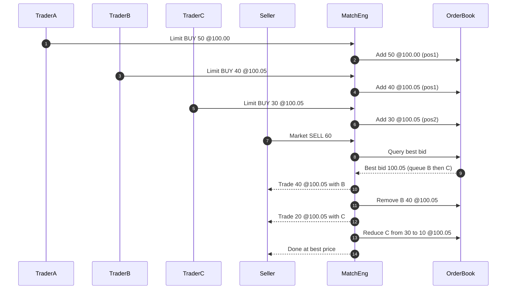
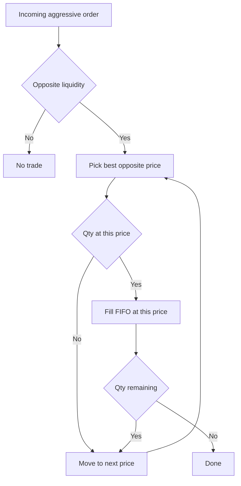

# <ins>MMT-01 — Algorithmic Trading Basics (Pre-Class Notes)</ins>

## <ins>1. Quantitative & Algorithmic Trading</ins>

**Quantitative Trading (QT)**  
→ Uses mathematical/statistical models to detect opportunities and run data-driven strategies.  
**Typical pipeline:**
- **Strategy Identification** : find an inefficiency *(edge)*.
- **Backtesting** : test on historical data.
- **Execution System** — automate and reduce transaction costs.
- **Risk Management** — capital allocation and **bet size**.

**Algorithmic Trading (AT)**  
→ Automated execution of investment decisions via an algorithm (rules on **timing**, **price**, **quantity**).  
Goal: remove emotional bias, make the strategy systematic and **scalable** (can handle larger capital without manual effort).

**High Frequency Trading (HFT)**  
→ Subset of AT with ultra-low **latency**, short horizons, large message flow.  
Key concepts: **co-location**, specialized order types, execution speed = **alpha** (competitive edge).

## <ins>2. Microstructure – Orders & Liquidity</ins>

**Bid / Ask / Spread**
- **Bid**: highest price a buyer pays.  
- **Ask**: lowest price a seller accepts.  
- **Spread = Ask − Bid** → proxy for **liquidity** (the smaller, the deeper the market).

**Order Types**

| Type                      | Description                                       | Typical use                                         |
|---------------------------|---------------------------------------------------|-----------------------------------------------------|
| **Market Order**          | Immediate execution at best available price       | Prioritize **speed**, not price                     |
| **Limit Order**           | Execute at a specific price or better             | Prioritize **price control**                        |
| **Stop Order**            | Becomes *market* once stop is triggered           | Confirm **direction** (breakouts, stop-loss)        |
| **Conditional (OCO/OSO)** | Linked logic across multiple orders               | **Advanced management** (brackets, auto TP/SL)      |

## <ins>3. Execution & Market Dynamics</ins>

**Market Impact**  
Price movement caused by trade size (large size → price displacement).  
Trader objective: **minimize impact**.

**Slippage**  
Difference between expected and executed price.  
More frequent in **volatile** markets and with **market orders**.  
Mitigation: execution algos (**VWAP**, **TWAP**).

**Volatility (σ)**  
Dispersion of prices.  
- **Historical Volatility** = standard deviation of past returns.  
- **Implied Volatility (IV)** = **forward-looking** volatility backed out from option prices.  
Key model: **Black–Scholes**.

## <ins>4. Alpha & Beta (Performance)</ins>

- **Alpha (α)**: excess return vs. benchmark (**risk-adjusted** outperformance).  
- **Beta (β)**: market sensitivity (β = 1 → tracks market, β > 1 → amplifies, β < 1 → dampens).  
Estimation: linear regression of asset vs. market returns.
\[
\beta = \frac{\operatorname{Cov}(R_i, R_m)}{\operatorname{Var}(R_m)}
\]

## <ins>5. OHLC Data & Indicators</ins>

**OHLC** = *Open, High, Low, Close* per time bar — basis for **candlestick** or **bar** charts.

**Moving Average (MA)**  
→ Smooths short-term noise, reveals trend.  
- **SMA** = simple moving average  
- **EMA** = exponential moving average (more weight on recent data)

**Bollinger Bands**  
→ ±2σ bands around the MA.  
Band width = **volatility**: wider = more **unstable** market.

# <ins>6. Key Takeaways for Market Microstructure Class</ins>

| Concept          | Trader interpretation                                   |
|------------------|----------------------------------------------------------|
| **Spread**       | Implicit execution cost                                  |
| **Market impact**| Price reaction to your size                              |
| **Slippage**     | Gap between signal and actual fill                       |
| **Latency**      | Delay from signal → order → execution                    |
| **Liquidity**    | Depth of the order book                                  |
| **Volatility**   | Risk / profit opportunity                                |

---

## Price Priority — Sequence (message flow)

Before
Price   Bid   Ask
100.10    -    60
100.05   70     -
100.00   50     -

Sell 60 hits best bid 100.05:
- Fill B 40 @100.05
- Fill C 20 @100.05 (C left 10)

After
Price   Bid   Ask
100.10    -    60
100.05   10     -
100.00   50     -

## Matching Logic — Flowchart (price → time)

